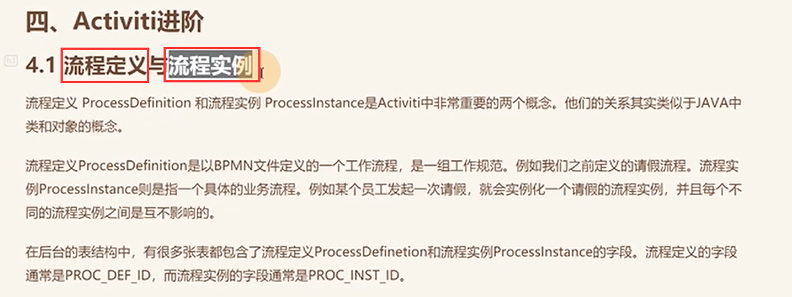
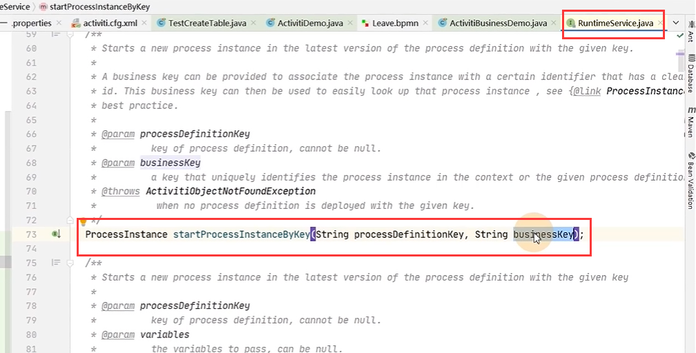
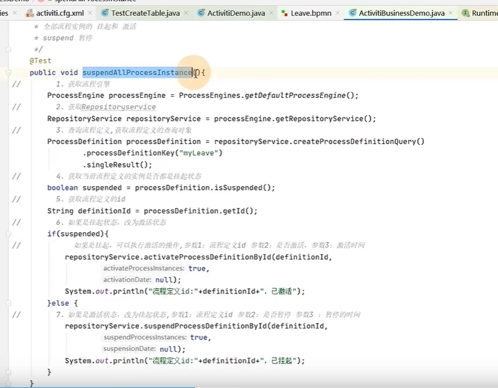
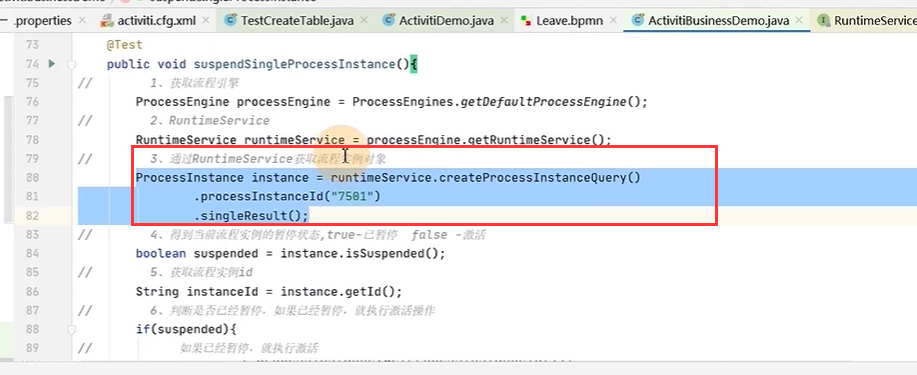
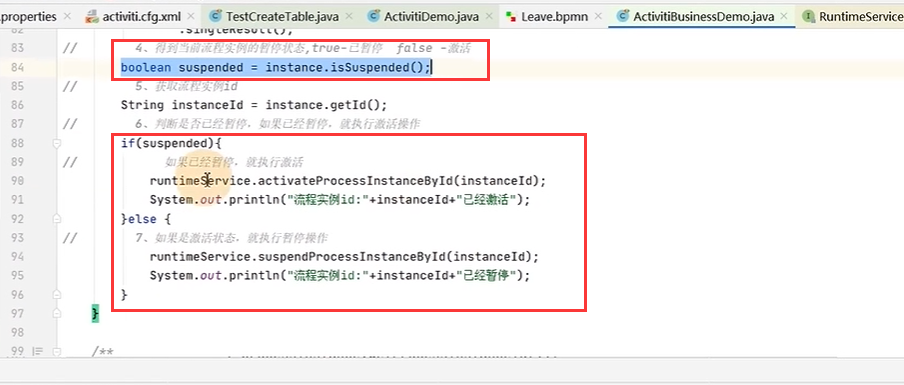

# 7、流程挂起与激活

​		重要的是我们必须理解这些概念 --比如流程定义 和 流程实例

#### 1、启动流程加一个businessKey

​			什么是businessKey -- 表示业务的key

​		比如我们整个审核的业务流程是比较封闭的，但是往往我们去和 业务系统合并的时候 需要关联很多的业务信息，比如请假单，那么请假单肯定还有一些别的业务上的信息--比如请假理由等等，那么就肯定需要一些业务字段，这些字段怎么和activiti的流程合到一起呢---就可以通过这个businessKey

​		businessKey其实相当于Activiti工作流的一个扩展，我们可以在流程启动时候加这么一个key

​	比如 这个1001就是businessKey

​	我们看一下这个接口方法：

还有这种带有变量的接口 ---这个就是我们后期说的 流程的变量

​		那么以后我们就可以 通过流程实例--获取到businessKey -- 然后关联到业务的信息了

​		注意：这个businessKey 在数据库中的默认长度是255 --所以不要传入的内容超出限制

​		

#### 2、挂起和激活流程

​			场景：比如我们现在 月底 需要暂停 一些业务流程，进行统计等等，就可以先将流程挂起。

​	挂起和激活操作代码demo

​	如果我们去处理挂起的任务的话是会报错的

​			提示：不能够执行一个挂起的任务

​	我们刚刚是挂起了 一个流程定义 -- 那么这样整个 请假流程 就全部不能运转了。

​	

​	如果我们需要停止某个 流程中的一个流程 -- 那么也可以 ---流程实例 挂起

​		先通过流程实例ID 找到流程实例

​		然后获取实例的挂起状态 -- 挂起/激活

​		通过实例ID进行挂起或者激活

注意：挂起整个流程定义 是使用的 repositoryService， 挂起某个流程实例 使用的是runtimeService，那么我们考虑任务是不是也是可以挂起的呢 -- -- 是否使用TaskService挂起呢 ---不可以，没有挂起方法。

https://www.bilibili.com/video/BV1Ya411z7kW/?p=7&vd_source=243ad3a9b323313aa1441e5dd414a4ef