# 8、流程变量

​	流程变量也是非常重要的，有了这个流程变量才可以使得这个流程变的复杂起来。

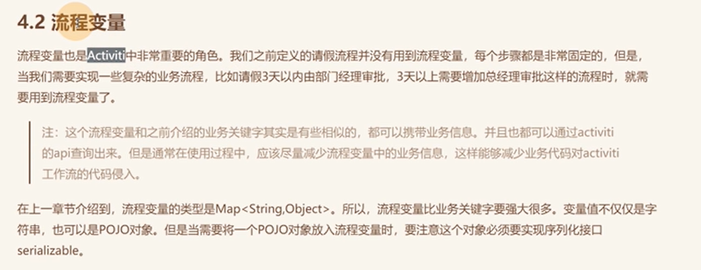

​	流程变量添加的时候是在启动流程的时候

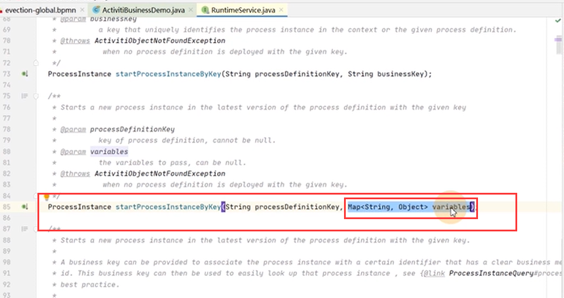

#### 2、流程变量作用域

​	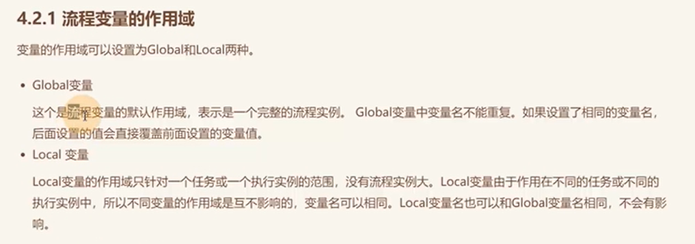

​			比如我们在启动流程实例的时候--传入一个流程变量，那么这个流程变量 在整个实例中都是会同样往下传递的。 如果在后面的流程中也设置一个流程变量 那就会覆盖前面的流程变量。

​			还有一种就是Local 它是针对一个执行实例的范围或者是一个任务

#### 3、如何使用流程变量

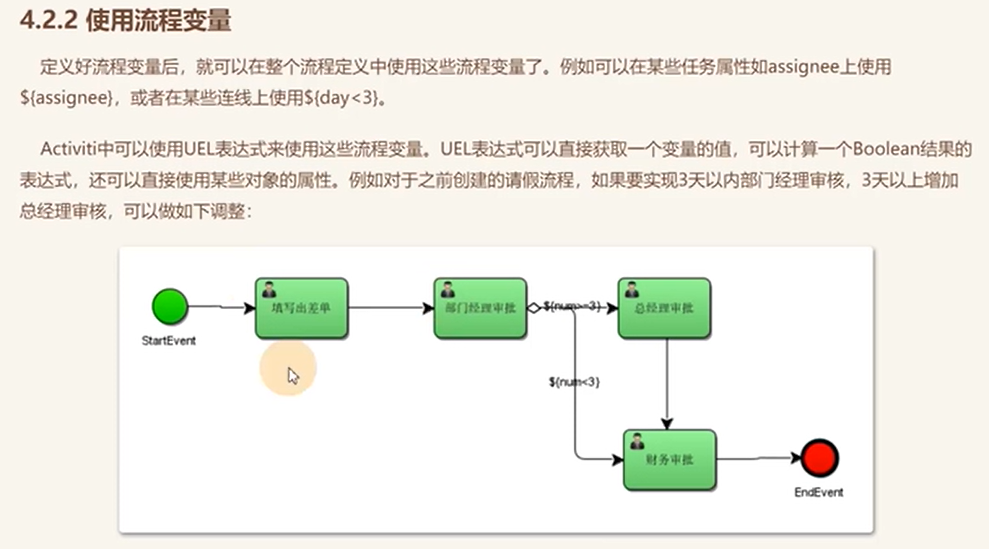

​		像我们在bpmn中 使用的${}的其实都是流程变量 -- 这种就叫uel表达式--UEL(Unified Expression Language)即统一表达式语言

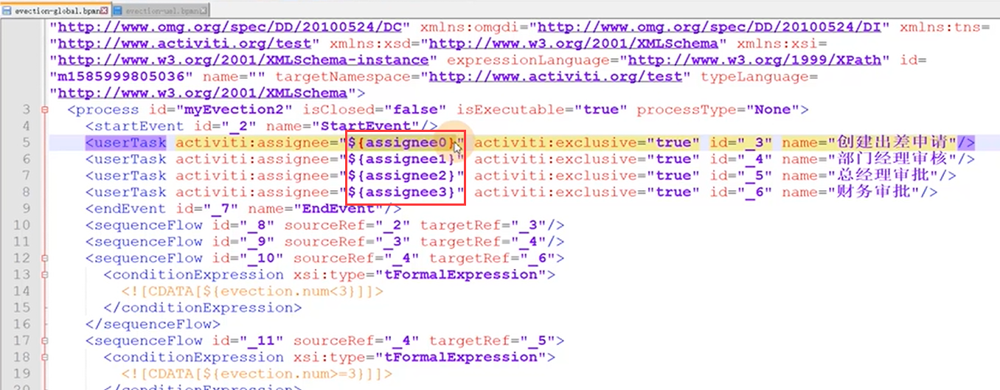

​	表达式中 对变量 进行了判断

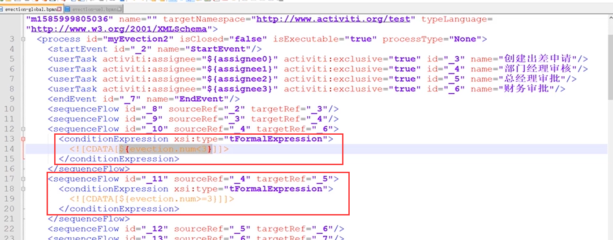

​	在代码中--我们启动一个流程实例的时候，传入这些变量，变量可以是字符串的形式传入，也可以是一个POJO对象

​		目前 我们是把时间放到了对象中 然后变量evection作为key，其他的字符串 放入的

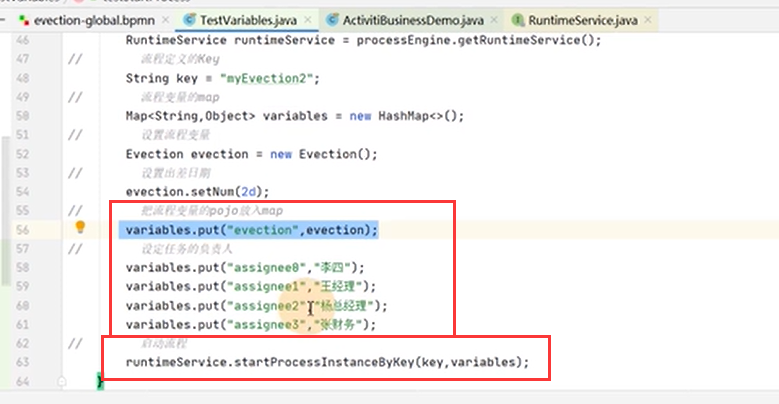

变量的设置

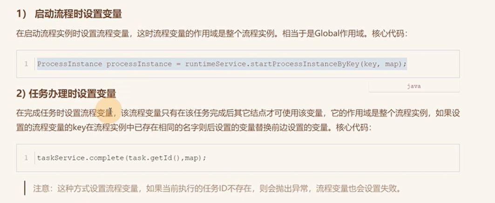

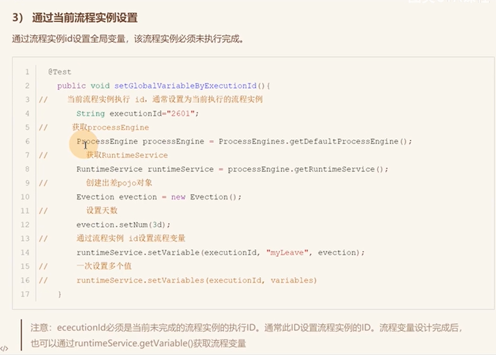

​	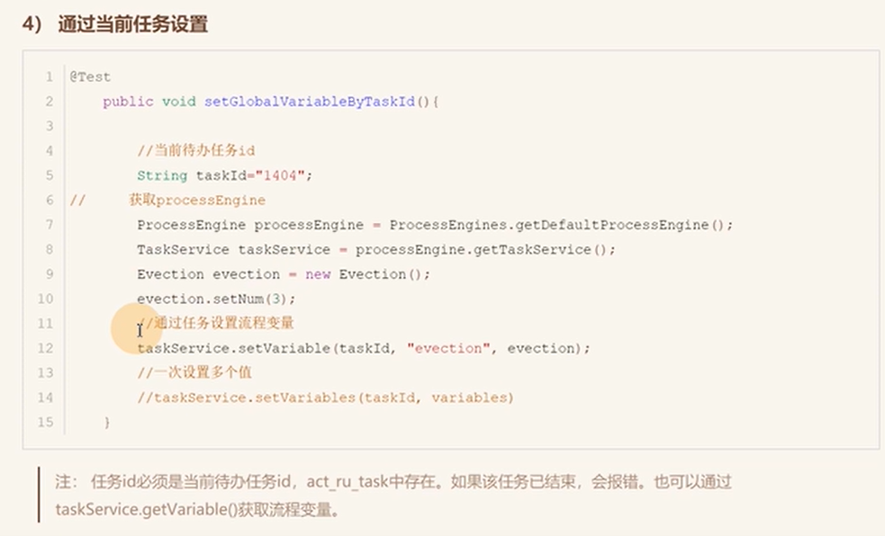

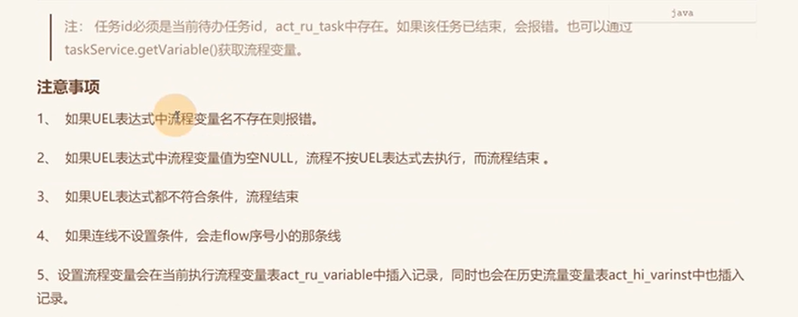

​			一定要保证UEL表达式可以执行成功，如果执行不成功报错了就

​	所有的变量都会在 这个表中存放

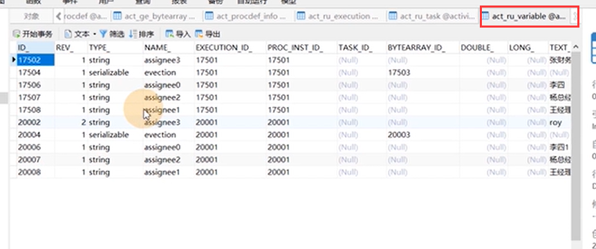

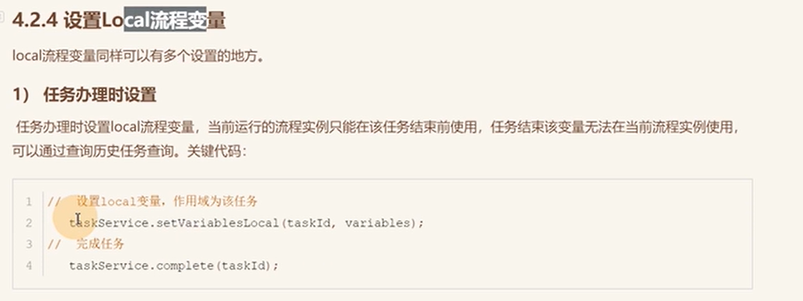

​		设置local变量 使用setVariableLocal -- 这个Local变量只会存在于当前的Task任务---这里的使用场景：比如在执行任务的过程中设置 下一步 的责任人。

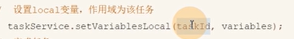

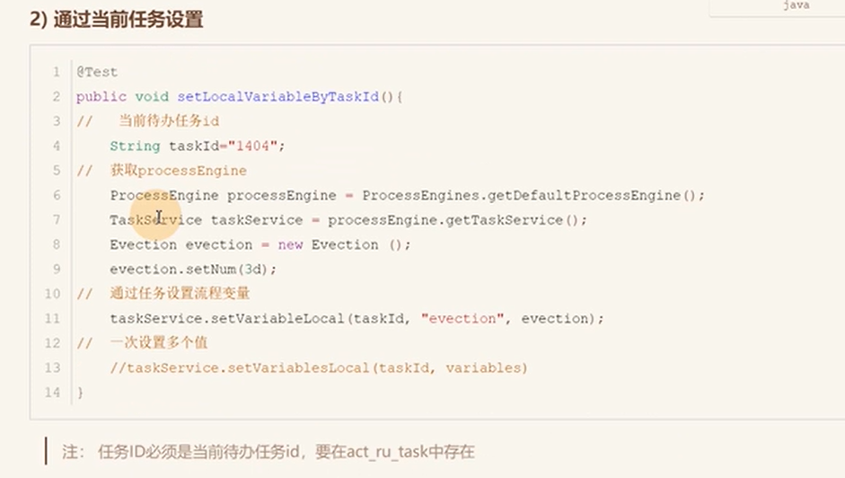

https://www.bilibili.com/video/BV1Ya411z7kW/?p=8&spm_id_from=pageDriver&vd_source=243ad3a9b323313aa1441e5dd414a4ef

