# 2.开发过程中需要注意的问题

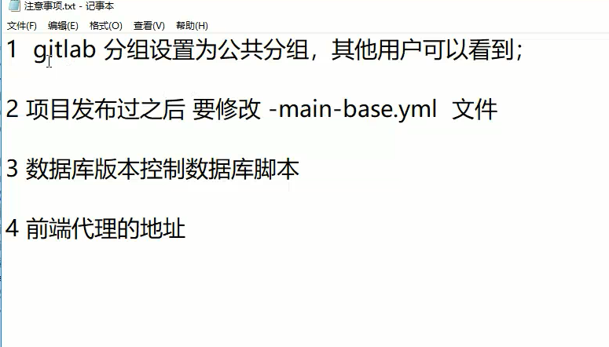

#### 1.创建公共分组

入口：

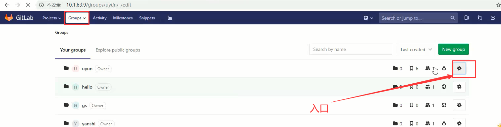

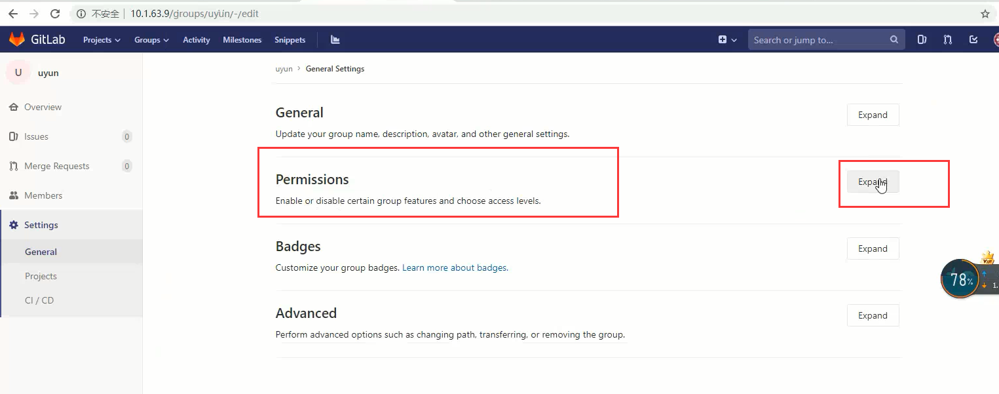

默认是私人的

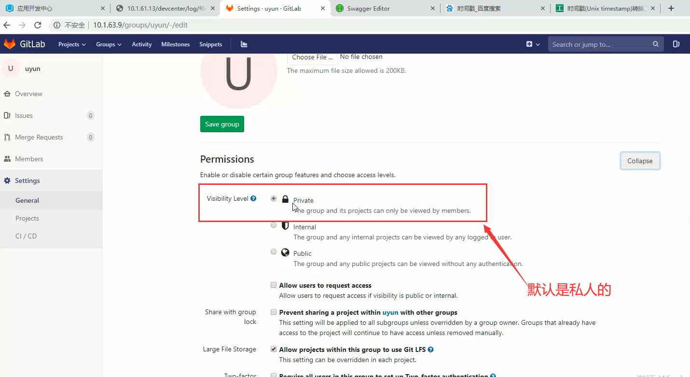

设置为公共的--这样设置其他人才可以加入到这个组

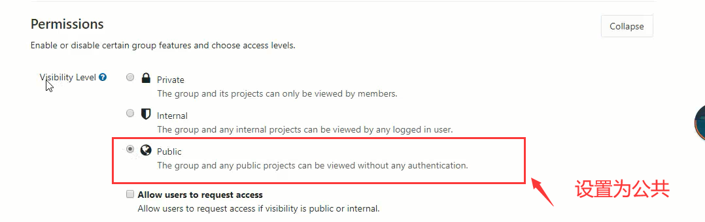

#### 2、项目在应用开发中心部署过，

需要修改配置文件yml中的app.id属性--在biz.app.code花括号的后面加任意的字符

​		因为你发布之后会在Apollo存一份配置文件，本地启动会去拿这个配置文件，这样连的是线上的服务，会导致没有权限，所以我们要加任意字符让他找不到，**找不到就会加载本地的配置。**

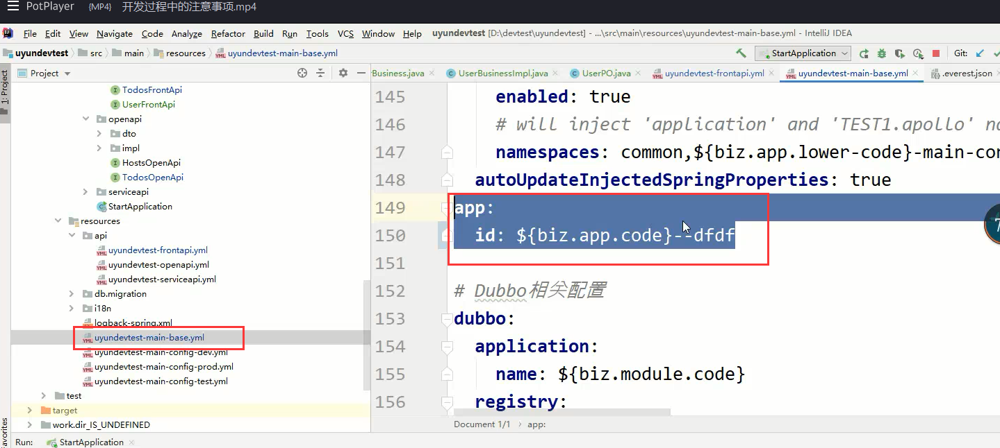

找不到会加载main.config-dev.yml

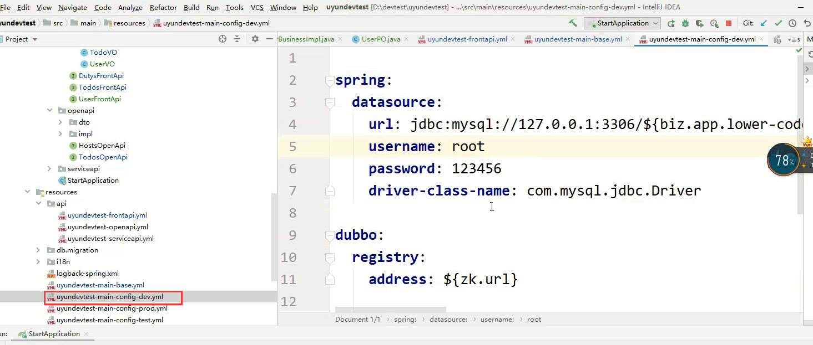

#### 3、数据库版本控制的数据库脚本

脚本位置：在我们添加了表之后，要在对应的数据库版本中加入创建的脚本数据（为新的脚本文件）

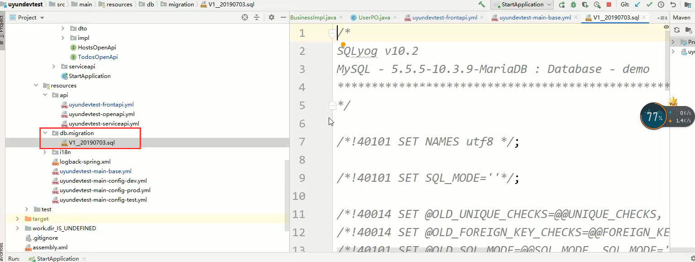

#### 4、前端代理地址

在frontend下的everest.json

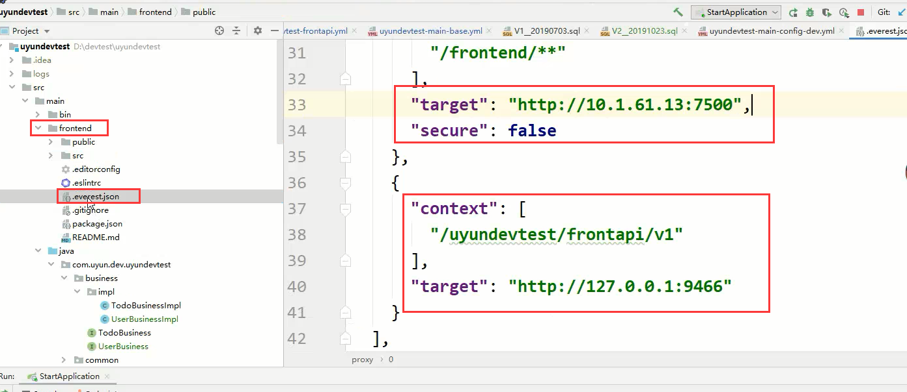

代理地址

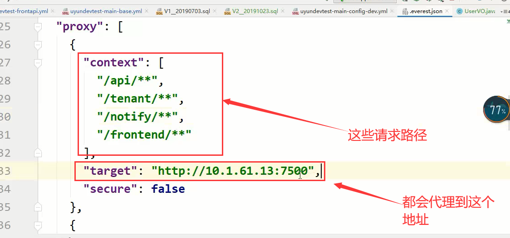

本地应用代理地址：

​		这俩种地址要注意一下，如果是登录的话是需要走线上的代理租户的地址（如：10.1.61.13:7500），

登录完成后，我们进入本地应用的话，那么就需要的是本地的代理地址，比如（127.0.0.1:9466）

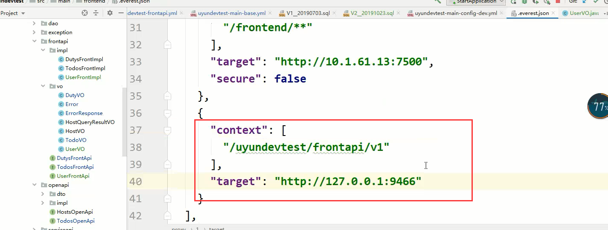

