# 1.mosh讲解Java基础部分

#### 1、必要的工具

​	首先是下载必要的工具，用于构建java应用程序

​	输入jdk dwonload 下载java的软件开发环境--可以到oracle.com去下载

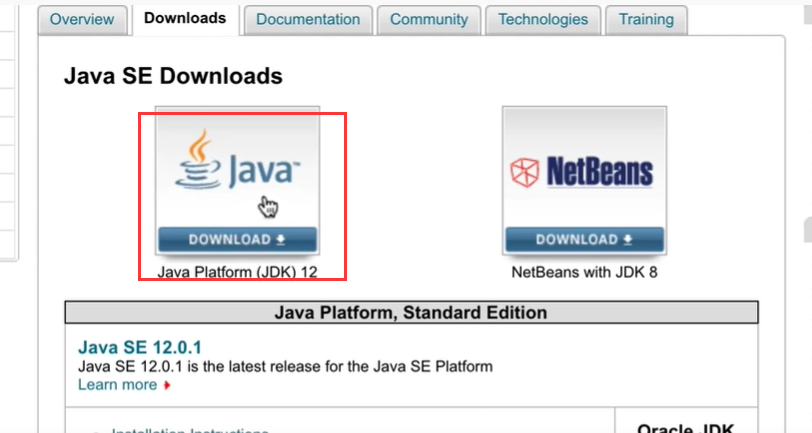

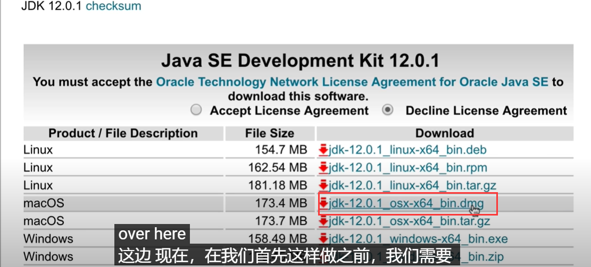

#### 1.2 开发IDE工具下载

​	有好几种java的开发工具，我们使用更智能的intellij

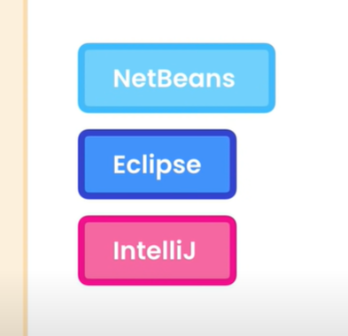

我们可以下社区版本-免费的使用

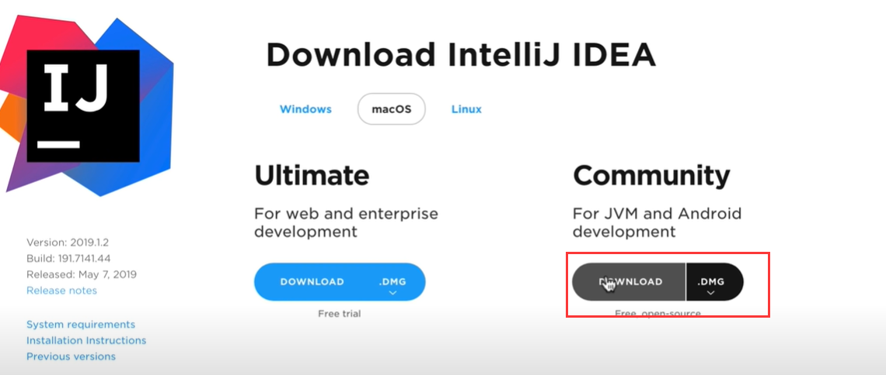

好了我们现在可以构建一个java程序了

## 2、java程序剖析

​	看看java程序的，分解java最小的构建模是，java中最小的构建块是函数Function，程序是函数，函数是一段代码，函数是一段代码一个执行任务。

​	执行任务 作为一个比喻，比如电视的遥控器按钮，每个按钮执行一个任务功能，编程语言正是这样，例如我们有一个函数，向人们发送电子邮件，我们可以有一个转换函数某人的体重（磅到千克），还可以有一个验证的函数，用户输入等，我们现在看看如何编写一个函数。

​	在java中，我们首先指定该函数的返回类型，如返回Sting字符串、集合，对象等等

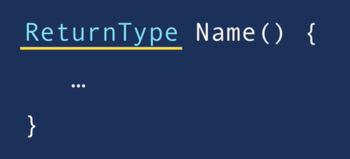

java程序是如何运作的：

​	基本涉及2个步骤：编译和执行Compilation，Execution

编译器--就是将我们编写的.java格式的文件编译为.class类型字节码 的文件

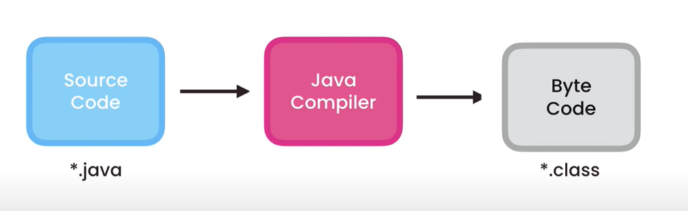

在标签类上右键---点击这个open in Terminal--打开终端

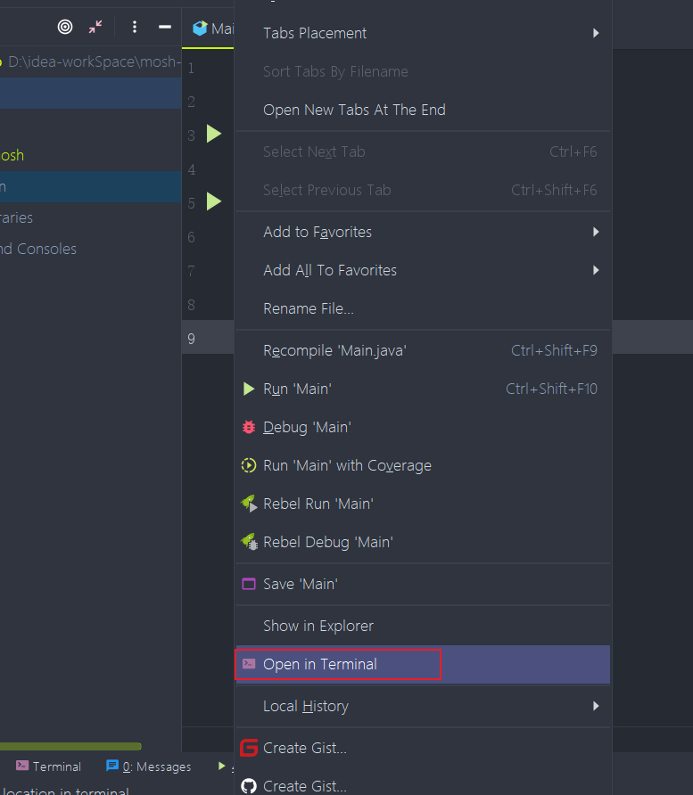

这样我们会调用出当前类路径下的终端

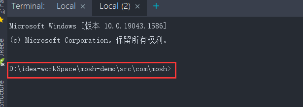

我们输入javac Main.java 

我们输入dir，可以看到有2个文件，分别是.java和.class

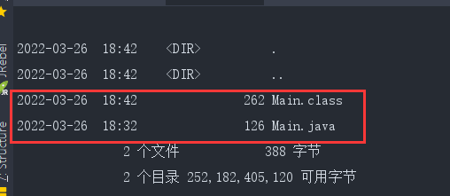

同样在idea中也会有相应的编译产生的路径及.class文件

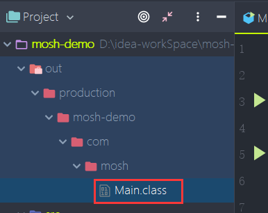

这意味着这个字节码文件是可以独立运行与任何平台的，那么任何需要运行java的程序只需要安装java的运行环境jre就可以了（java runtime environment）

这个java运行环境 有一个，软件组件叫Java虚拟机或者是JVm

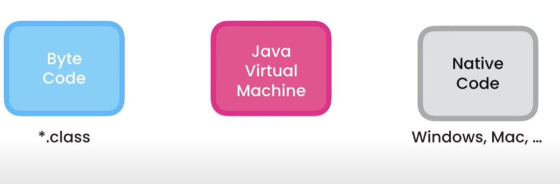

这个JVM可以接收我们的.class代码，然后转换翻译为我们使用设备需要的本机代码，这样java就实现了跨平台的使用了

现在我们使用java虚拟机运行一个java程序，我们到文件的上级目录src下，也就是我们源码文件夹下

​	我们现在可以像调用java虚拟机一样，然后我们输入完整的路径，它会找到.class字节码文件，然后由字节码转化为本机代码，也就是我们使用的操作系统认识的代码

​		如果有多个class文件-会识别路径最近的class

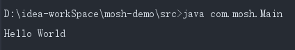

​	当我们使用ide编辑工具时，这些步骤对我们隐藏了，我们没有看到编译或执行步骤

所以我们已经看到了 java的实际应用，现在让我 告诉你，关于java的五个有趣的事实。

- java是由James Gosling 詹姆斯-高斯林开发，在1995年 在sun公司，后来2010年被甲骨文	收购。
- 它最初被称为橡木，是长在高斯林加外面的橡树，后来改名我green绿色，最终改名为java，受到了java咖啡的启发，改名我java，这就是为什么java的标志像咖啡的原因了

#### 版本

​	我们有4个版本的java

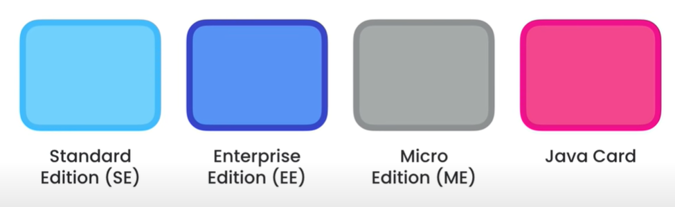

SE：标准版--我们平时学习使用和开发

EE：企业版用于构建超大规模和分布式系统，它建立在SE标准之上，提供额外的库和容错

ME：是java标准版的一个子集，适用于移动设备版本，它具有的库特定于移动设备

Java Card：用于智能卡，

全球大约900万java开发者，目前30亿部手机运行java程序以及1.2亿台电视和播放器

根据lndeed.com统计的java开发者的平均工资是101929美金，大约60万RMB每年

所以java的机会无处不在，这意味着我们拥有更多的机会被录用。

