# 11.流控制

​	这里我们学习 控制流程 或控制执行流程在我们的程序中

我们从**比较运算符**开始：

然后我们会讨论**逻辑运算符**

**条件语句**：

用于重复执行的循环：

## 1、比较运算符

​		例如 我们进行对x和y的比较 是否相等

​	例如字符串的比较

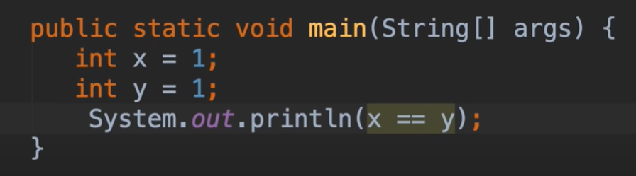

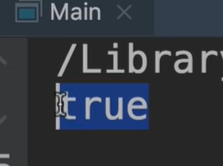

## 2、逻辑运算符

​	&& 是并且   || 是或者 or

​	例如：我们设置一个温度为22度，进行逻辑运算 如果大于20度，并且小于30度的情况 为true

​	他的执行顺序是由左到右的，如果满足 temperature 》20 然后再执行之后的逻辑

​			如果不满足后面的逻辑也将不执行

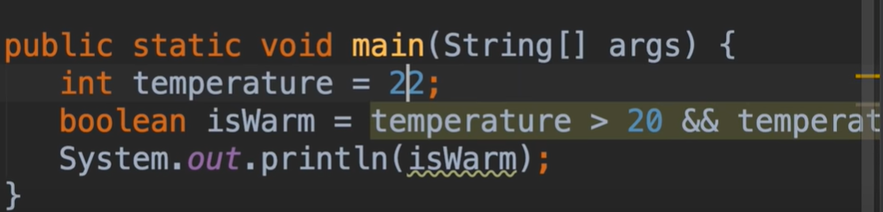

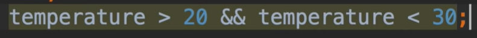

## 3、if 语句

java中if语句非常的重要，因为他们允许我们构建，可以根据特定条件做出决策的程序

例如：判断温度 大于30 等等进行不同的操作

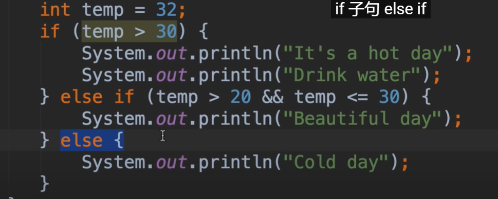

我们可以简写一下，最后的else可以不加 花括号也是可以的，

​		我们可以将temp > 20 && temp <= 30优化一下，因为最上面第一个条件 temp >30 如果不成立肯定就是小于等于30了，我们在else if中下面直接判断都将是 小于等于30的内容，所以我们就直接使用 temp > 20就可以了

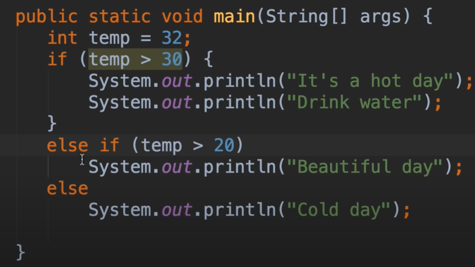

#### 简化if语句--更易于阅读

例如：我们判断一下收入income，如果是高收入我们设置变量 hasHightIncome 为true

​	结果报错：提示--此处不允许声明变量

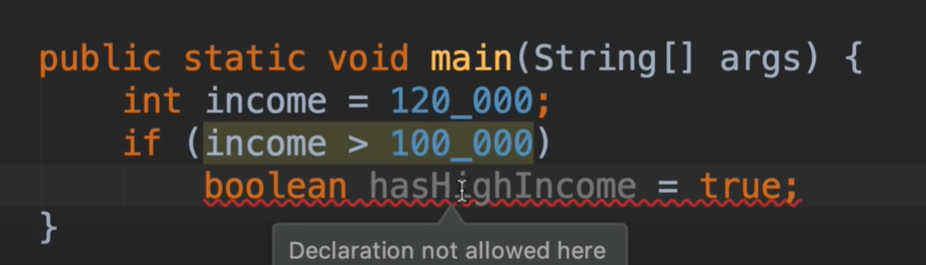

​	因为我们需要确定变量的范围--这里必须加上{}括号就可以了

​		现在有个问题：这个变量只能是在这个代码块内访问，我们在外面是访问不到的

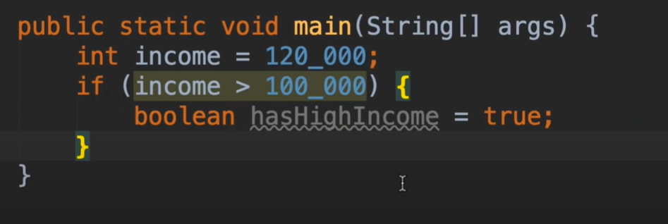

我们想要全局的访问就把它提取到为 类变量

​		显然这样写是很low的，专业的程序员是不会这样写的

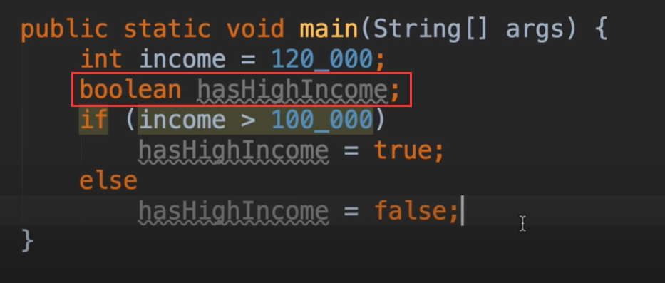

好我们改进一下：首先设置默认值是false

​			然后判断true的 情况 设置变量为true，其他情况就使用默认false就可以了

​			但是这样还不理想，我们可以完全摆脱这个if

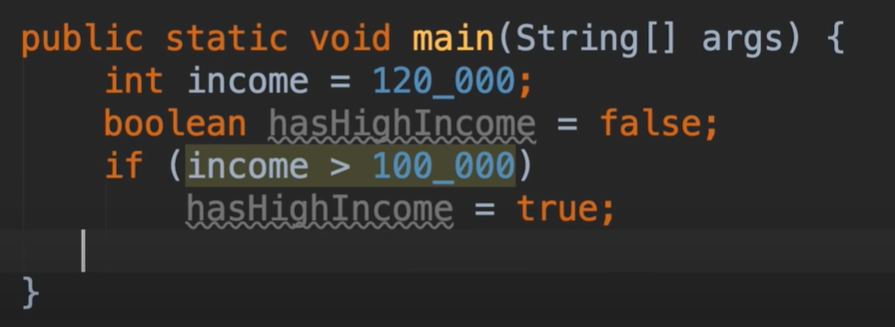

再次优化--是不是很赞

​		我们直接使用这个 表达式 如果计算的结果为true或者false，都赋值给hasHighIncome，就实现了这个场景

这是最简单和优雅的方式

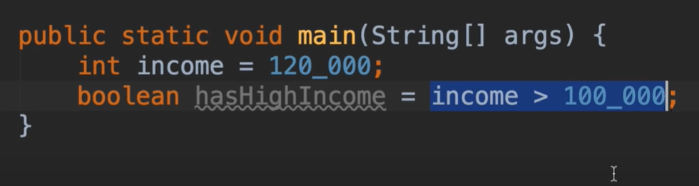

最后我们再改进一下，个人还是比较喜欢把表达式放在括号内，虽然这里不需要括号，但是为了可读性更清晰我们使用括号比较好一些---这样很明显 我们的赋值运算 = 号后面的就是一个表达式

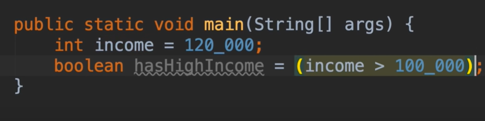

#### 三元操作符

​	想象一下判断收入---如果收入超过10万，将客户进行不同的分类，大于10万为头等舱，小于为经济舱

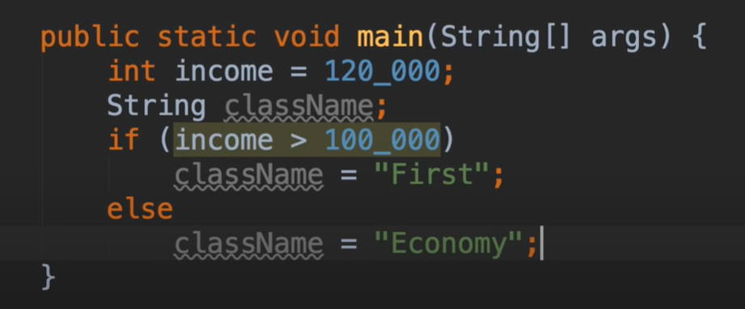

​	现在我们需要简化一下代码，专业程序员不这样写

我们可以用一行处理 如果大于120_000 为true 就是First 否则就是 Economy

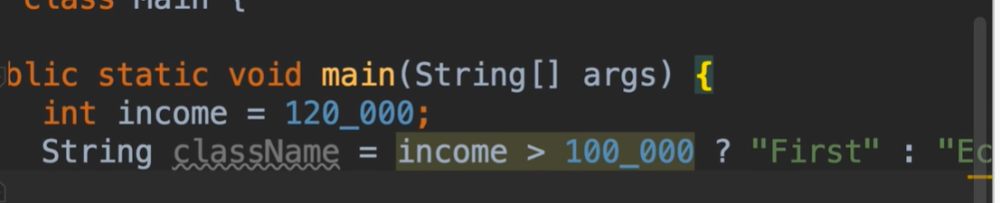

