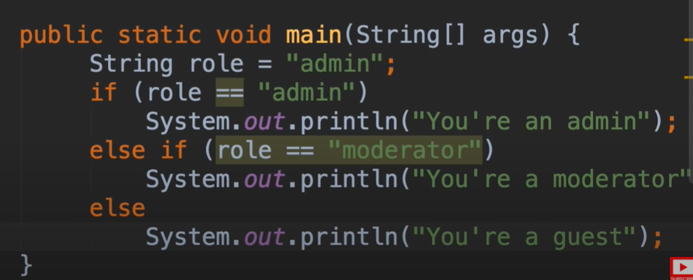
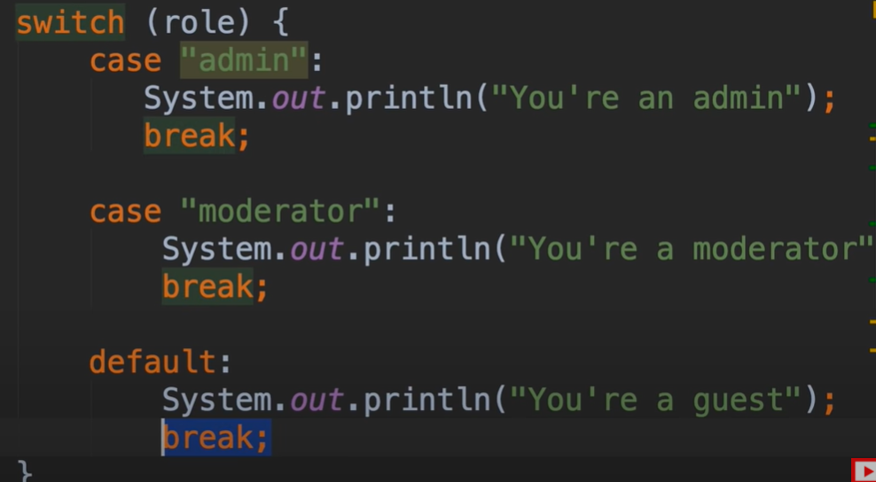
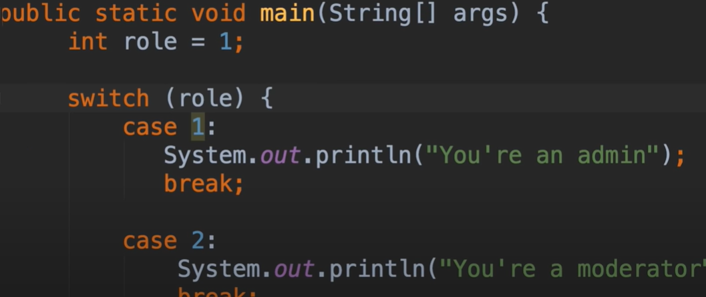

# 12.mosh-switch语句

 现在我们查看java中的switch语句，我们使用三个语句来执行代码不同的部分，具体取决于类似于if语句的表达式

​		假设-我们要编写一个程序并检查 当前用户的角色，然后我们根据不同角色打印不同的消息，所以我们要申明一个字符串变量 role

​		那么使用if语句也是可以实现这个场景的

我们使用switch来看一下

​	case是判断 如果是真 则进入代码块执行内容，执行完之后break跳出本代码块，default是默认 执行代码块

​	我们现在是使用String进行的比较，我们也可以使用除 long之外的整数，byte，short，Integer都是可以的

我们使用的case看起来就像 第一种情况，第二种情况，第三种情况等等

## 练习Exercise ：FizzBuzz

