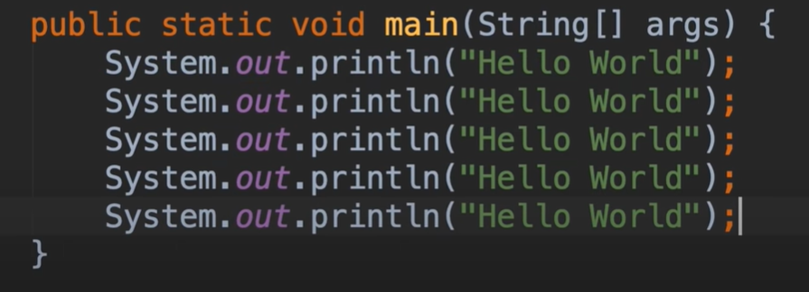
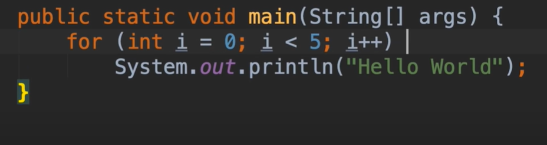
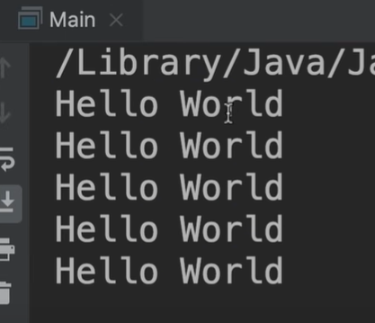
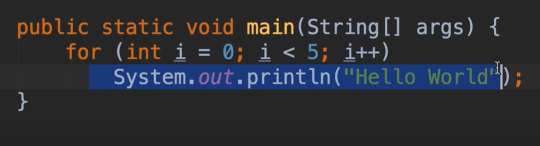
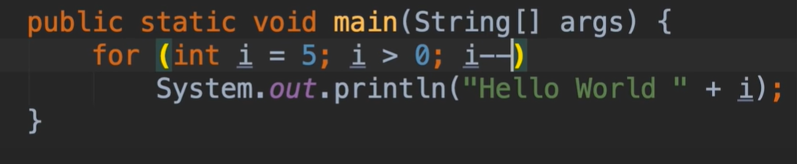
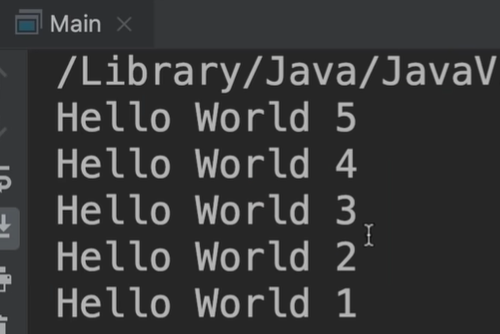
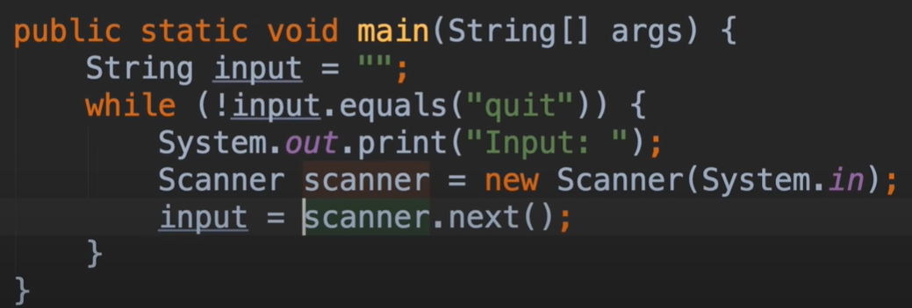
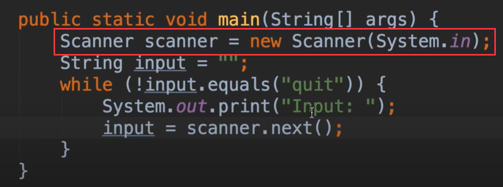
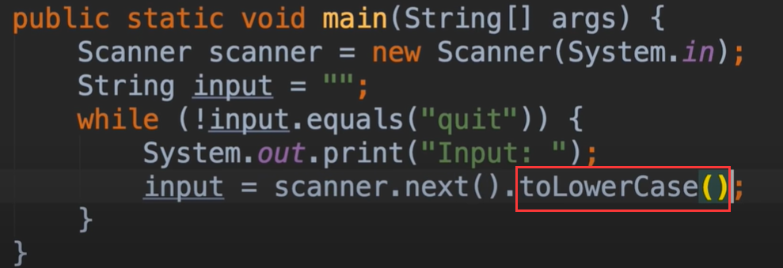
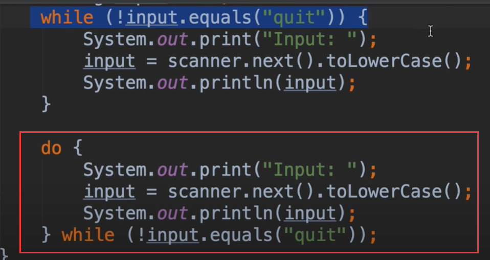

# 14.mosh-For循环

例如：我们想输出一个 hello World 并且需要5次

这个代码明显看起来很丑，这就是我们在java中需要使用到循环的地方

有几种不同类型的循环，我们先了解一下for循环

​	使用for循环 需要声明一个循环和一个计数器变量，我们声明一个名为 i 的变量初始化值设置为0，然后编写一个布尔表达式来确定循环

​		我们现在没有加{}，如果有多个循环就需要加上了

我们了解一下当java看到这个for循环的代码是如何执行的：

​	从初始值开始0，如果条件满足，循环的代码块中就会被执行一次，直到条件不满足的时候，就会执行for下面部分的代码

我们也可以这样递减的方式进行循环

## While 循环

我们在确定需要循环多少次的话最好使用for循环，如果我们不确定需要循环多少次，比如用户不断的输入东西，直到他们输入完成后，然后终止程序，这种情况下我们不知道用户输入了多少次内容，这样场景我们使用While循环编写程序

​		引用类型的字符串，不能在引用类型之间使用比较运算符，因为这些**运算符比较的是内存地址或对象而不是他们的值**，所以如果你有2个String进行比较的话，不同的内存地址，我们可以使用equals方法

因为每次循环的时候我们都要创建一个 new Scanner扫描对象，假设用户输入了10次，那么就创建了10个对象，这样是不必要的，也是一种不好的做法，因为这样会污染我们的内存，所以最好在外部创建扫描对象

假设用户以小写字母输入内容，我们将一直无法退出，所以我们需要将接收到的内容转化为小写

​	toLowerCase

## do while 循环

我们使用do while重写以上逻辑的代码

​		与while循环的区别是 while是先判断后执行，do while 是先执行后判断，循环至少执行一次

