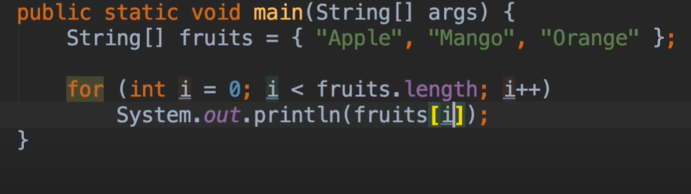
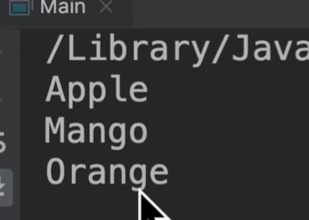
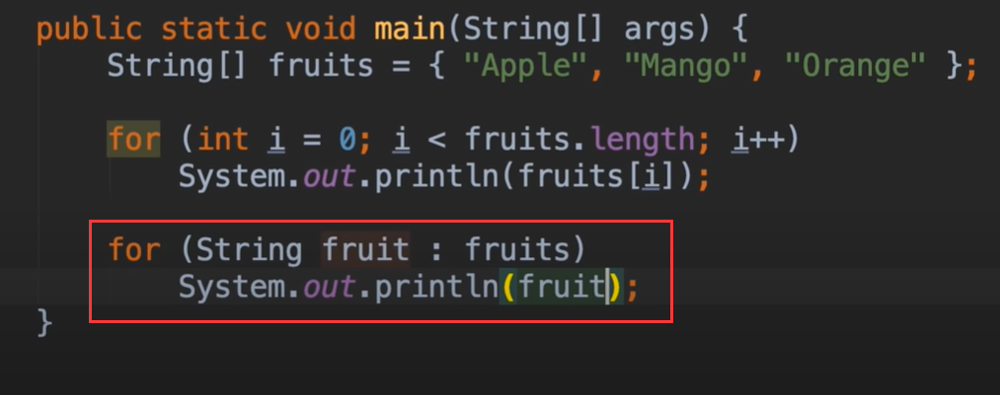
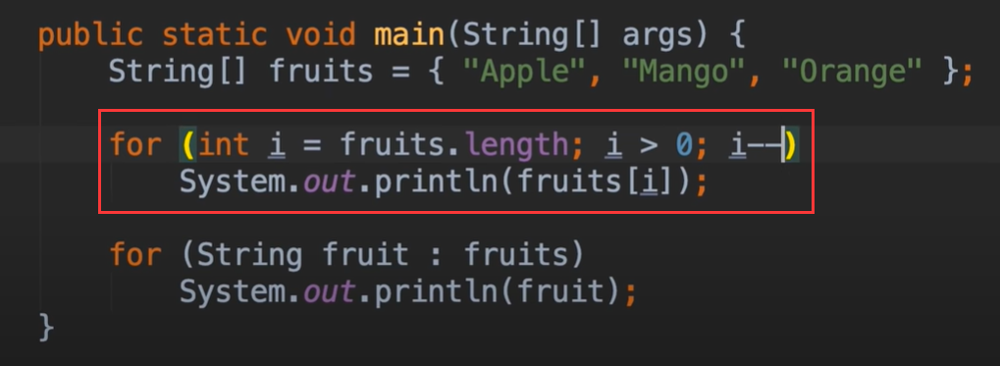

# 16.mosh-For-Each Loop

 ## forEach 循环

我们了解一下java中的 forEach循环

​		遍历数组或者是集合

例如：我们先声明一个字符串数组，然后循环数组内的元素

我们可以使用for loop、 while loop、 do while loop，但是还是for each loop 更方便一些

​	我们先使用for循环实现看一下：

控制台输出没有问题

那么如果是使用for each的话，声明循环变量，但这个变量类型应该基于数组中的项目类型

​	这样写的话是不是更简单呢，使用foreach有个限制，**就是我们只能从开头循环到结尾**，如果想从结尾循环到开头的话那么还是使用for循环，foreach第二个限制就是 **我们无法知道每个元素的索引**

这里我们可以使用for循环进行 倒序的循环

