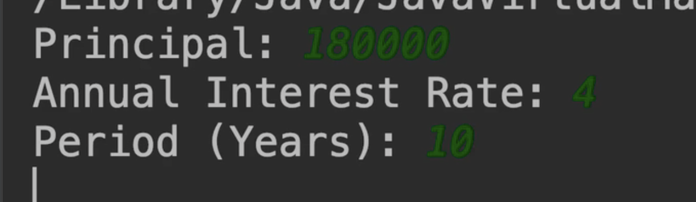
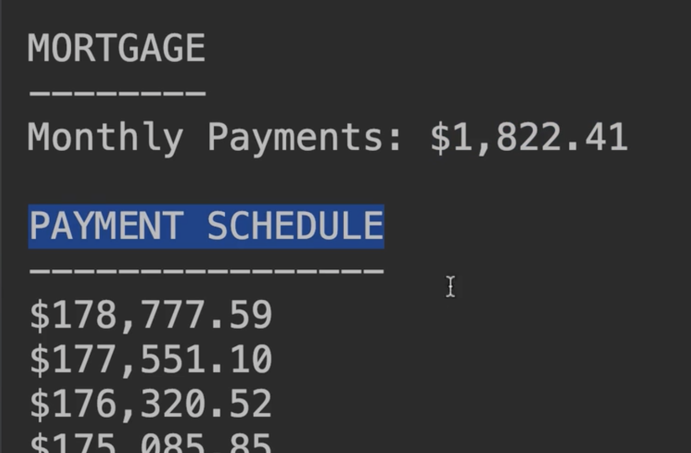
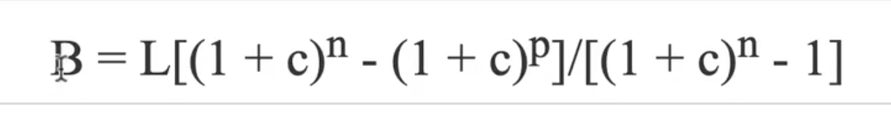
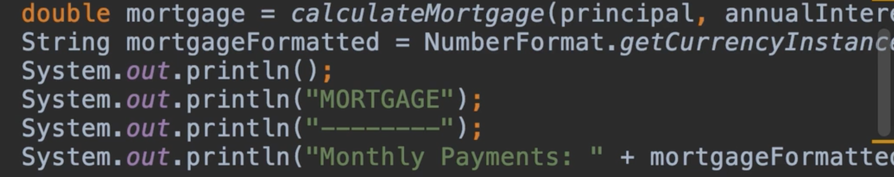
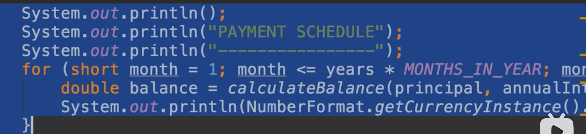
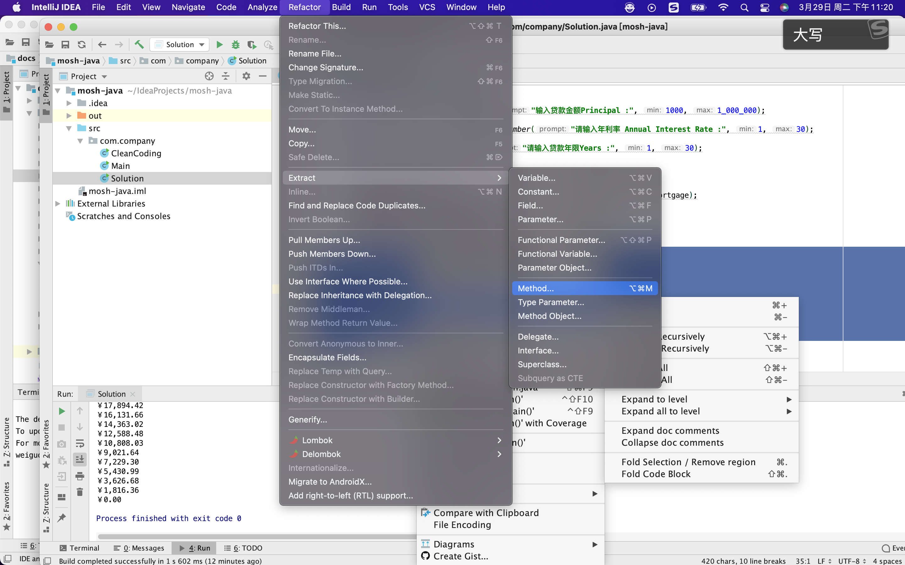

# 19.mosh-付款时间表项目


	

​	付款时间表项目：就像之前的计算器项目一样，输入3个值

​		然后计算出 每期月供金额-还有付款时间表，显示剩余部分




​	每次付款后，显示的还款余额都会减少




这个是计算余额的公式




L:代表贷款金额 c代表月利息 ，n代表期数（1年12期），p是我们已支付期数


写好的代码

```java
package com.company;

import java.text.NumberFormat;
import java.util.Scanner;

public class Solution {
    //一年12月
    final static byte MONTH_IN_YEAR = 12;
    //百分比
    final static byte PERCENT = 100;


    public static void main(String[] args) {

        int principal = (int) readNumber("输入贷款金额Principal :", 1000, 1_000_000);

        float annualInterest = (float) readNumber("请输入年利率 Annual Interest Rate :", 1, 30);

        byte years = (byte) readNumber("请输入贷款年限Years :", 1, 30);


        double mortgage = calculateMortgage(principal, annualInterest, years);
        //格式化金额
        String mortgageFormatted = NumberFormat.getCurrencyInstance().format(mortgage);
        System.out.println();
        System.out.println("MORTGAGE");
        System.out.println("--------");
        System.out.println("Monthly Payments" + mortgageFormatted);

        //打印付款计划
        System.out.println();
        System.out.println("PAYMENT SCHEDULE");
        System.out.println("----------------");

        //现在我们需要for循环，迭代所有的支付
        for (short month = 1; month <= years * MONTH_IN_YEAR; month++){
            double banlace = calculateBanlace(principal, annualInterest, years, month);

            System.out.println(NumberFormat.getCurrencyInstance().format(banlace));
        }


    }


    // 1.这里我们需要什么参数呢 L=贷款金额 ，n贷款期限 ，c月利率，p支付期数
    //这里我们想要的是付款金额
    public static double calculateBanlace(int principal,float annualInterest,byte years,short numberOfPaymentsMade){


        short numberOfPayments = (short) (years * MONTH_IN_YEAR);

        //计算得出月利率
        float monthlyInterset = annualInterest / PERCENT / MONTH_IN_YEAR;

        double blance = principal
                * (Math.pow(1 + monthlyInterset, numberOfPayments) - Math.pow(1 + monthlyInterset, numberOfPaymentsMade))
                / (Math.pow(1 + monthlyInterset, numberOfPayments) - 1);

        return blance;

    }

    //2.第二步--因为我们的循环大部分内容都是一致的，只有少部分代码不一致，需要重构一下
    //  我们要读取一下这个是什么内容
    public static double readNumber(String prompt,double min,double max){
        Scanner scanner = new Scanner(System.in);
        double value;
        while(true){
            System.out.println(prompt);
            value = scanner.nextFloat();

            //判断年利率是否在范围
            if (value > min && value <= max)
                break;
            System.out.println("请输入 "+ min +" - "+ max +"之间的年化利率");

        }

        return value;

    }


    //1.最先抽取的计算月供的方法
    public static double calculateMortgage(int principal,float annualInterest,byte years){

        short numberOfPayments = (short) (years * MONTH_IN_YEAR);

        //计算得出月利率
        float monthlyInterset = annualInterest / PERCENT / MONTH_IN_YEAR;

        //计算月供
        double mortgage = principal * (monthlyInterset * (Math.pow(1 + monthlyInterset, numberOfPayments)))
                / (Math.pow(1 + monthlyInterset, numberOfPayments) - 1);

        return mortgage;
    }


}

```


	#### Refacting 现在我们重构一下

​	现在看起来我们的主方法有点内容多了，大于18行代码我们就可以考虑重构了

​	重构应该看俩块，1，代码上的重复代码，以及高度相关的行，

​	代码没有任何重复，但我们有很多行高度相关，他们具有一个单一的目的（比如 目的是展示关于贷款项目的总结）



另外我们还有一部分代码，他们的目的是打印付款计划



所以我们可以提取这俩个方法

​	框选代码-然后右键或者是从菜单选择 重构method




重构后的代码：记住你的主方法尽量控制在20行内处理

```java
package com.company;

import java.text.NumberFormat;
import java.util.Scanner;

public class Solution {
    //一年12月
    final static byte MONTH_IN_YEAR = 12;
    //百分比
    final static byte PERCENT = 100;


    public static void main(String[] args) {

        int principal = (int) readNumber("输入贷款金额Principal :", 1000, 1_000_000);

        float annualInterest = (float) readNumber("请输入年利率 Annual Interest Rate :", 1, 30);

        byte years = (byte) readNumber("请输入贷款年限Years :", 1, 30);


        printMortgage(principal, annualInterest, years);


        printPaymentSchdedule(principal, annualInterest, years);


    }

    
    private static void printMortgage(int principal, float annualInterest, byte years) {
        double mortgage = calculateMortgage(principal, annualInterest, years);
        //格式化金额
        String mortgageFormatted = NumberFormat.getCurrencyInstance().format(mortgage);
        System.out.println();
        System.out.println("MORTGAGE");
        System.out.println("--------");
        System.out.println("Monthly Payments" + mortgageFormatted);
    }

    private static void printPaymentSchdedule(int principal, float annualInterest, byte years) {
        //打印付款计划
        System.out.println();
        System.out.println("PAYMENT SCHEDULE");
        System.out.println("----------------");

        //现在我们需要for循环，迭代所有的支付
        for (short month = 1; month <= years * MONTH_IN_YEAR; month++){
            double banlace = calculateBanlace(principal, annualInterest, years, month);

            System.out.println(NumberFormat.getCurrencyInstance().format(banlace));
        }
    }


    // 1.这里我们需要什么参数呢 L=贷款金额 ，n贷款期限 ，c月利率，p支付期数
    //这里我们想要的是付款金额
    public static double calculateBanlace(int principal,float annualInterest,byte years,short numberOfPaymentsMade){


        short numberOfPayments = (short) (years * MONTH_IN_YEAR);

        //计算得出月利率
        float monthlyInterset = annualInterest / PERCENT / MONTH_IN_YEAR;

        double blance = principal
                * (Math.pow(1 + monthlyInterset, numberOfPayments) - Math.pow(1 + monthlyInterset, numberOfPaymentsMade))
                / (Math.pow(1 + monthlyInterset, numberOfPayments) - 1);

        return blance;

    }

    //2.第二步--因为我们的循环大部分内容都是一致的，只有少部分代码不一致，需要重构一下
    //  我们要读取一下这个是什么内容
    public static double readNumber(String prompt,double min,double max){
        Scanner scanner = new Scanner(System.in);
        double value;
        while(true){
            System.out.println(prompt);
            value = scanner.nextFloat();

            //判断年利率是否在范围
            if (value > min && value <= max)
                break;
            System.out.println("请输入 "+ min +" - "+ max +"之间的年化利率");

        }

        return value;

    }


    //1.最先抽取的计算月供的方法
    public static double calculateMortgage(int principal,float annualInterest,byte years){

        short numberOfPayments = (short) (years * MONTH_IN_YEAR);

        //计算得出月利率
        float monthlyInterset = annualInterest / PERCENT / MONTH_IN_YEAR;

        //计算月供
        double mortgage = principal * (monthlyInterset * (Math.pow(1 + monthlyInterset, numberOfPayments)))
                / (Math.pow(1 + monthlyInterset, numberOfPayments) - 1);

        return mortgage;
    }


}


```


