# 2.变量和常量


我们现在做一个抵押贷款的计算器


​	这里我们使用变量来临时存储到计算机内存中


比如： 年龄是30

```
//int 变量只能存储整数 等号是赋值 30是初始值
int age = 30;

//我们在同一行可以申明多个变量,以逗号分隔-但是不推荐这样使用
int age = 30, temperature = 20;
```


在java的各种类型中，分为俩类，

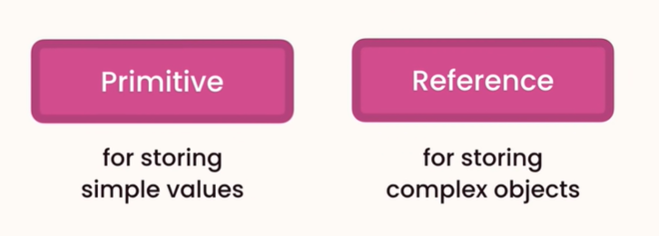


​		Primitve原始类型：存储简单的值

​		Reference非原始类型或引用类型：存储复杂对象的类型


在原始类型中

​	如：byte 占用 1个字节内存，可以存储 -128--127 的值，拥有的字节越多可以存储的数值越大

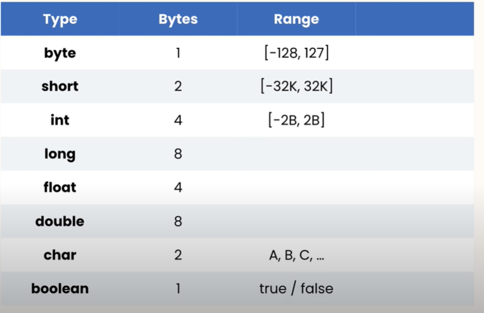


我们使用int可以用下划线进行分割这样比较好看一些

​	以下红色波浪线的原因是超出了int的范围，int能表达的最大数值是20亿，现在是31亿了

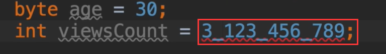


提示整数太大

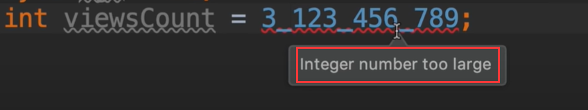


所以我们现在需要改变类型 我们使用long

​	我们看到还是会报错，因为java编译器将此数值视为整数类型，已经超出了范围，解决这个问题我们需要在数值后面加一个l，作为后缀数字，我们可以使用大写也可以使用小写，但是小写看起来有点像数字1，**所以我们最好使用大写**

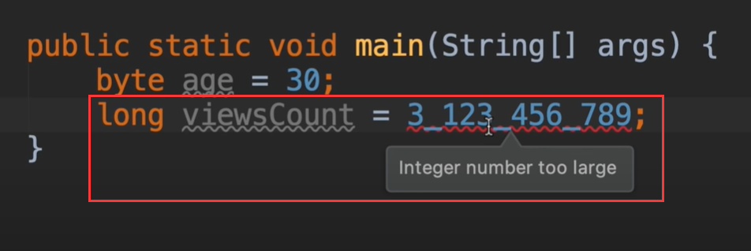


double：变量很大 用于存储产品价格的大容量 8个字节容量

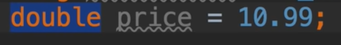


我们可以改为float浮点类型：

​	提示不兼容浮点类型--错误原因是默认情况下java看到这些小数点的数字，认为是double类型的

所以，即使我们设置了浮点类型，也会被认为是double类型，就像我们表示long类型一样添加后缀

​	我们添加大写或者小写的F都是可以的

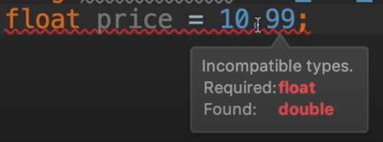


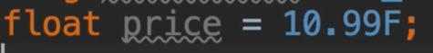


char:表示一个字符，String表示一串字符

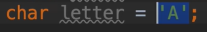


我们现在了解一下引用类型：基本类型外所有类型都是引用类型


如我们设置变量当前日期

​	会使用到**new 运算符**，然后为这个变量分配内存，和原始数据类型不同的是，原始数据类型不需要分配内存，而引用类型是需要分配内存的，内存由java分配和释放，在处理引用类型时，我们总是分配内存，不必释放这些内存，因为java运行环境会自动处理，所以我们使用new运算符 然后我们重复我们的类名称，然后我们添加括号和分号，我们现在就定义了这个变量；

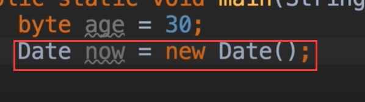


我们定义的这个变量是日期类型 的一个实例，所以这些类定义，用于创建新的模板或者是创建新的蓝图对象

​	我们也可以创建一个关于人的实例对象，现在这些对象或者是这些类有我们可以使用访问的成员，运算符，所以我们现在实例 now 后面输入点

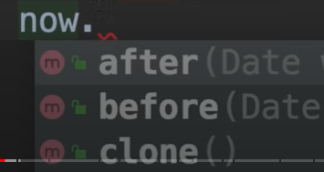

可以看到这些都是属于此类的成员


如我们使用now.getTime() 这个方法 获取时间，这将返回时间分量，这个对象不同是，原始类型和引用类型之间类型，

​	这些原始类型没有成员，如果我们输入使用原生类型点的话，我们看不到这些成员

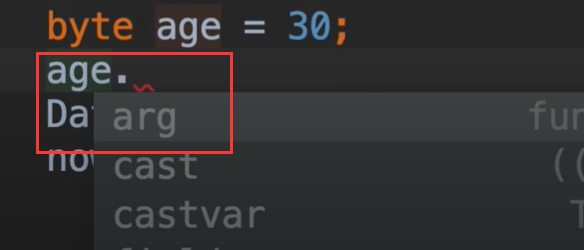


内存管理：

​	例如：

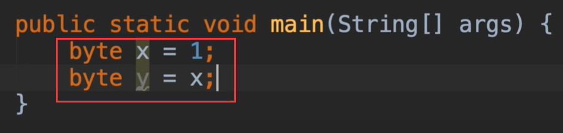


在内存中是有2个不同的变量 x和y的，这俩个变量不同的是内存位置，所以他们完全相互独立；


相互独立-换句话说就是 如果改变了x，那么Y不会受到影响


我们测试一下：

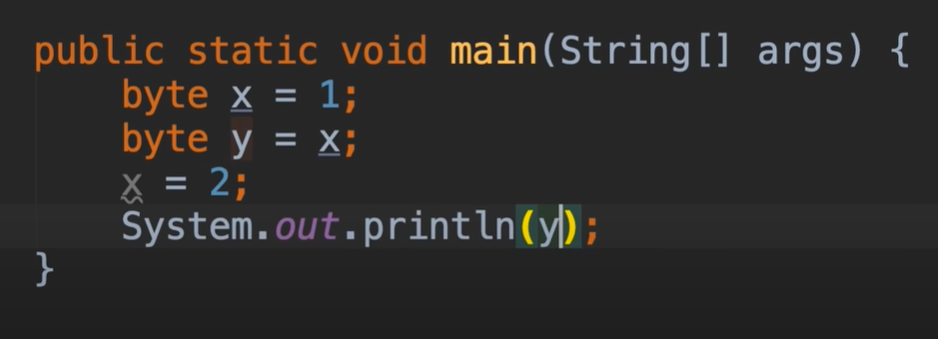


可以看到打印的结果，还是1，因为他们使用的内存是独立的

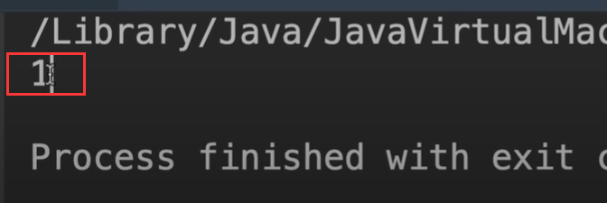


我们现在使用引用类型--如坐标点 

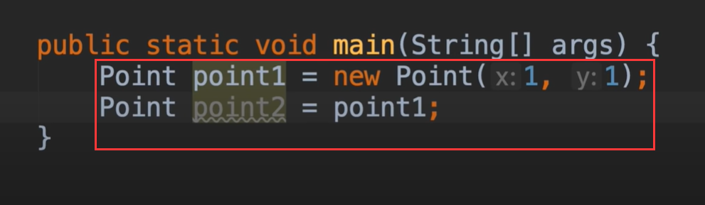


​	其实该点存的是 一个引用的地址，如下图，point1存储的是位置，在100的位置上，然后去这个内存100的位置是这个引用对象的值。这就是我们为什么称他们为引用对象，因为他们不存储实际的值，他们存储的是一个引用的值。

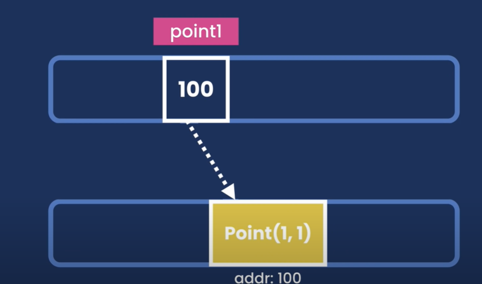


像这样 这俩个对象引用的是同一个地址--内存中引用的是同一个位置，所以这俩个对象不是相互独立的

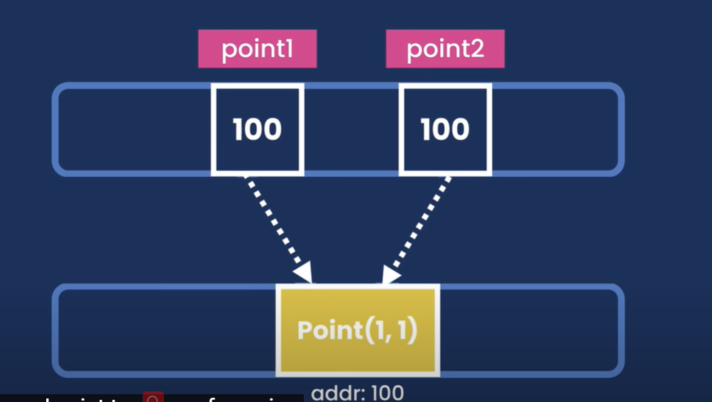


所以如果我们更新了引用类型的值后，之前使用这个引用类型的值也将发生改变

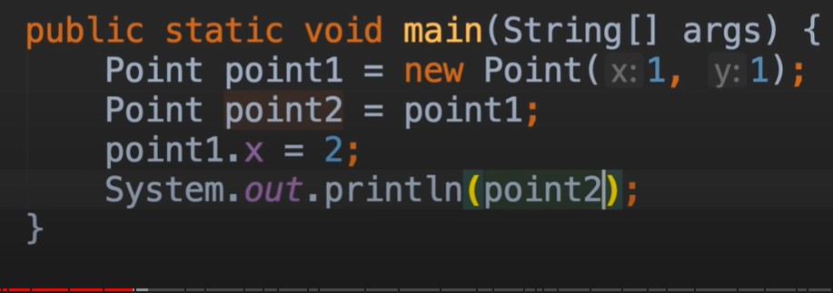


结果也发生了改变

​		所以记住：这个属于引用类型的复制，他们的value值是一样的（内存地址一样），原始类型被复制，他们的value值是完全的独立的（内存地址独立）

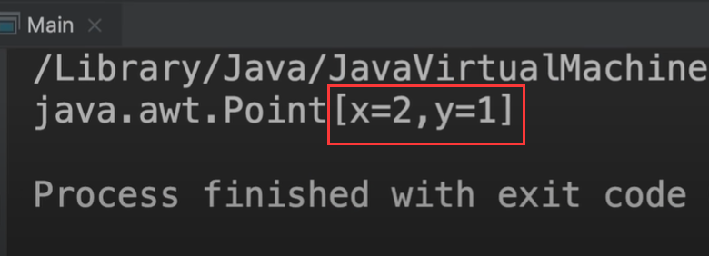


#### String

使用String 首先声明一个 message 变量名称，因为是引用类型，所以我们应该实例化这个变量 new String ()

​		我们看到一些波浪线的警告：提示 new String 是多余的，因为java有更短的方法初始化字符串变量


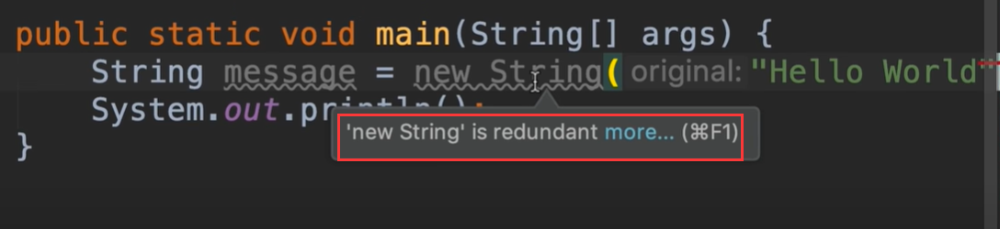


这样看起来像一个原始类型，因为我们没有带new 运算符

​		但这是个简写初始化字符串变量，他是属于引用类型的，因为我们经常使用他所以给他创建了简写的方法；

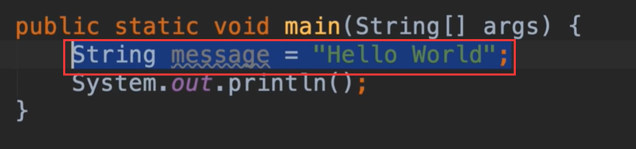


我们现在将字符串 进行replace修改后，然后打印原始的message，因为字符串是属于引用类型，理论上应该是修改后的内容显示

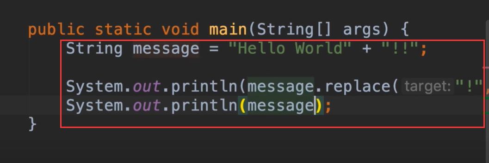


但是我们发现，打印的还是初始化的值，因为在java中对字符串进行了修改，是不允许被修改的，所以任何修改字符串的方法，所以任何修改字符串的方法都会返回一个全新的字符串对象。

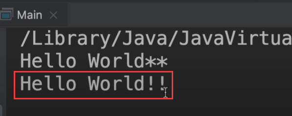


我们看一下这个大小写转化的方法

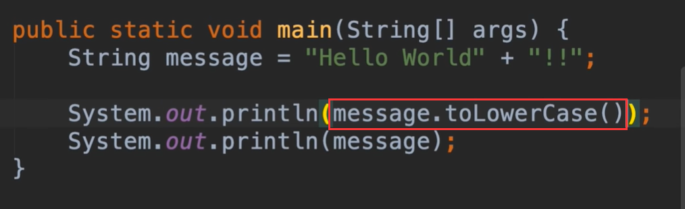


我们可以再次看到 原来的字符串并没有得到影响

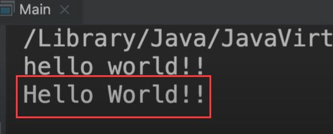


字符串修剪的方法 toUpperCase

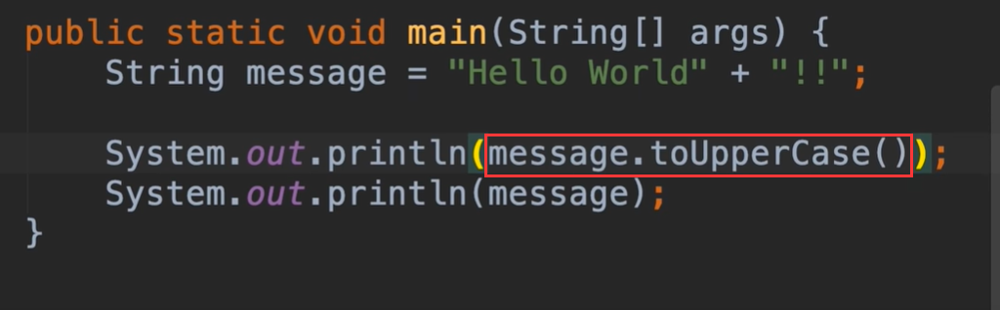


还有trim()方法可以去掉字符串前后端空格--中间不会影响


