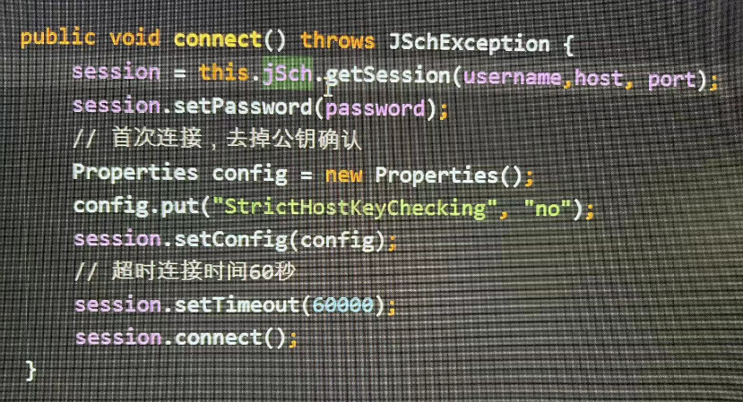
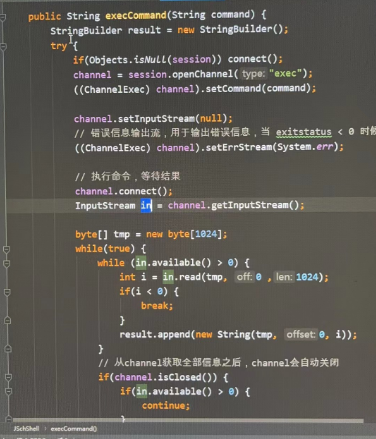
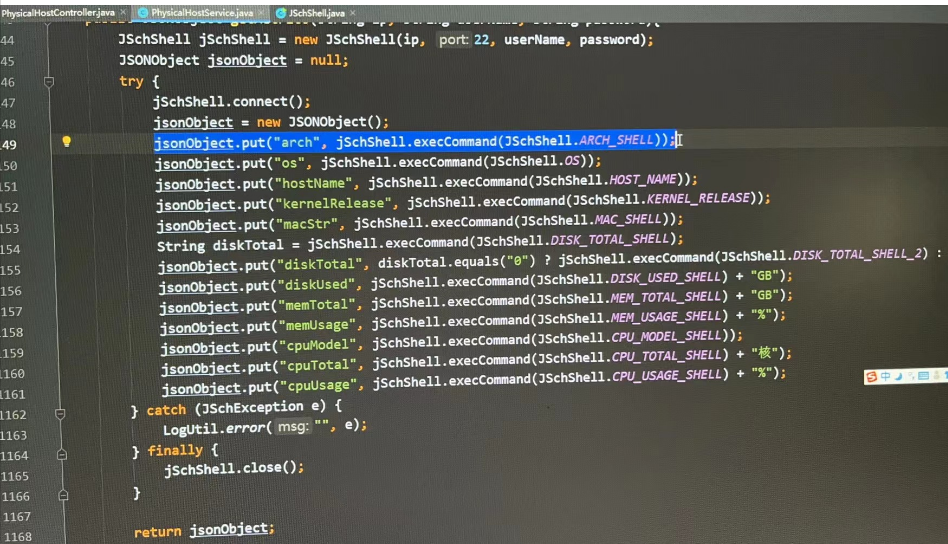

# 2、使用java连接终端执行脚本

​	可以使用JSch这个类来处理。

#### 1、连接终端

​			使用jsch -- 需要用户名密码 端口

​			如果需要RAS加密认证的话--需要读取配置文件

​			获取session--然后进行连接

#### 2、执行终端命令

​		连接上终端后可以使用 jsch.execCommand(执行的命令) -- 来进行命令的操作

​		注意   execCommand 这个是封装的

​		

​		操作完成的结果 其实是使用 **输入流** InputString 来接 

​		然后通过循环 -- 来处理成字符串

​		

然后通过String转化为JSONObject

 -- 然后设置成对象映射 --保存到数据库中就可以了

​		

​			--这样就完成了简易的终端操作

