# 3、多线程定时执行批量任务

这里的主要环境和工具如下：

        IntelliJ IDEA 2021.2.3
    
        JDK8
    
        Mysql5.7
    
        Postman
    
        Navicat Premium
    
        spring-boot 2.6.7
    
        mybatis 2.2.2
## 	

## 	1、创建项目

​		idea--new project

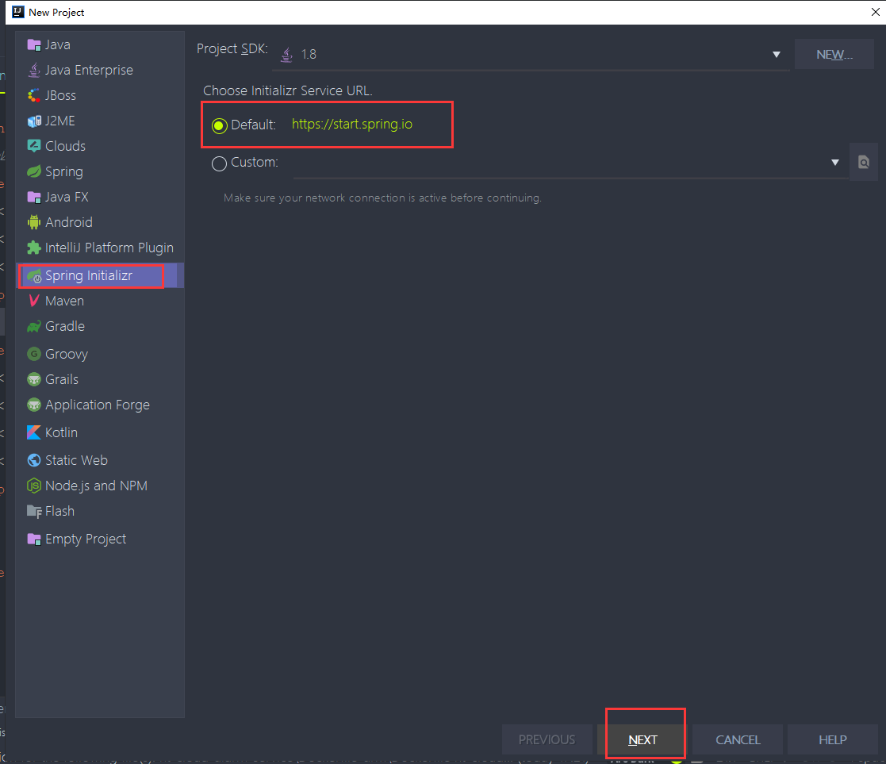


​	

​	选择生成项目的内容--设置

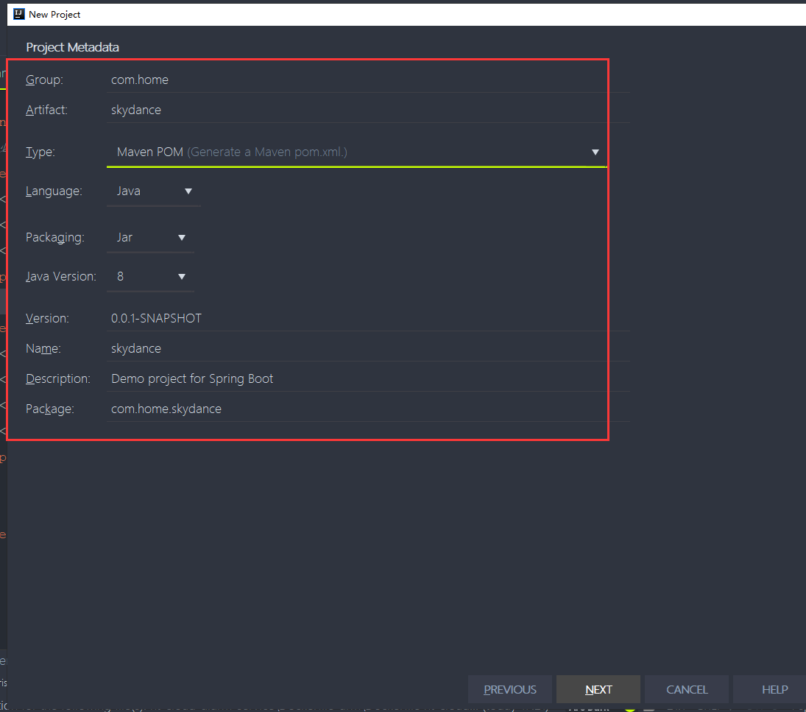


​	设置mysql的驱动--还有携带mybatis框架

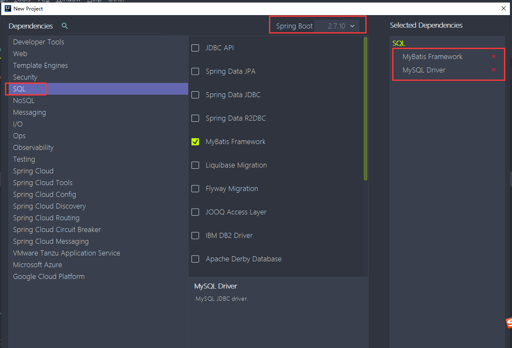


​	项目生成的结构有问题---应该是我们那个地方选择错了

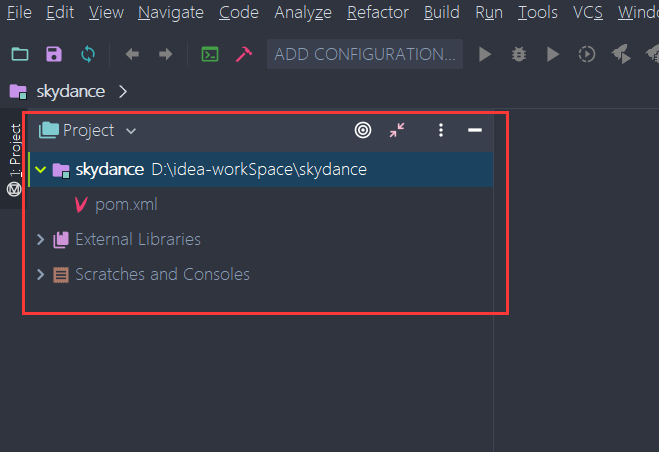


​	原因是Maven 选择的原因---要选择   生成一个maven基础项目

​			不要选择 生成一个maven pom的xml

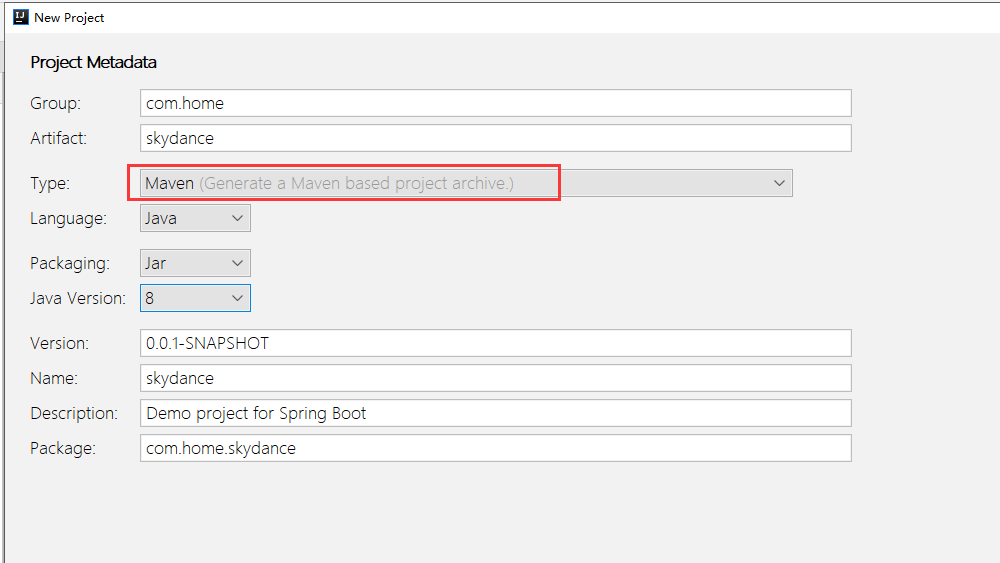


## 	2、pom完整内容

```
<?xml version="1.0" encoding="UTF-8"?>
<project xmlns="http://maven.apache.org/POM/4.0.0" xmlns:xsi="http://www.w3.org/2001/XMLSchema-instance"
         xsi:schemaLocation="http://maven.apache.org/POM/4.0.0 https://maven.apache.org/xsd/maven-4.0.0.xsd">
    <modelVersion>4.0.0</modelVersion>
    <parent>
        <groupId>org.springframework.boot</groupId>
        <artifactId>spring-boot-starter-parent</artifactId>
        <version>2.6.7</version>
        <relativePath/> <!-- lookup parent from repository -->
    </parent>
    <groupId>com.home</groupId>
    <artifactId>skydance</artifactId>
    <version>0.0.1-SNAPSHOT</version>
    <name>skydance</name>
    <description>skydance</description>
    <properties>
        <java.version>1.8</java.version>
    </properties>
    <dependencies>
        <dependency>
            <groupId>org.mybatis.spring.boot</groupId>
            <artifactId>mybatis-spring-boot-starter</artifactId>
            <version>2.2.2</version>
        </dependency>
 
        <dependency>
            <groupId>org.springframework.boot</groupId>
            <artifactId>spring-boot-starter-web</artifactId>
        </dependency>
        <dependency>
            <groupId>mysql</groupId>
            <artifactId>mysql-connector-java</artifactId>
            <scope>runtime</scope>
        </dependency>
        <dependency>
            <groupId>org.springframework.boot</groupId>
            <artifactId>spring-boot-starter-test</artifactId>
            <scope>test</scope>
        </dependency>
        <dependency>
            <groupId>org.junit.platform</groupId>
            <artifactId>junit-platform-commons</artifactId>
        </dependency>
    </dependencies>
 
    <build>
        <plugins>
            <plugin>
                <groupId>org.springframework.boot</groupId>
                <artifactId>spring-boot-maven-plugin</artifactId>
            </plugin>
        </plugins>
        <resources>
            <resource>
                <directory>src/main/resources</directory>
                <includes>
                    <include>**/*.properties</include>
                    <include>**/*.xml</include>
                </includes>
                <filtering>true</filtering>
            </resource>
            <resource>
                <directory>src/main/java</directory>
                <includes>
                    <include>**/*.properties</include>
                    <include>**/*.xml</include>
                </includes>
                <filtering>true</filtering>
            </resource>
        </resources>
    </build>
 
</project>
```


## 3、配置文件

​	application.properties

```
server.port=9001
spring.datasource.url=jdbc:mysql://127.0.0.1:3306/world?&serverTimezone=Asia/Shanghai&useUnicode=true&characterEncoding=utf8&useSSL=false&allowMultiQueries=true
spring.datasource.username=root
spring.datasource.password=root
spring.datasource.driver-class-name=com.mysql.jdbc.Driver

# mapper.xml扫描路径
mybatis.mapper-locations=classpath:com/home/skydance2/dao/*.xml

```

地址/端口/数据库名称：jdbc:mysql://127.0.0.1:3306/world

指定时区：serverTimezone=Asia/Shanghai

指定编码：useUnicode=true

指定字符集：characterEncoding=utf8

禁用SSLuseSSL=false

开启批量执行sql：allowMultiQueries=true


## 4、创建表

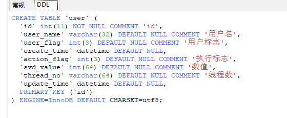


## 5、设置mybatis的maven插件


​	pom引入插件

```
		<!--mybatis自动生成代码，插件-->
            <plugin>
                <groupId>org.mybatis.generator</groupId>
                <artifactId>mybatis-generator-maven-plugin</artifactId>
                <version>1.3.2</version>
                <configuration>
                    <configurationFile>${basedir}/src/main/resources/generator/generatorConfig.xml</configurationFile>
                    <overwrite>true</overwrite>
                    <verbose>true</verbose>
                </configuration>
            </plugin>
            
            
            
```


​	配置生成的配置文件

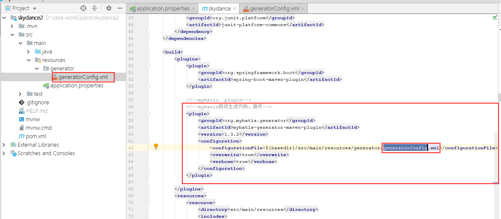


​		generatorConfig.xml

```xml
<?xml version="1.0" encoding="UTF-8"?>
<!DOCTYPE generatorConfiguration
        PUBLIC "-//mybatis.org//DTD MyBatis Generator Configuration 1.0//EN"
        "http://mybatis.org/dtd/mybatis-generator-config_1_0.dtd">

<generatorConfiguration>
    <!--<classPathEntry location="/Program Files/IBM/SQLLIB/java/db2java.zip" />-->
    <!--使用mybatis插件的时候必须要指定classPathEntry-->
    <classPathEntry location="D:\apache-maven-3.3.9\ht_repository\mysql\mysql-connector-java\5.1.41\mysql-connector-java-5.1.41.jar"/>
    <!--id=Mybatis3Context-->
    <context id="DB2Tables" targetRuntime="MyBatis3">
        <!--  <property name="javaFileEncoding" value="UTF-8"/>-->
        <commentGenerator>
            <property name="suppressDate" value="true"></property>
            <!--是否自动去除注释-->
            <property name="suppressAllComments" value="true"></property>
        </commentGenerator>
        <!--数据库连接的url，用户名，密码，一定要指明编码方式-->
        <jdbcConnection driverClass="com.mysql.jdbc.Driver"
                        connectionURL="jdbc:mysql://localhost:3306/world?characterEncoding=utf-8"
                        userId="root"
                        password="123456">
        </jdbcConnection>

        <javaTypeResolver>
            <property name="forceBigDecimals" value="false"/>
        </javaTypeResolver>
        <!--生成模型的包名和位置-->
        <javaModelGenerator targetPackage="com.home.skydance.model"
                            targetProject="D:\idea-workSpace\skydance2/src/main/java">
            <property name="enableSubPackages" value="true"/>
            <property name="trimStrings" value="true"/>
        </javaModelGenerator>
        <!--生成映射文件的位置-->
        <sqlMapGenerator targetPackage="mapper" targetProject="D:\idea-workSpace\skydance2/src/main/resources">
            <property name="enableSubPackages" value="true"/>
        </sqlMapGenerator>
        <!--生成dao接口的包名和位置-->
        <javaClientGenerator type="XMLMAPPER" targetPackage="com.home.skydance.mapper"
                             targetProject="D:\idea-workSpace\skydance2/src/main/java">
            <property name="enableSubPackages" value="true"/>
        </javaClientGenerator>
        <!--tableName:表名
            domainObjectName：实体类名
        -->
        <table tableName="user" domainObjectName="User" enableCountByExample="false"
               enableDeleteByExample="false" enableUpdateByExample="false" enableSelectByExample="false">
        </table>
    </context>
</generatorConfiguration>
```


## 6、多线程定时执行批量任务


#### 	1、重要的第一部分

​			创建线程池

```java
# 获取当前设备的物理 线程数量
Runtime.getRuntime().availableProcessors()

# 然后最大线程数就是这个 -- 
private static final Integer MAXIMUM_POOl_SIZE = CORE_POOL_SIZE;

# 创建线程池 -- 这里注意参数--
    CORE_POOL_SIZE -- 核心线程数
    CORE_POOL_SIZE * 2 -- 最大线程数
    	0 -- keepAliveTime当线程数大于核心时，这是多余空闲线程在终止前等待新任务的最大时间。
    		设置为0 其实就是任务完成 直接关闭线程
    TimeUnit.SECONDS -- 代表的是时间单位 TimeUnit.SECONDS代表-秒 
    new LinkedBlockingQueue<>(100) -- 设置有界队列 -- 最大100个任务排队
private ThreadPoolExecutor pool = new ThreadPoolExecutor(CORE_POOL_SIZE, MAXIMUM_POOl_SIZE * 2, 0, TimeUnit.SECONDS, new LinkedBlockingQueue<>(100));


```

	keepAliveTime的概念：
	keepAliveTime的单位是纳秒，即1s=1000000000ns，1秒等于10亿纳秒。
	keepAliveTime是线程池中空闲线程等待工作的超时时间。
	当线程池中线程数量大于corePoolSize（核心线程数量）或设置了allowCoreThreadTimeOut（是否允许空闲核心线程超时）时，线程会根据keepAliveTime的值进行活性检查，一旦超时便销毁线程。
	否则，线程会永远等待新的工作


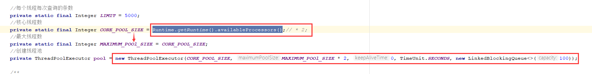


**CPU密集型任务**
这种类型的场景，主要消耗的是CPU资源，可以将线程数设置为（CPU核心数+1）。比 CPU 核心数多出一是为了防止线程偶发的缺页中断，或者其它原因导致的任务暂停而带来的影响。一旦任务暂停，CPU 就会处于空闲状态，而在这种情况下多出来的一个线程就可以充分利用 CPU 的空闲时间。

**I/O密集型任务**
这种任务应用起来，系统会用大部分的时间来处理 I/O 交互，而线程在处理 I/O 的时间段内不会占用 CPU 来处理，这时就可以将 CPU 交出给其它线程使用。因此在 I/O 密集型任务的应用中，我们可以多配置一些线程，具体的计算方法是 2N


#### 2、重要第二部分

​		1.获取需要处理的数据总量

​		2.计算轮次  -- 至少需要一轮处理

​		3.创建一个接收返回结果的集合

​		4.启动核心线程数量的线程--用数据起始位置start 标识线程


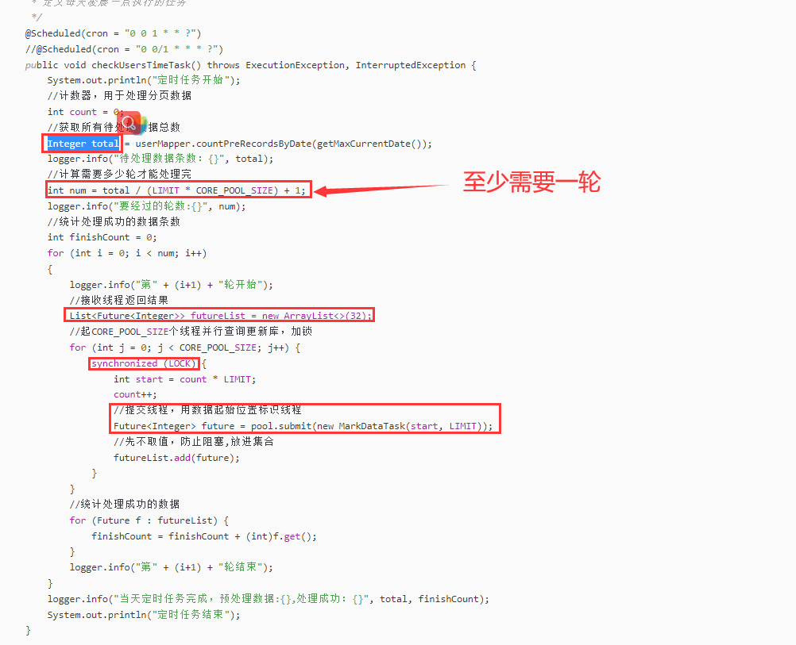


​	处理业务数据

​		selectByDateTime是根据时间分页查询

​		小于当前时间的 5000条数据 进行的操作

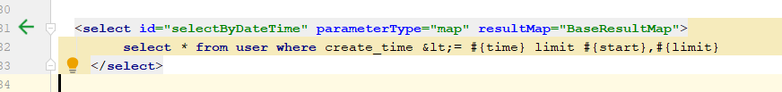


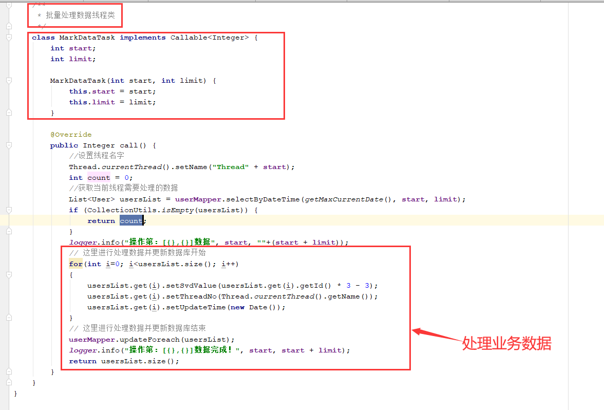


```java
package com.home.skydance.service;

import com.home.skydance.entity.User;
import com.home.skydance.dao.UserMapper;
import org.slf4j.Logger;
import org.slf4j.LoggerFactory;
import org.springframework.scheduling.annotation.EnableScheduling;
import org.springframework.scheduling.annotation.Scheduled;
import org.springframework.stereotype.Component;
import org.springframework.transaction.annotation.Transactional;
import org.springframework.util.CollectionUtils;

import java.time.LocalDate;
import java.time.LocalDateTime;
import java.time.LocalTime;
import java.time.ZoneId;
import java.util.ArrayList;
import java.util.Date;
import java.util.List;
import java.util.concurrent.*;

/**
 * 定义自动执行的任务
 */
@Component
@EnableScheduling
@Transactional(rollbackFor = Throwable.class)
public class CronService {

    private static Object LOCK = new Object();
    private final static Logger logger = LoggerFactory.getLogger(CronService.class);
    private final UserMapper userMapper;
    public CronService(UserMapper userMapper) {
        this.userMapper = userMapper;
    }

    //每个线程每次查询的条数
    private static final Integer LIMIT = 5000;
    //核心线程数
    private static final Integer CORE_POOL_SIZE = Runtime.getRuntime().availableProcessors();// * 2;
    //最大线程数
    private static final Integer MAXIMUM_POOl_SIZE = CORE_POOL_SIZE;
    //创建线程池
    private ThreadPoolExecutor pool = new ThreadPoolExecutor(CORE_POOL_SIZE, MAXIMUM_POOl_SIZE * 2, 0, TimeUnit.SECONDS, new LinkedBlockingQueue<>(100));

    /**
     * 定义每天凌晨一点执行的任务
     */
    @Scheduled(cron = "0 0 1 * * ?")
    //@Scheduled(cron = "0 0/1 * * * ?")
    public void checkUsersTimeTask() throws ExecutionException, InterruptedException {
        System.out.println("定时任务开始");
        //计数器，用于处理分页数据
        int count = 0;
        //获取所有待处理数据总数
        Integer total = userMapper.countPreRecordsByDate(getMaxCurrentDate());
        logger.info("待处理数据条数：{}", total);
        //计算需要多少轮才能处理完
        int num = total / (LIMIT * CORE_POOL_SIZE) + 1;
        logger.info("要经过的轮数:{}", num);
        //统计处理成功的数据条数
        int finishCount = 0;
        for (int i = 0; i < num; i++)
        {
            logger.info("第" + (i+1) + "轮开始");
            //接收线程返回结果
            List<Future<Integer>> futureList = new ArrayList<>(32);
            //起CORE_POOL_SIZE个线程并行查询更新库，加锁
            for (int j = 0; j < CORE_POOL_SIZE; j++) {
                synchronized (LOCK) {
                    int start = count * LIMIT;
                    count++;
                    //提交线程，用数据起始位置标识线程
                    Future<Integer> future = pool.submit(new MarkDataTask(start, LIMIT));
                    //先不取值，防止阻塞,放进集合
                    futureList.add(future);
                }
            }
            //统计处理成功的数据
            for (Future f : futureList) {
                finishCount = finishCount + (int)f.get();
            }
            logger.info("第" + (i+1) + "轮结束");
        }
        logger.info("当天定时任务完成，预处理数据:{},处理成功：{}", total, finishCount);
        System.out.println("定时任务结束");
    }

    public static Date getMaxCurrentDate() {
        LocalDate localDate = LocalDate.now(); //获取今天的日期
        //LocalDate yesterday = localDate.plusDays(-1); //前一天日期是今天减1
        LocalDate yesterday = localDate;
        LocalDateTime startTime = LocalDateTime.of(yesterday, LocalTime.MIN);
        LocalDateTime endTime = LocalDateTime.of(yesterday, LocalTime.MAX);
        return Date.from(endTime.atZone(ZoneId.systemDefault()).toInstant());
    }

    /**
     * 批量处理数据线程类
     */
    class MarkDataTask implements Callable<Integer> {
        int start;
        int limit;

        MarkDataTask(int start, int limit) {
            this.start = start;
            this.limit = limit;
        }

        @Override
        public Integer call() {
            //设置线程名字
            Thread.currentThread().setName("Thread" + start);
            int count = 0;
            //获取当前线程需要处理的数据
            List<User> usersList = userMapper.selectByDateTime(getMaxCurrentDate(), start, limit);
            if (CollectionUtils.isEmpty(usersList)) {
                return count;
            }
            logger.info("操作第：[{},{}]数据", start, ""+(start + limit));
            // 这里进行处理数据并更新数据库开始
            for(int i=0; i<usersList.size(); i++)
            {
                usersList.get(i).setSvdValue(usersList.get(i).getId() * 3 - 3);
                usersList.get(i).setThreadNo(Thread.currentThread().getName());
                usersList.get(i).setUpdateTime(new Date());
            }
            // 这里进行处理数据并更新数据库结束
            userMapper.updateForeach(usersList);
            logger.info("操作第：[{},{}]数据完成！", start, start + limit);
            return usersList.size();
        }
    }
}
```


