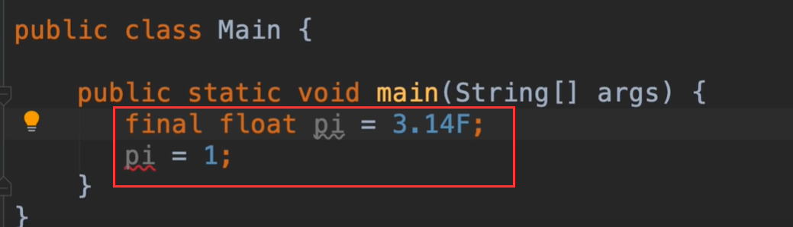
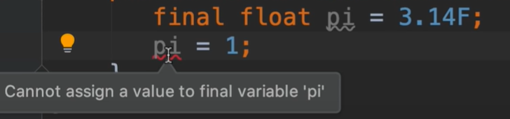

# 5.mosh-常量

## 常量 Constants

​	我们已经学到很多变量的知识，已了解到声明他们时，我们需要初始化他们，并且在整个程序生命周期中，可以更改变量的值，但是有时我们不希望变量的值发生改变

​	例如我们设置变量π的值3.14我们不希望他发生改变

​		我们可以使用final来修饰，这样如果有想改变final修饰的内容直接就报错了

会提示不能给最终的变量赋值

按照惯例--常量应该使用大写字母来命名  PI

