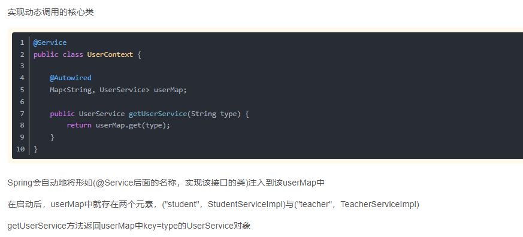

# 5、spring接口多实现如何使用

​			我们平时定义一些service的接口，那么这个接口可能需要有多种实现，我们会根据不同的场景去做不同的实现，所以就需要到了这个如何使用这个多实现的接口

现在假设一个情景，前端传入不同的用户类型，后端返回该用户的任务。

你可能问我，为什么不直接把（用户类型，用户任务）存入数据库？

​		其实使用Map<String, 对象> instance；这种方式注入后，spring会自动的将多个实现放入到这个Map中，key就是，我们在实现类上写的@Server("key")

​	

​		我们在使用的时候 只需要在这个注入的 map 实例上get具体的实现--传入具体实现的key，然后调用方法就可以完成具体的业务了

​			instanceService.get("Key").method();

https://blog.csdn.net/qq_33591903/article/details/104813512