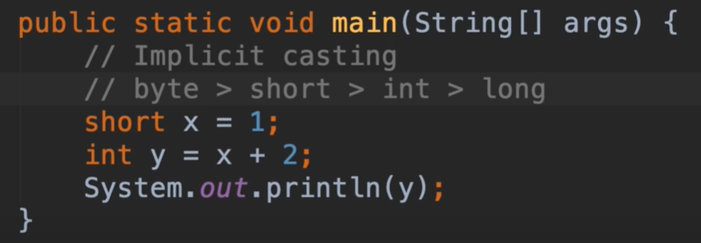

# 6.mosh-算术表达式

​	在Java中我们有与数学相同的运算符，我们有加减、乘除、模数（余数）

​	

​		我们来看几个例子：

我们使用++X 结果也是2

我们看一下这种情况

​	这样的情况会是x先去赋值给y 那么y=1 然后 x++ 那么x =2

如果是++在前，那么先进行++x 运算 x = 2，然后赋值给y y=2

这样的情况是先 进行x+2运算的，然后赋值给x 结果是3 

x=x+2这种情况是可以简写的 简写为 x += 2 意思是 x先加2

x -= 2，代表 x-2   还有 x /= 2等等

表达式的优先级----（）最高

#### 类型转换

​	将short的值 x和 int类型的值2 运算 赋值给y

打印的结果是3

这个是我们所期望的结果--但是我们理解一下背后的执行情况，因为正在处理2种不同的数据类型

​	short 和 int 

参与运算的x会被变为一个匿名的变量，变量将是一个int 的类型 与运算的值类型相同，java会将这个x的值拷贝走然后转为运算的类型，这就是我们所说的**隐式转换**也是自动转换

​		只要我们有一个值，我们就不必担心他，并且值可以转换为更大的数据类型

 从byte 到 long

那么如果是浮点类型呢--这里我们有一个编译错误

​	因为我们需要使用俩种类型中大的一种

隐式转换会转为double

打印的结果是3.1

最终的隐式转换 最大将转为double

**隐式转换**：如果数据丢失怎么办？也就是我们说的精度丢失

​	比如 你希望Y是一个整数

​	这样我们就需要做**显式转换**

​		我们将x转为int类型

结果是3，这样就需要注意了，可能会造成精度的丢失

还有就是显式转换 不能将String转为数据类型

​		相当于我们不能把鸡蛋转化为整数，因为他们不兼容

那么我们如何为这种String类型转换为数值类型呢，就需要使用到包装类了

​		使用包装类型的主要作用就是可以兼容String类型

如果String是想转化为浮点类型的话，使用包装类Double

