# 7.mosh-数学运算

​			java中有个数学运算的类Math

比如我们现在想要进行四舍五入运算 通过round方法

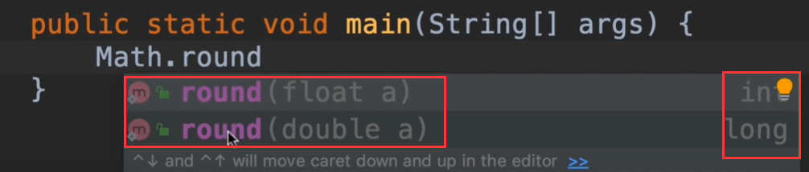

进行flot运算

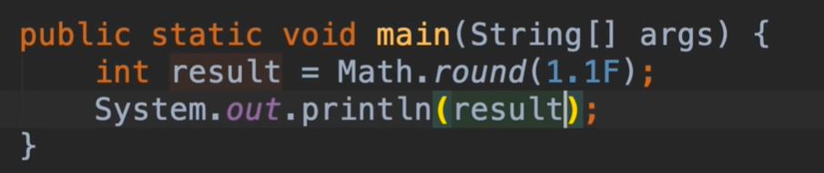

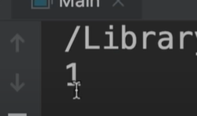

比如使用ceil方法：他是大于等于这个数值的最小整数，比如1.2的上限是2

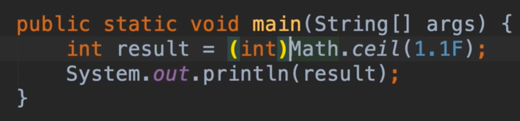

结果是2

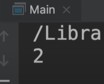

floor方法是数值下限---返回值是1

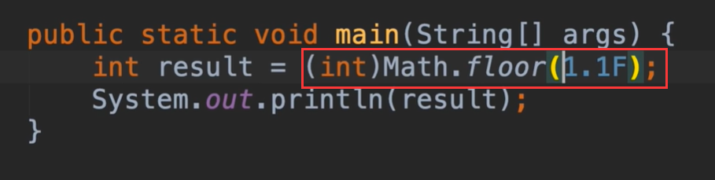

比较返回数值大的max方法 返回值2

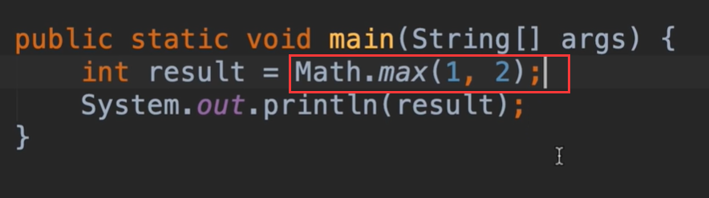

比较返回值小的值min--返回值1

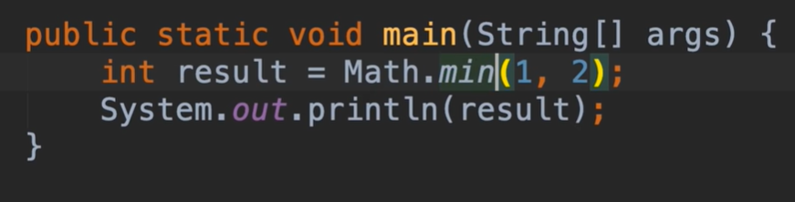

random方法会生成一个介于0和1之间的一个随机值

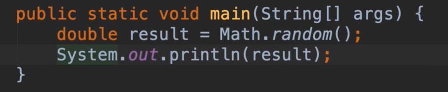

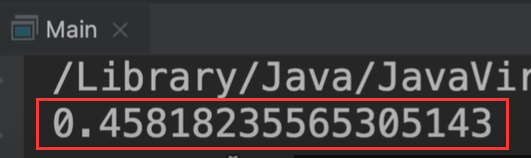

比如说想生成0-100的随机值

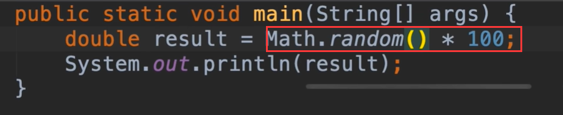

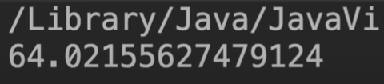

比如再进行一个四舍五入

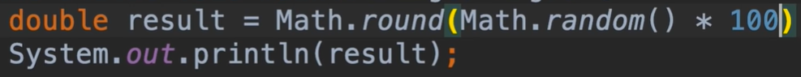

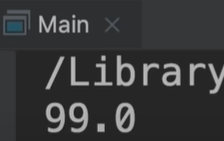

#### 格式化数值

当我们处理一些比如格式化货币的值的时候 比如显示 $1,234,567, 或者是0.1的时候显示为10%

​	下面我们演示一下如何在java中格式化数字

​	在这里我们会使用到NumberFormat这个类，属于java.text包下的，这个类用于处理文本，日期，数字等等

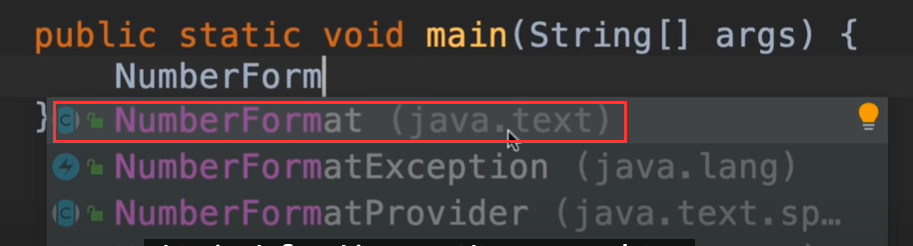

现在我们使用运算符new 实例化一下这个变量

​		会提示错误，说他是抽象的，不能被实例化，所以在java中我们有抽象类的概念，他们基本就像一个半生不熟的蛋糕，我们不能使用 new运算符来创建，**抽象类如何创建实例，以及他们为什么不能创建？**

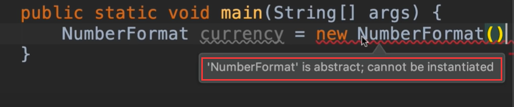

​	我们使用另外一种方式来实例NumberFormat

​		如我们使用getCurrencyInstance方法，可以直接获取到货币的实例，并且返回一个 Number数值类型对象

​		所以我们将使用这样类型的方法而不是new 运算符，其实这就是一个工厂方法，因为他就像一个工厂，它创建返回了一个新的Number对象。

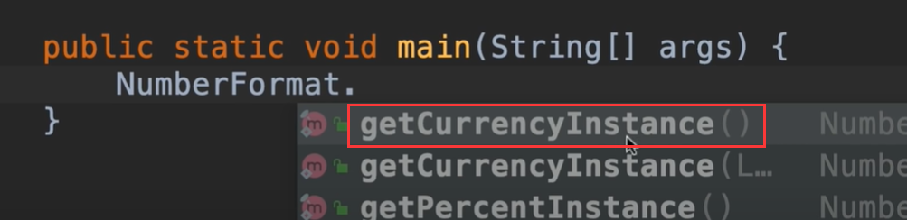

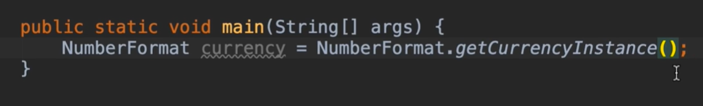

现在我们看一下这个对象格式化值的方法，我们看到很多个format，就是说这个方法被重载了很多个

​		我们可以给他传入一个long或者double或者是其他Object类型

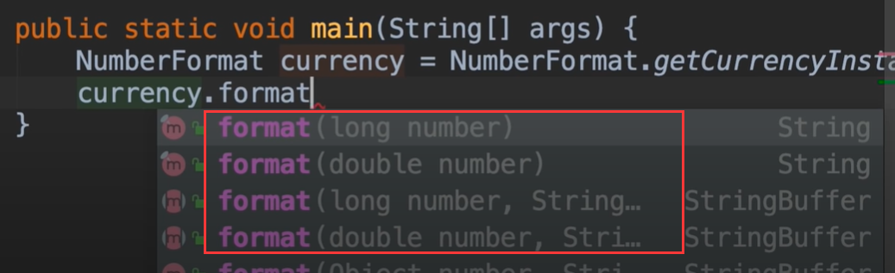

将数字转化为 货币的表达方式---返回的类型是一个String类型

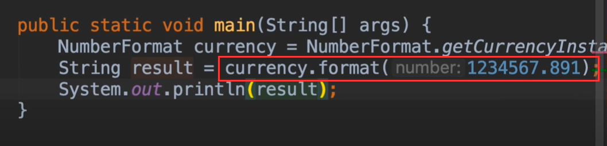

看结果是我们想要的结果

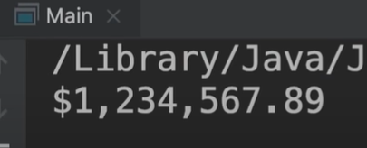

数字格式化百分比的方法 getPercentInstance()

​	我们发现使用了百分比的方法，但是变量的值还是之前的currency货币

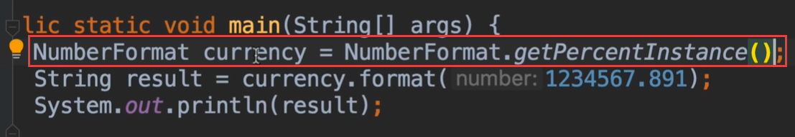

我们在变量上右键--可以看到一个refaceor menu菜单 --Rename 修改名称

​	

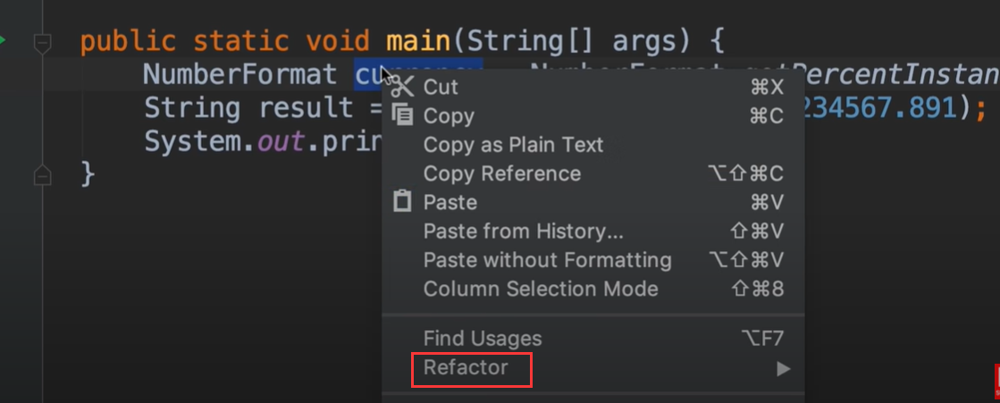

或者我们使用shift + F6 出现一个红框--可以看到一些名称的建议

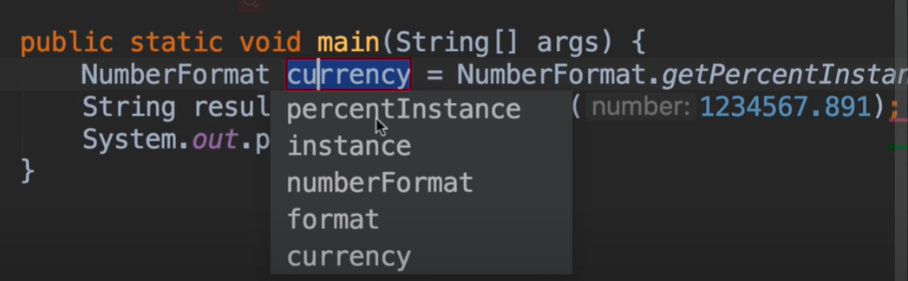

然后当我们使用这个红框后修改内容时，发现下面引用他的地方也就自然发生改变了，这个非常有用

​		然后我们按Enter完成了变量名称的修改

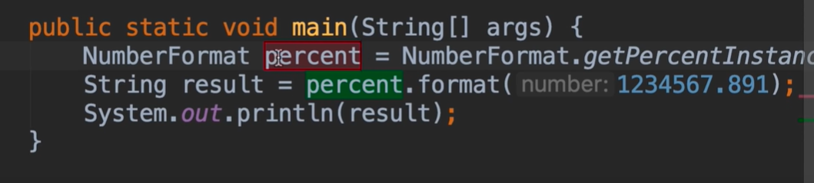

我们查看一下这个0.1的百分比

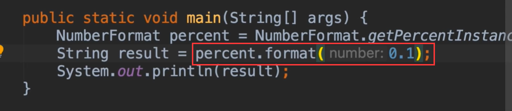

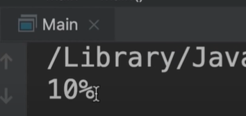

我们还可以简化一下--直接通过getPercentInstance获取到实例，然后调用实例的方法，传入参数，获取到返回的String类型对象

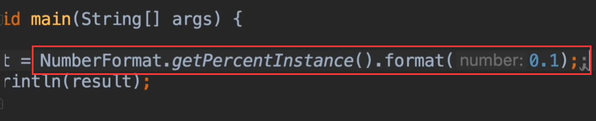

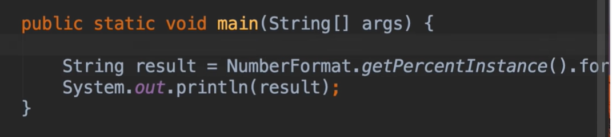

