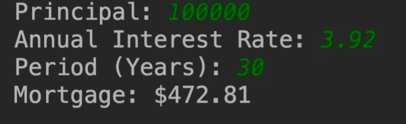
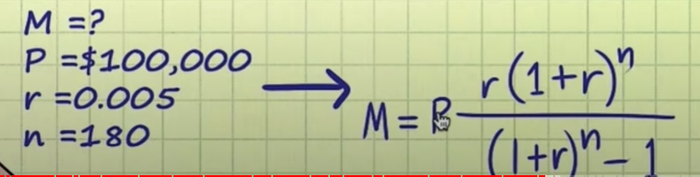

# 9.mosh-抵押贷款计算器


现在我们做一个小项目：抵押贷款计算器（我们将之前学习的知识点串联一下）

​	我们会遇到几个问题 1.需要输入贷款金额，2.需要输入年利率，3.然后以年为单位输入贷款年限

​	然后该计算器会帮助我们计算出每月的月供 并且显示为一种货币格式




​			


我们先了解一下抵押贷款的计算公式

P是本金也就是贷款金额，r是 月利率 n就是付款的次数

​	考虑到r月利率要使用%百分比的方式表示，那么计算实际的月利率就需要 目前年利率3.92 / 100 然后在除以 12就得到月利率了

​		p = 100000 贷款金额

​		r = 3.92  / 100 / 12 = 0.0392 / 12 

​		n = 30年 * 12 ---是付款的次数

​		注意：n的幂 ，这里就需要使用到数学类 math的幂的方法了




我们实现一下吧

```java
package com.mosh;

import java.text.NumberFormat;
import java.util.Scanner;

public class Main {

    public static void main(String[] args) {
        final byte MONTHS_IN_YEAR = 12;
        final byte PERCENT = 100;

        Scanner scanner = new Scanner(System.in);
        System.out.println("Principal 输入贷款金额：");
        int principal = scanner.nextInt();

        System.out.println("Annual Interest Rate 请输入年利率：");
        float annualInterest = scanner.nextFloat();
        float monthInterest = annualInterest / PERCENT / MONTHS_IN_YEAR;

        System.out.println("Period （Years）输入贷款年限：");
        byte years = scanner.nextByte();

        //支付次数 月数
        int numberOfPayments = years * MONTHS_IN_YEAR;

        double mortgage = principal * (monthInterest * Math.pow(1 + monthInterest, numberOfPayments))
                / (Math.pow(1 + monthInterest, numberOfPayments) - 1);

        // 计算出月供 然后以金额的格式输出
        String mortgageFormatted = NumberFormat.getCurrencyInstance().format(mortgage);
        System.out.println("Mortgage 月供是：" + mortgageFormatted);

    }
}


```


