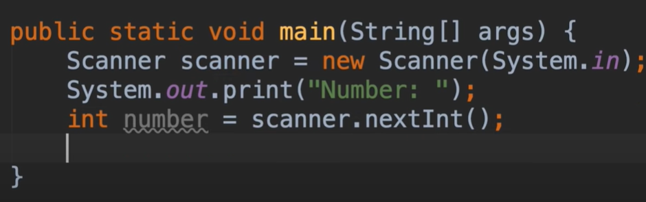
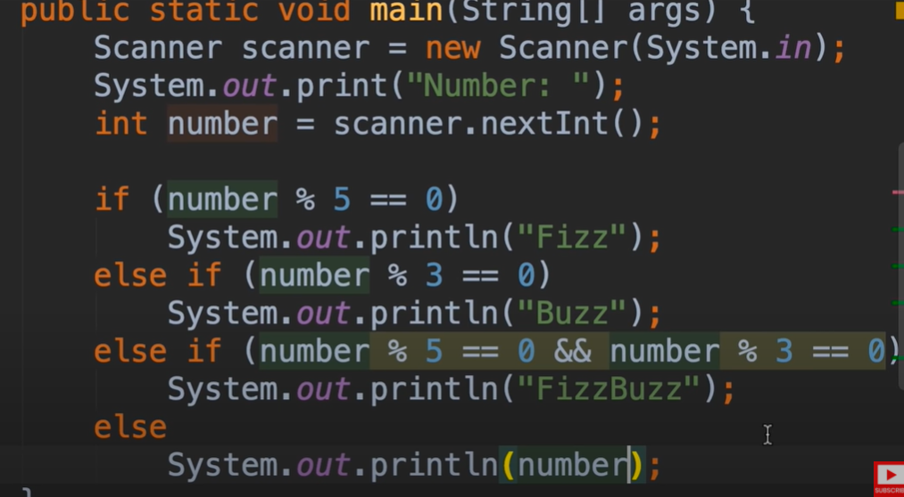
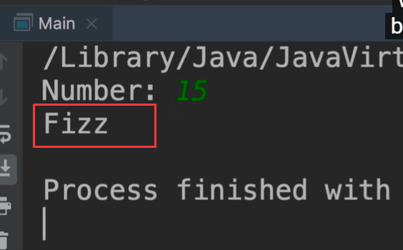
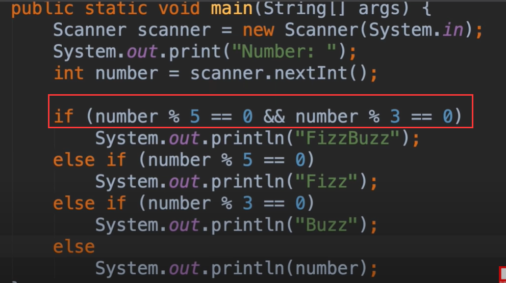

# 13.mosh-练习Exercise-FizzBuzz

​	现在是时候练习一下 一个流行的面试题

​			编写一个程序，如果这个数字可以被5整除，你将返回一个Fizz，如果这个数字能被3整除就返回buzz

如果这个数据既可以被3整除又可以被5整除，比如15，则返回fizzBuzz，如果是不能被整除的我们就显示他输入的数字

首先第一部分代码是：创建终端输入实例 和 读取终端输入

然后初步代码是这样

有个问题

​	当我们输入15的时候发现和我们预想的结果不一致 预想的是 FizzBuzz

因为在 第一个if number % 5 == 0 判断为真，之后的判断就不会继续往下执行了，所以没有执行到后面的代码

在这种情况下，我们要把最通用的判断放到最外层才可以--这样就没有问题了

​	有些人争辩说，我们已经重复了这个number % 5 == 0 这个表达式，考虑是不是将重复的省略掉，我们这里使用另外一种方式处理嵌套的使用呢？其实在我看来这种方法有点业余和丑陋，因为这些嵌套的if else语句是一种不好的做法，这是不是很糟糕，这些嵌套的次数越多，你的代码对其他人来说就越混乱，所以我们更喜欢原来的解决方案。

​	即使代码中有一些重复，你编写的程序越多，你构建的软件就会思考权衡各种方案，每个方案都有一定的有点和缺点

