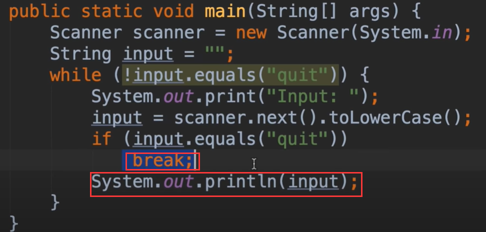
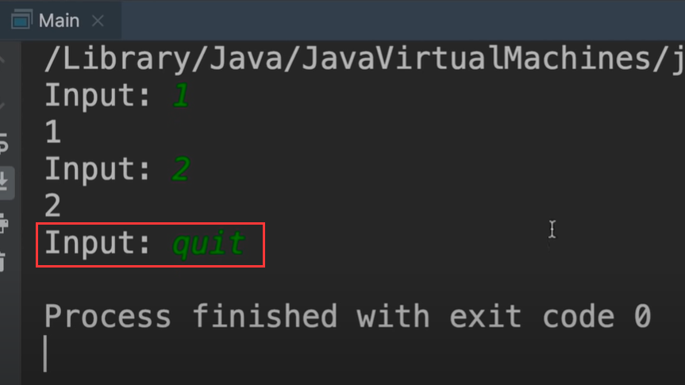
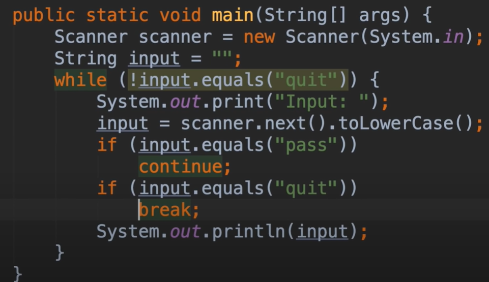

# 15. mosh- break and Continue

我们可以使用break跳出循环，break后将不再执行循环内部 break下的其他内容，循环也会被终止

输入quit后 并没有执行后面的打印语句

如果是我们不想回显他，并且不想终止循环呢，我们可以使用continue，他将指向循环的开始，continue下的代码也将被忽略掉，不会执行

​		回顾一下：break是终止一个循环，而continue是 将控制异动到循环的开头

