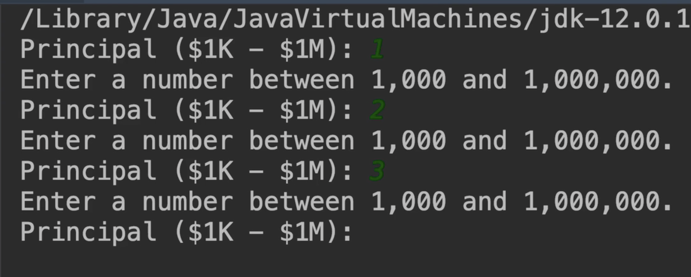
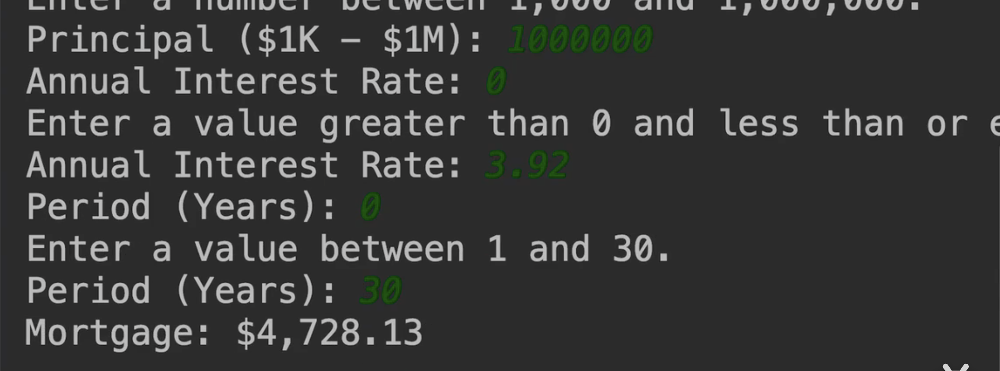

# 17.mosh-项目抵押计算器


​		现在我们回到我们的抵押贷款计算器，实现一些基本的功能

​		需求是：1.我们可以贷款的总额是 1000-100万美元

​		必须是输入1000-100万之间的数字，否则会提示然后重新输入-如果一直输入不在此区间就一直输入




​	需求2.输入完贷款金额后，我们输入年利率

​		年利率必须是大于0小于30 的值，否则就提示然后需要重新输入

​	需求3.输入贷款年限-然后最后得到结果 是月供金额




第一次实现：

```java
package com.company;

import java.text.NumberFormat;
import java.util.Scanner;

public class Main {

    public static void main(String[] args) {

        //一年12月
        final byte MONTH_IN_YEAR = 12;
        //百分比
        final byte PERCENT = 100;

        //贷款年限
        int numberOfPayments = 0;

        int principal = 0 ;
        float monthlyInterset = 0 ;

        Scanner scanner = new Scanner(System.in);

        while (true){
            System.out.println("输入贷款金额：");
            principal = scanner.nextInt();

            if (principal >= 1000 && principal <= 1_000_000){

                break;
            }
            System.out.println("请输入金额范围 1000 --- 1_000_000 ");

        }

        while(true){
            System.out.println("请输入年化利率 ");
            float annualInterest = scanner.nextFloat();

            //判断年利率是否在范围
            if (annualInterest > 0 && annualInterest <= 30){
                //计算得出月利率
                monthlyInterset = annualInterest / PERCENT / MONTH_IN_YEAR;

                break;
            }
            System.out.println("请输入 0 -30之间的年化利率");

        }

        while (true){
            System.out.println("请输入贷款年限");
            int years = scanner.nextInt();
            if (years >= 1 && years <= 30){
                numberOfPayments = years * MONTH_IN_YEAR;
                break;

            }
            System.out.println("请输入贷款年限 1 - 30 年期间");
        }


        //计算月供
        double mortgage = principal * (monthlyInterset * (Math.pow(1 + monthlyInterset, numberOfPayments)))
                / (Math.pow(1 + monthlyInterset, numberOfPayments) - 1);


        //格式化金额
        String mortgageFormatted = NumberFormat.getCurrencyInstance().format(mortgage);
        System.out.println("月供金额是" + mortgageFormatted);


    }
}

```


​	


