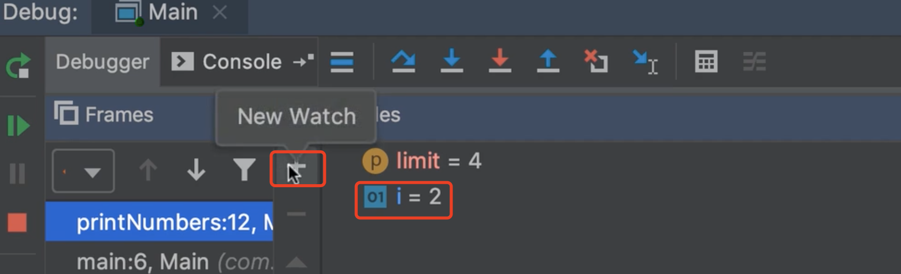

# 20.mosh-types-Error

​	在构建java应用程序时，我们遇到俩种类型的错误

- 编译错误
- 语法错误

​		这些错误会阻止我们编译应用程序，当我们不遵循java语言的语法时，就会发生语法错误

其他错误是发生在运行时，当我们运行程序时可能会发生Run time errors

compile time errors ：大多数情况下我们的代码编辑器会告诉我们，关于这个错误的信息

run time errors ： 这些错误比较棘手，我们需要使用一个名为debugger的调试器，来调试我们的程序。有了这个我们逐行运行代码，并查看各种变量这能帮助我们确定问题的根源。

在本节中，我们展示如何调试应用程序使用intellij

#### 1、编译时错误

​		我们先看一下编译时错误

Common Syntax Errors：常见语法错误

​	例如--

#### 2、debugger

跨步运行--就是一行一行执行

左侧的刷新按钮--可以让我们重新运行（可能我们需要重复的验证）

Step into 介入：这个按钮是进入方法内部

new Watch：如果我们想观察某个变量点击 + 新建观察的变量

我们可以输入一个变量的名称：比如变量 i

如果我们调试完成了记得把这些观察的变量删除掉

直接运行到下一个断点

跳出这个方法： 这个方法内的代码都会执行完毕，到调用这个方法的地方停止

让窗口显示所有被调用的方法：按照相反的顺序，在这个Frames这个窗口中我们可以看到调用相反的顺序，因为所有的方法被调用的堆叠在一起，这真的很有用

​		如果是调试大型应用程序的时候，可以在某个地方设置断点，在代码的中间，看看框架窗口（Frames），可以看到你是如何到达那里的，你可以看到所有被调用的方法，并且可以到达这个点，非常非常有用的。

​		这都是关于java调试应用程序的每个开发人员都必须掌握的一项非常重要的技能

