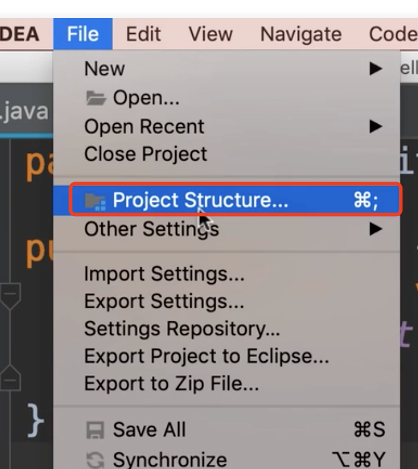
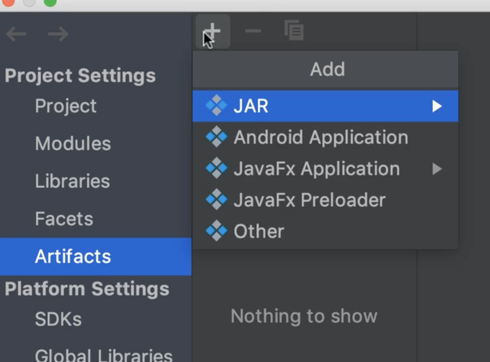
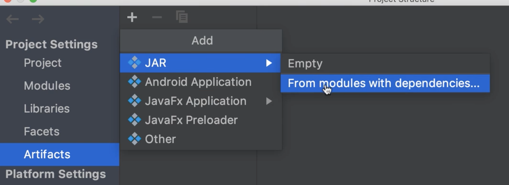
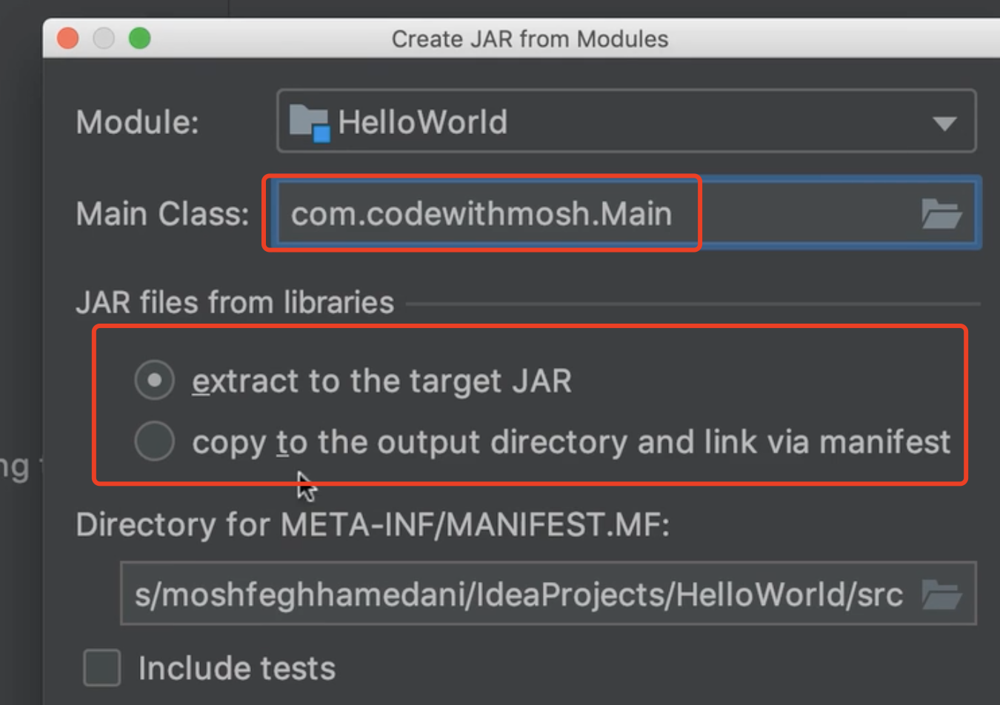
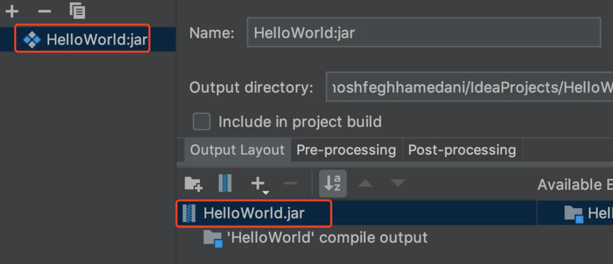
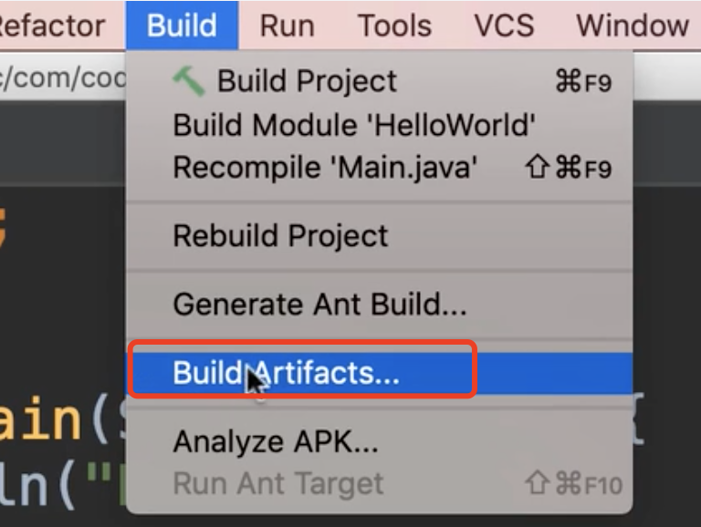
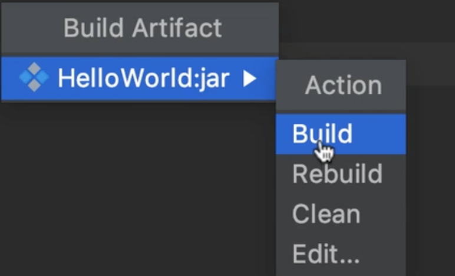
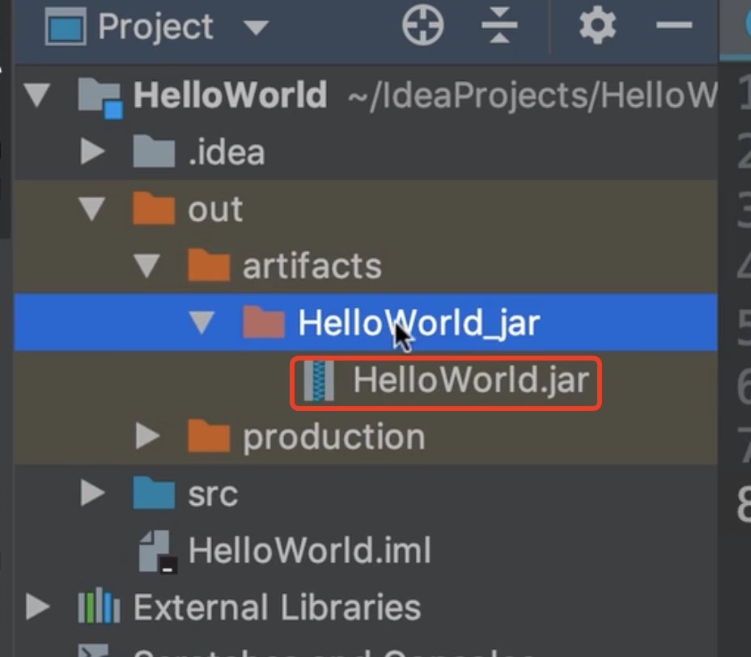
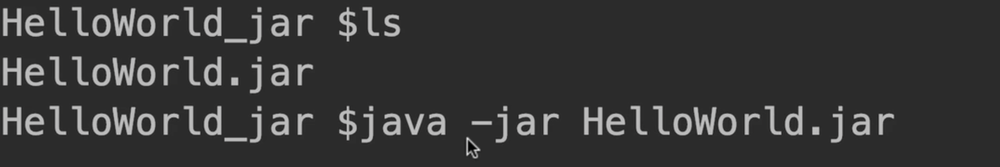

# 21.mosh-Packaging打包应用

​	packaging Application：打包应用

​		我们最不想讨论的是部署应用程序，部署一个java应用程序，你想部署他以便别人使用这个应用程序。

​	假设：现在已经构建一个java程序，并希望提供给别人使用，你需要将代码打包成jar文件，它是一种包文件格式，一旦有了他你就可以给安装了java运行环境的人使用了

创建jar文件：使用Intellij

​	idea的菜单 有file--》project Structure

然后在左侧我们选择 Artifacts:工件

​	Artifacts是我们所有项目的组合，是我们整合的资产

现在我们添加一个工件Artifacts

​	我们有各种各样的工件

我们将使用jar-- 》From modules with。。。

我们选择主类，然后选择依赖Libraries的使用方式

​		点击ok

好了--现在我们就构建好这个jar的工件了

然后我们在菜单上点击构建-build --构建工件

然后我们可以 构建、重新构建、清除（将删除目录中的全部文件），和编辑

点击构建后，我们看一下生成的jar包

我们在jar包上右键--然后进入终端 open in terminal

