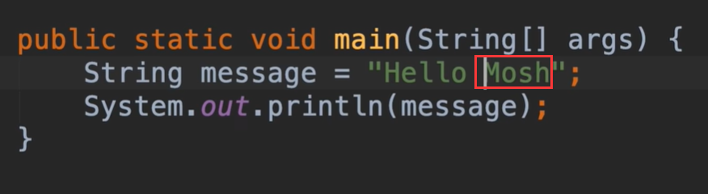
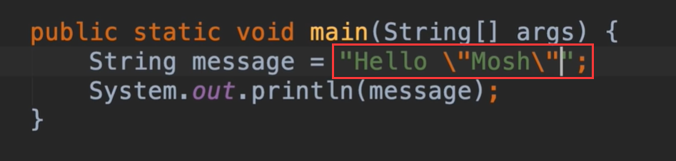
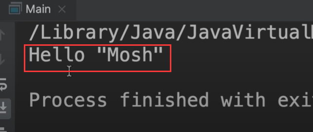
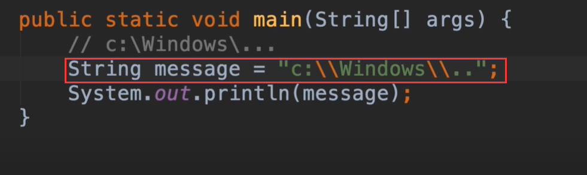
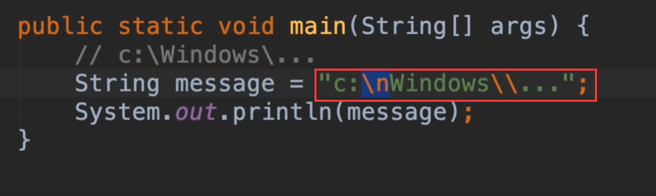

# 3.mosh-转义序列

## Escape Sequences--转义序列

​	有时我们的字符串会包括特别的字符，像制表符，换行符，反斜杠，现在我们处理如何正常展示这些字符的问题

比如我们现在想让Mosh这个字符串 显示为"Mosh",如果我们直接添加引号的话，编译器是会报错的，它认为已经有引号了，它不理解你的含义，这就是为什么会有编译错误的问题了

要处理这个问题 我们在引号前加 反斜杠，使用这个反斜杠我们就可以让编译器明白我们这个属于内部的符合表示

如果我们想在字符串显示\反斜杠，那么就需要双层转义一下 一个\反斜杠用俩个来表示

如果我们想显示\n的话，发现控制台给我们换行 了---都需要加入俩个\\进行转义处理

