# 4.mosh-Array

## 关于java的数组

​		我们使用数组来存储项目列表,比如 数字列表或 人员列表，或者是消息列表

我们需要使用方括号，来表示数组

​	因为数组类型是引用类型--所以我们都需要new 运算符

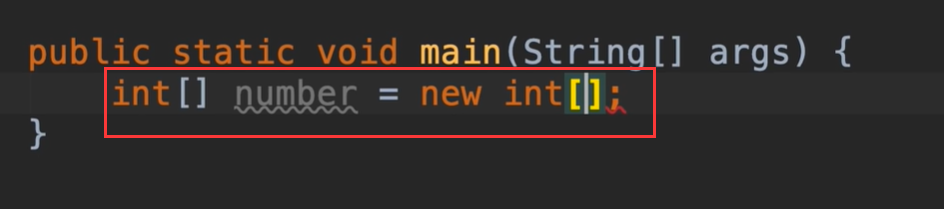

然后我们指定这个数组的长度或大小，如我们指定5

​	如果我们使用一个无效的索引 比如10 会发生什么呢

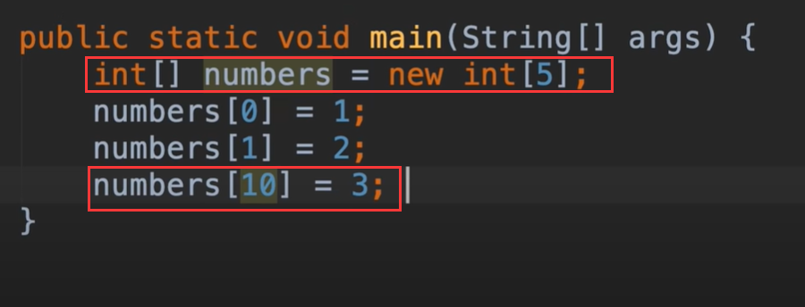

我们运行项目--发现程序奔溃了--所以我们要注意这种情况的发生

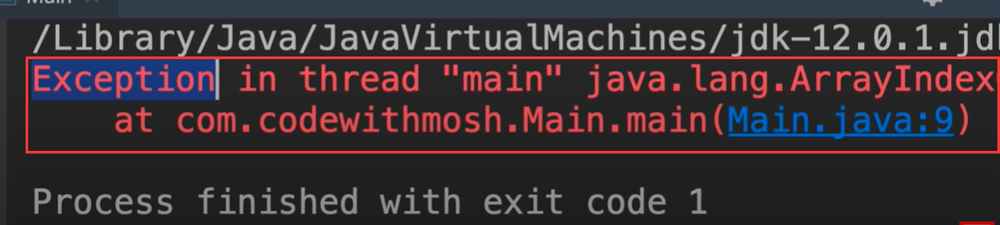

然后我们将这个数组输出一下，看看得到什么

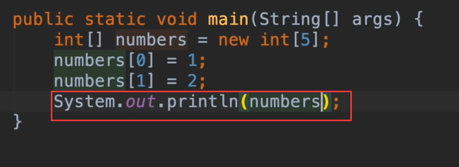

我们得到的是奇怪的字符串-而不是我们数组中的值

​	这是我们默认的原因，打印一个数组java返回的字符串是根据内存地址计算的，所以我们打印的数组是看不到数值的，看到了和我们预期不一样的东西，因为每个数组对象都将在一个不同的内存空间

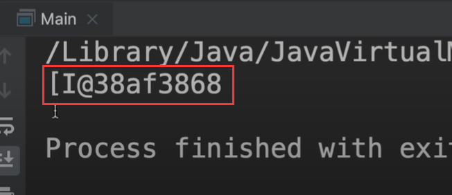

那么我们如何才能看到实际的数组的值呢？

​	我们在java中有一个名为Arrays的类，我们使用他调用一个字符串的方法toString()并传递我们的数组

这将返回字符串

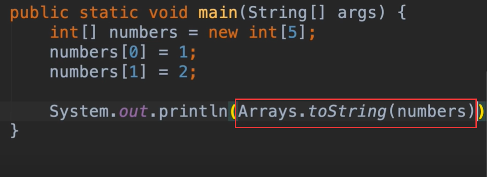

​		

​			后面的3项没有设置值也会被初始化设置为0

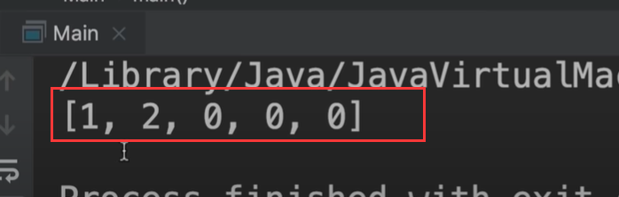

以上是创建数组比较旧的方式，现在我们有新的创建数组的方式

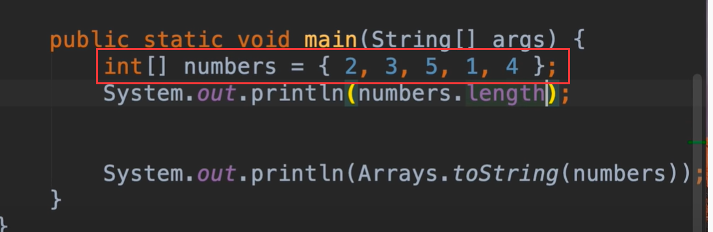

#### 多维数组

​	例如我们创建一个2乘3的矩阵 二维数组，我们添加2行三列

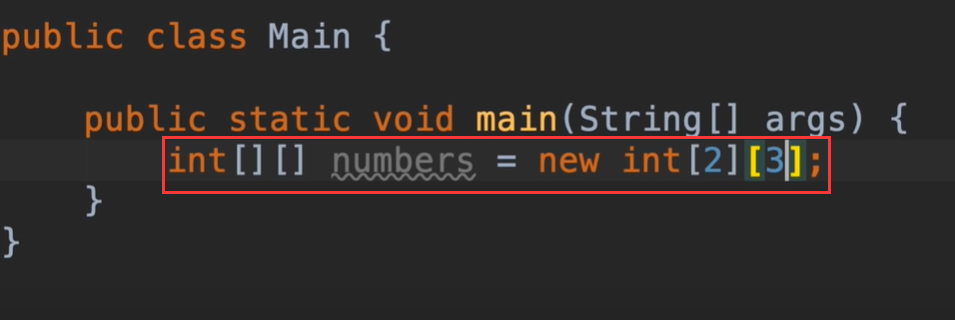

我们给第一行-第一列添加一个值，然后打印一下

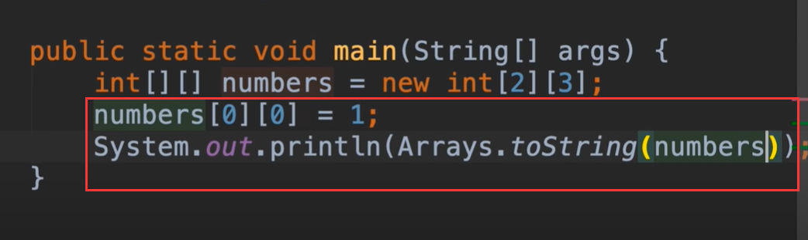

发现再次得到奇怪的字符串

​	因为我们使用的是多维数组，为了解决这个问题，我们需要使用另外一个方法 称为 深度 toString，deepToString

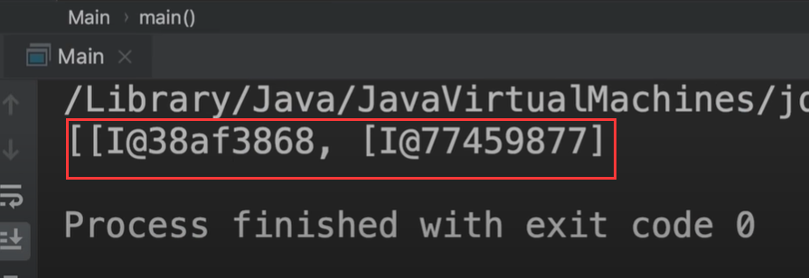

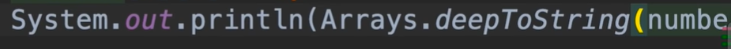

查看一下结果

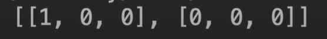

也可以创建一个三维的数组，我们现在使用简易方式创建一个二维的数组

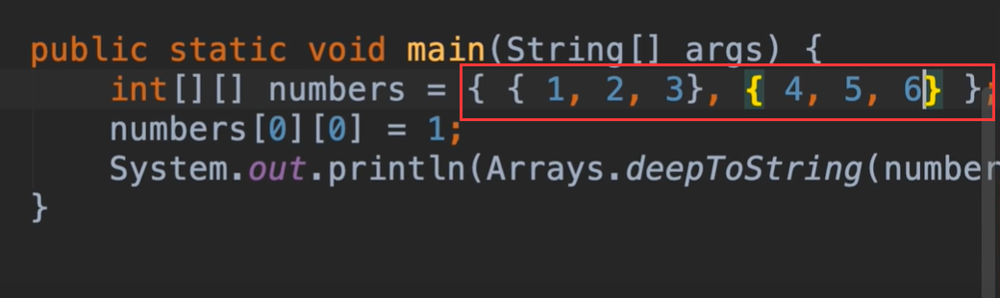

