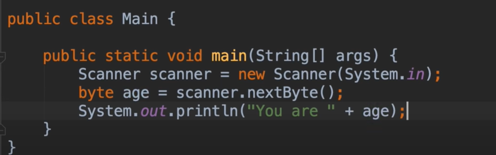

# 8.mosh-Read&input

读取和输入

​		java有一个扫描仪对象：Scanner，属于java.util包下

​		这个括号内需要指定，我们到哪里读取数据--我们现在想要从**终端窗口**读取数据

​		那么我们就输入参数 System.in

​	System是一个系统类 System.in 就是终端输入的方法

​	例如我们平时打印内容使用System.out.Println(),这个其实就是调用系统类的输出方法，输出在终端

读取数据的方法，所有的这些System类下的方法，都是从next开头的

​		例如我们读取一个Byte就使用nextbyte,读取一行数据就使用nextLine

测试一下：

​		这个You are 是字符串 + age是Byte类型，在这种情况下，我们将发生隐式转换

​		因此java会将自动把这个字符串转换为 byte类型进行 与 age 的运算，以便将他们添加到一起

如果我们输入一个浮点数，则会发生异常

因为这个nextByte只能解析 Byte类型的值--如果我们需要解析浮点类型的 需要使用 nextfloat 或者 nextdouble方法来解析

如果想解析String类型的输入 直接使用next方法就可以

当我们输入一个全名的时候，我们发现打印了名 却没有打印姓

​		这是因为我们每次调用next方法时，都是获取一个tokens，这里有一个空格所以我们这里有俩个tokens

所以我们需要调用2次 next方法，才可以获取到全名称

需要调用2次next方法，然后组合在一起，这种并不理想，所以我们可以使用另外一个方法就是读取一整行内容

​	无论有多少空格和制表符，都可以完全输出一行全部的内容

​	没问题完全输出了

