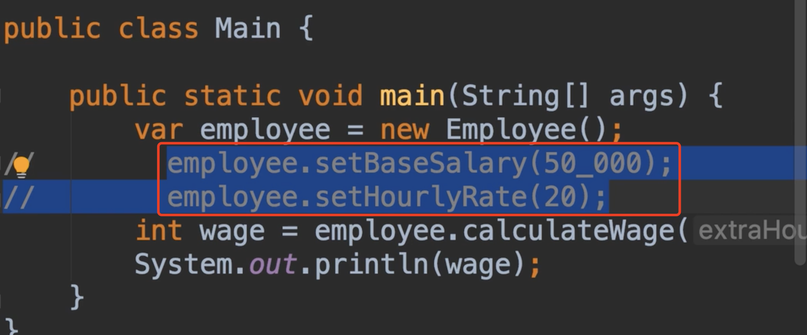
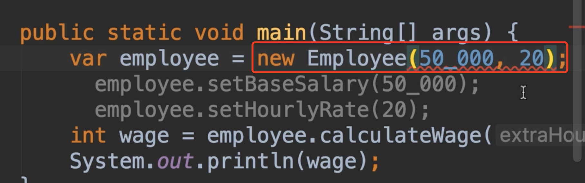
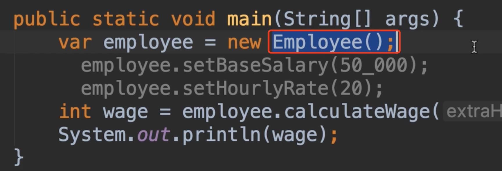
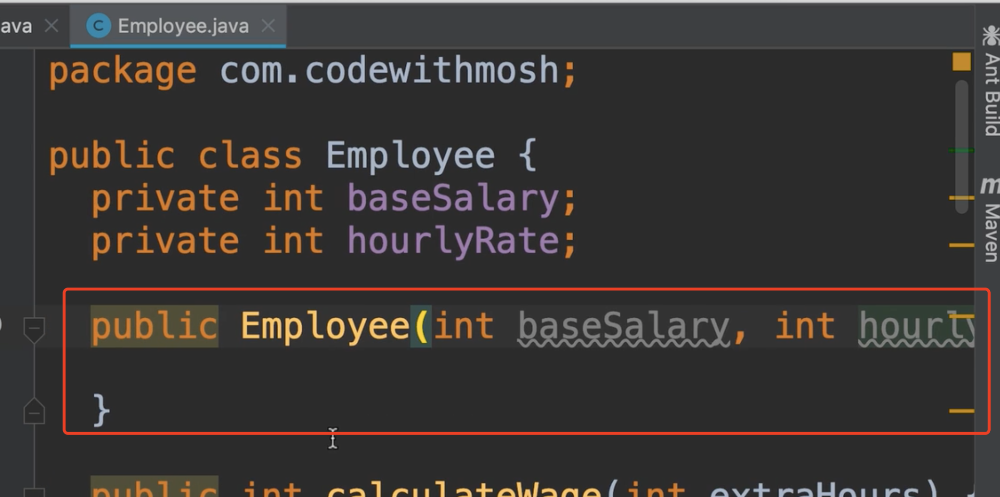
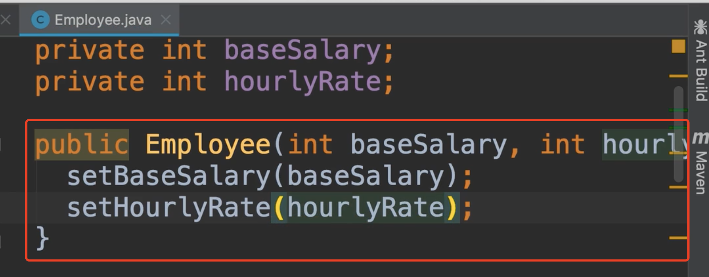
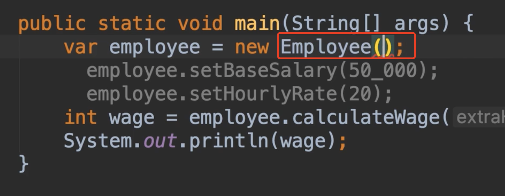
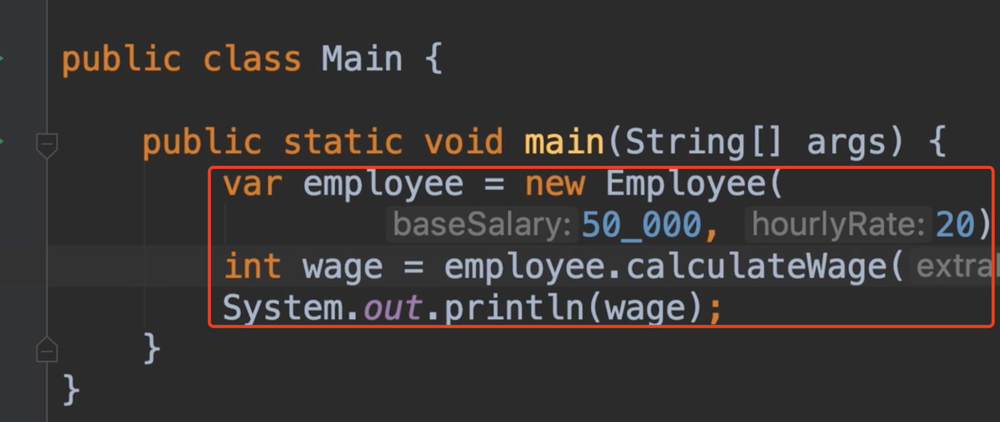
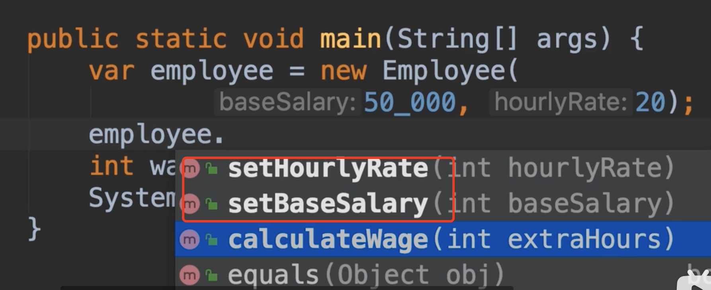

# 10.Constructors构造器

​	我们回到之前的员工的计算工资的方法中，有个问题，如果我忘记了设置他们的基本工资和，小时工资怎么办？计算的总工资将没有意义，结果将是0

​		这里我们将是一个糟糕的实现，因为使用employee的人必须记住调用这些方法是有序的，这是糟糕的设计，我们不想强迫我们类的使用者以特定的方式使用他们，这就像一个神奇的遥控器，迫使你在换频道的时候先按a再按b，这真的很奇怪，所以我们希望使用这个类的接口尽可能的简单，我们想减少猜测工作，我们该如何做？

​	我们希望是在创建对象的时候，初始化这些状态，所以我们需要传入参数的方式构建对象

​	这里我们发现报错了，因为目前并没有构造函数

​	构造函数是一种特殊的方法，当我们创建新对象时，他被调用

​	看这个Employee()它看起来就像是在调用一个方法，实际上我们有这个方法在Employee的类中，只不过不是我们创建的，而是java编译器自动创建的这个方法，这个方法是什么构造函数，就是用于构建新的Employee对象的，这个默认的构造函数会给我们初始化值，原始类型int是0，boolean类型是false，引用类型是null

​	现在我们在Employee类中创建一个构造函数，它没有返回类型，也没有void，方法名称与类名一致，我们设置2个参数，有了这个构造函数，java编译器就不会为我们创建默认的构造函数了，我们可以根据这里接收的值来初始化我们的字段值

​	然后在内部会使用我们的Setter方法进行对值的初始化操作

​	回到主类main，我们会看到一个错误，因为我们自己创建了构造器，编译器就不会帮我们创建了

​	然后我们设置一下传入的值

​	现在我们只有3行代码，代码更简洁了，所以我们使用构造函数创建我们的对象，如果不创建构造函数，java编译器会自动为我们创建一个，这称为默认构造函数（它将初始化所有字段为默认值）

​	现在还有个问题，假设我们已经创建对象使用构造器初始化字段值了，如果我们不想改变Employee中的基本工资和小时工资的话，因此我们可以再次使用抽象的原理把他们隐藏起来。如果不隐藏调用这些setter方法是会被重新设置值的，如果需要可能会重新设置就可以保留，看需求

