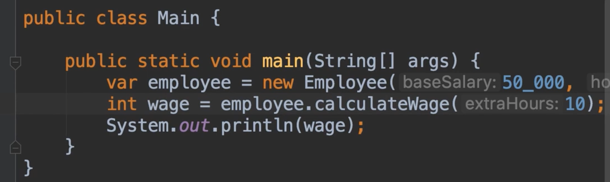
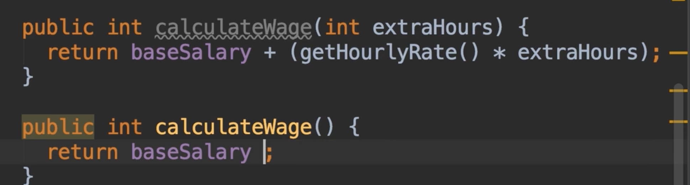
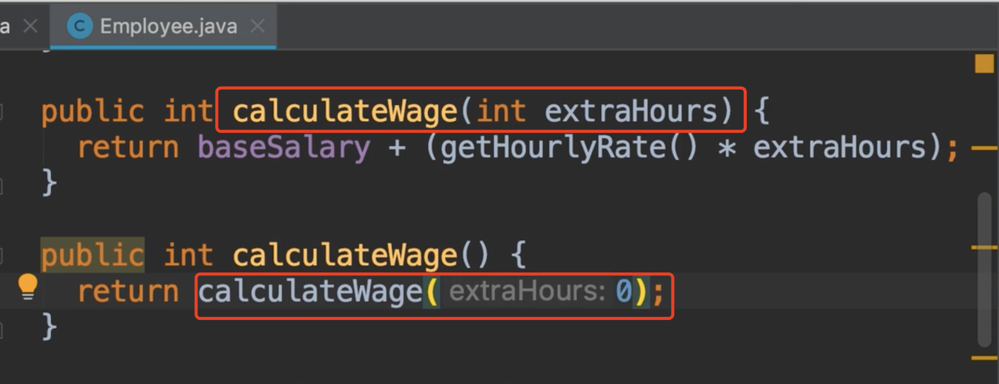

# 11.方法重载

​		有些情况下，对于不同的参数我们需要不同的方法实现

​		例如：这个计算工资的方法，现在我们把10个小时作为加班时间，但是如果这个员工不加班，过去你会创建一个不同的实现接收所有参数

方法重载意味着，他的不同实现具有不同参数，我们看一下Employee类

按command + D复制--然后去掉加班时间参数

另外一种实现是调用计算工资的方法传入0的加班时长

​		但是请记住，重载方法的次数太多，将使你的程序难以维护，因为最终会遇到很多变化，这些方法会互相调用，结果变的很糟糕。个人而言不想方法太多，可以适当使用但不要过度使用。

