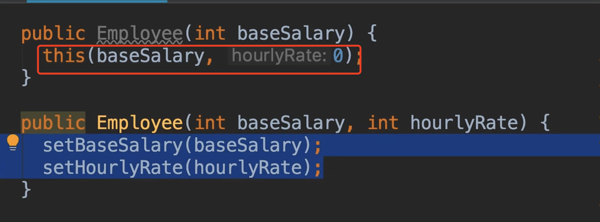
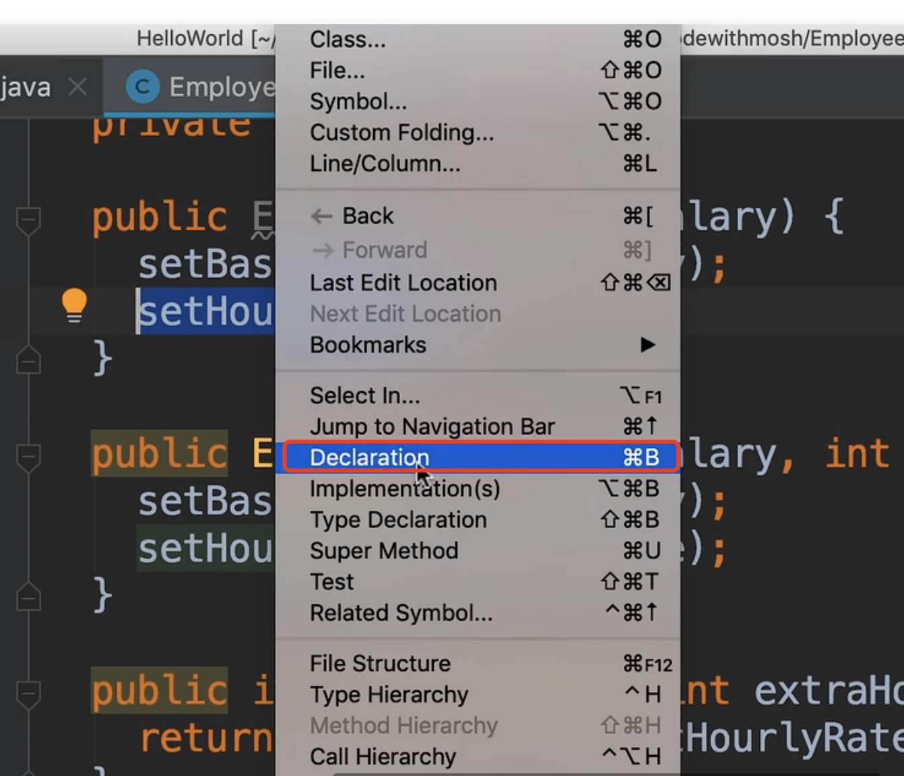
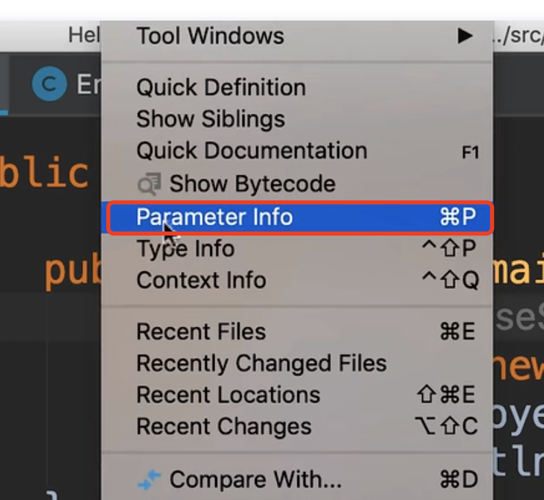

# 12.构造函数重载

​		Constructor Overloading 构造器重载

​		前面我们学习了方法重载，我们也可以重载构造函数，因为从技术上讲，构造器也是一种方法。

​		例如：在创建Employee对象时，我们想象一下我们的一些员工，他们有基本工资，给个月也可以加班可以不加班，我们不想通过重载方法的方式处理，我们更喜欢重载构造函数的方式

​	command + b 可以快速调到光标所选的方法

现在我们回到main主类中

 new Employee（10000）；

查看方法参数的快捷键 Command + P

