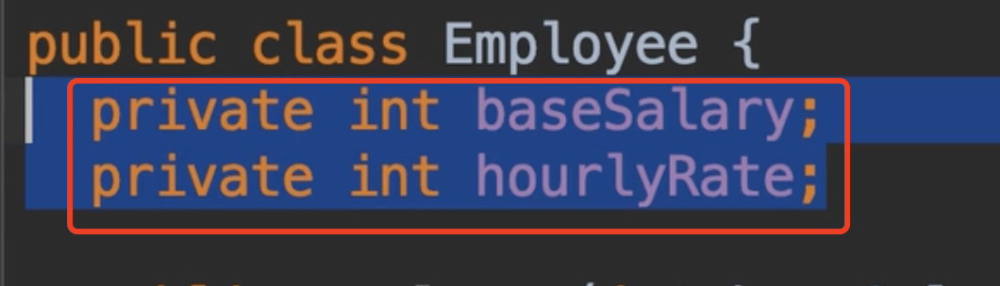
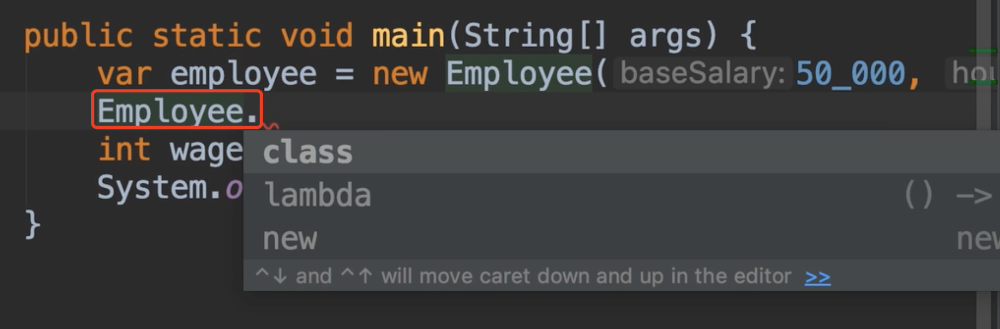
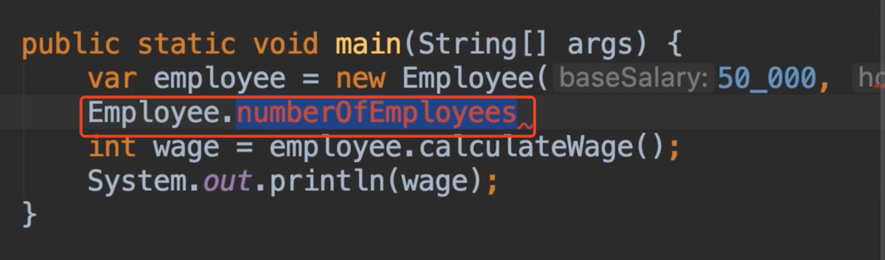
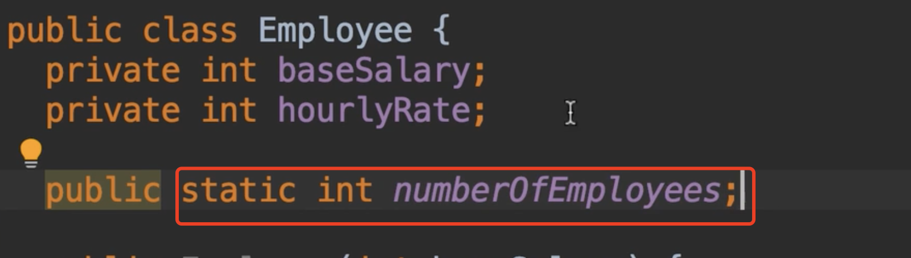
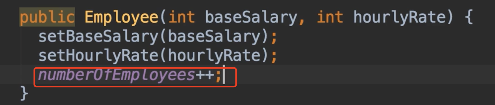
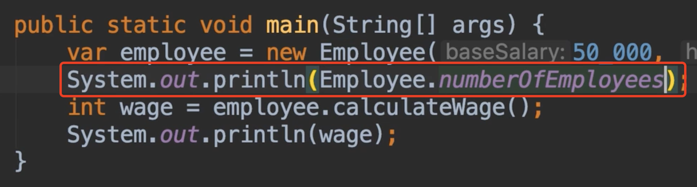
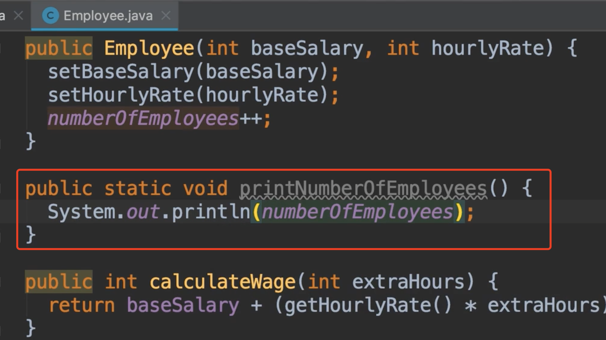
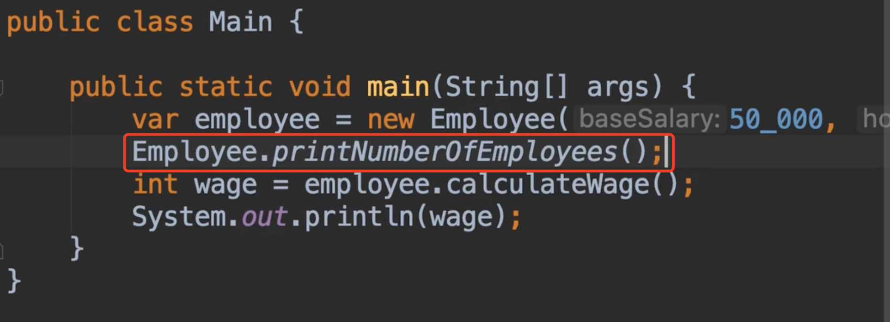
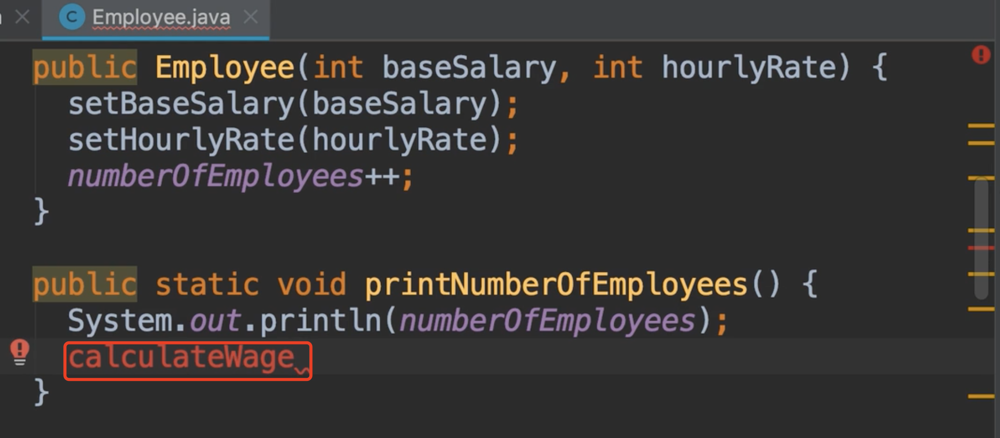

# 13.静态成员

​		 Static Members 静态成员

​		静态成员和方法，使用static关键字，在面向对象编程中，类可以有俩种类型的成员，实例成员和静态成员

​		实例成员属于实例或者是对象--当我们创建Employee对象时可以访问这些成员

​	静态成员：也称为类成员，例如现在我们Employee类没有静态成员，类直接点是没有东西的

​	那么你肯定会问，这个的目的是干什么的？这些成员我们什么时候用？我们在以下情况使用他们：

​	例如，员工人数，这个人数不属于任何员工个人，这就是我们使用静态变量的地方

那么我们现在创建一次对象就给员工人数+1

然后我们打印一下员工人数：我们不用创建对象直接可以通过类访问他

​	你将在所有对象中共用他

​	静态方法：

​	

​	我们可以直接通过类调用这个方法

​	在静态方法中是不能调用非静态方法的，因为他们属于实例方法，如果想访问我们必须创建对象后才可以访问

​	我们在静态方法中创建实例后可以访问实例方法，这个需要记住，这就是为什么声明在主类main方法是静态的，我们通过主类main实例化对象后就可以访问的原因

​	为什么main方法是静态的，这是为了Java在运行时能够直接调用此方法，而无需必须创建一个新的对象，这就是为什么main方法始终为static的原因

​	另外我们的系统类System 有一堆静态成员，在其中的静态字段out，在之后的Java类库中我们会看到很多的类都有静态成员的使用

​		

