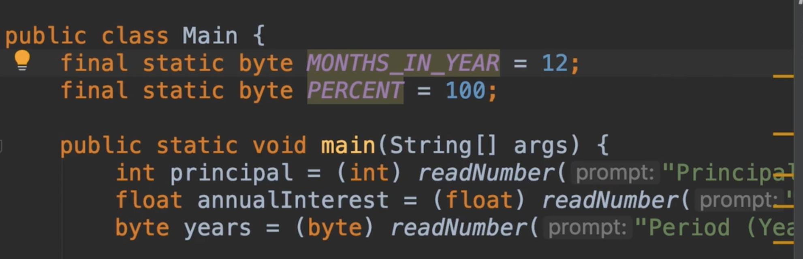
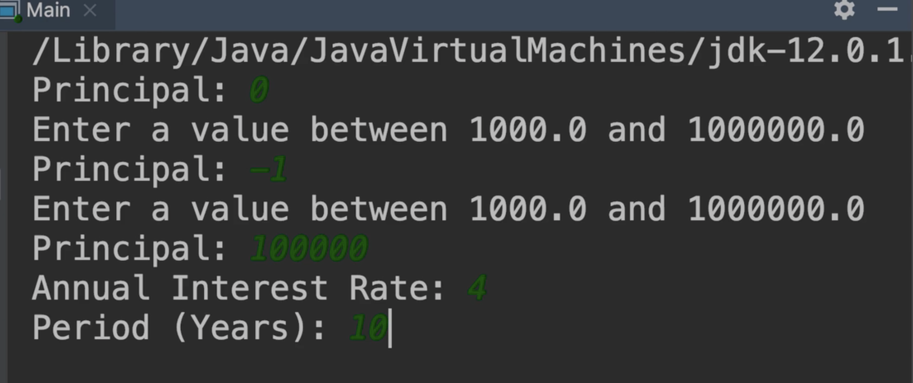
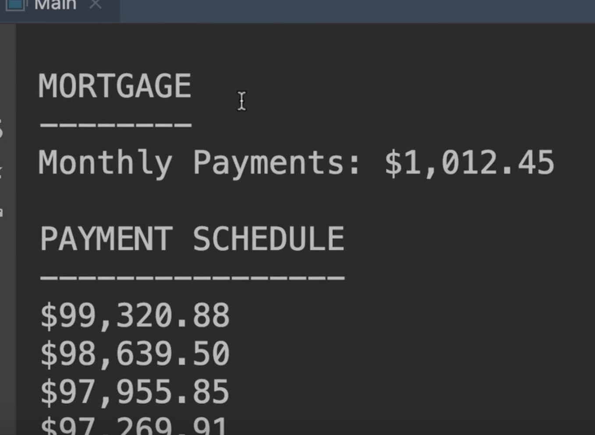
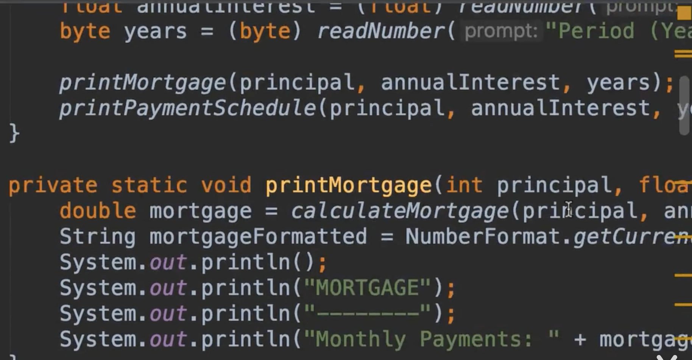

# 14.The Problem问题


​	回想一下我们之前的抵押贷款项目：




 	我们输入贷款金额，年利率，贷款年限可以得出每月的还款金额







​		现在如果我们看一下之前实现的代码：我们可以看到这些代码非常程序化，我们有很多不相干的方法，例如我们有打印付款，他完全是负责在控制台输出的方法等等方法




​		所以，以上的情况就是，我们没有进行封装，没有抽象，只有一堆方法相互调用，这就是我们所说的 过程代码，现在我们想要重构这段代码

​		使用面向对象的设计，重构，是在不改变行为的情况下改变代码的结构，所以我们不想改变这个程序的功能，我们只是想改变我们的结构。

​		在这段代码中，我们希望采用不同的方法，而不是你看着我做，我想让你把这个当成一个项目，一个实践的机会，所以在解决这个问题之前，先暂停一下。这点非常重要，就和学习骑自行车一样，你必须这么做，所以花费20--30分钟进行重构，请提取你认为必要的类，然后回头看看我是如何解决同样问题的，所以要找到源代码，编写代码并开始重构此项目。


初始未优化前的面向过程的代码

```java
package com.company;

import java.text.NumberFormat;
import java.util.Scanner;

public class Solution {
    //一年12月
    final static byte MONTH_IN_YEAR = 12;
    //百分比
    final static byte PERCENT = 100;


    public static void main(String[] args) {

        int principal = (int) readNumber("输入贷款金额Principal :", 1000, 1_000_000);

        float annualInterest = (float) readNumber("请输入年利率 Annual Interest Rate :", 1, 30);

        byte years = (byte) readNumber("请输入贷款年限Years :", 1, 30);


        printMortgage(principal, annualInterest, years);


        printPaymentSchdedule(principal, annualInterest, years);


    }

    
    private static void printMortgage(int principal, float annualInterest, byte years) {
        double mortgage = calculateMortgage(principal, annualInterest, years);
        //格式化金额
        String mortgageFormatted = NumberFormat.getCurrencyInstance().format(mortgage);
        System.out.println();
        System.out.println("MORTGAGE");
        System.out.println("--------");
        System.out.println("Monthly Payments" + mortgageFormatted);
    }

    private static void printPaymentSchdedule(int principal, float annualInterest, byte years) {
        //打印付款计划
        System.out.println();
        System.out.println("PAYMENT SCHEDULE");
        System.out.println("----------------");

        //现在我们需要for循环，迭代所有的支付
        for (short month = 1; month <= years * MONTH_IN_YEAR; month++){
            double banlace = calculateBanlace(principal, annualInterest, years, month);

            System.out.println(NumberFormat.getCurrencyInstance().format(banlace));
        }
    }


    // 1.这里我们需要什么参数呢 L=贷款金额 ，n贷款期限 ，c月利率，p支付期数
    //这里我们想要的是付款金额
    public static double calculateBanlace(int principal,float annualInterest,byte years,short numberOfPaymentsMade){


        short numberOfPayments = (short) (years * MONTH_IN_YEAR);

        //计算得出月利率
        float monthlyInterset = annualInterest / PERCENT / MONTH_IN_YEAR;

        double blance = principal
                * (Math.pow(1 + monthlyInterset, numberOfPayments) - Math.pow(1 + monthlyInterset, numberOfPaymentsMade))
                / (Math.pow(1 + monthlyInterset, numberOfPayments) - 1);

        return blance;

    }

    //2.第二步--因为我们的循环大部分内容都是一致的，只有少部分代码不一致，需要重构一下
    //  我们要读取一下这个是什么内容
    public static double readNumber(String prompt,double min,double max){
        Scanner scanner = new Scanner(System.in);
        double value;
        while(true){
            System.out.println(prompt);
            value = scanner.nextFloat();

            //判断年利率是否在范围
            if (value > min && value <= max)
                break;
            System.out.println("请输入 "+ min +" - "+ max +"之间的年化利率");

        }

        return value;

    }


    //1.最先抽取的计算月供的方法
    public static double calculateMortgage(int principal,float annualInterest,byte years){

        short numberOfPayments = (short) (years * MONTH_IN_YEAR);

        //计算得出月利率
        float monthlyInterset = annualInterest / PERCENT / MONTH_IN_YEAR;

        //计算月供
        double mortgage = principal * (monthlyInterset * (Math.pow(1 + monthlyInterset, numberOfPayments)))
                / (Math.pow(1 + monthlyInterset, numberOfPayments) - 1);

        return mortgage;
    }


}

```


 #### 个人优化面向对象的代码	

​		贷款基本类loanInfo

```java
package com.company.problem;


import java.text.NumberFormat;

/**
 * 贷款基本信息
 */
public class LoanInfo {

    private static byte MONTH_IN_YEAR = 12;

    private static byte PERCENT = 100;

    //贷款金额
    private int principal;


    //年利率
    private float annualInterest;


    //贷款年限
    private byte years;


    //使用一个全参的构造器
    public LoanInfo(Integer principal, Float annualInterest, Byte years) {
        this.principal = principal;
        this.annualInterest = annualInterest;
        this.years = years;
    }


    //获取标准格式
    public void getPrintMortgage(){
        int principal = this.getPrincipal();
        float annualInterest = this.getAnnualInterest();
        byte years = this.getYears();
        printMortgage(principal,annualInterest,years);
    }


    //获取付款表信息
    public void getPrintPaymentSchdedule(){
        printPaymentSchdedule(this.getPrincipal(),this.getAnnualInterest(),this.getYears());
    }


    private static void printMortgage(int principal, float annualInterest, byte years) {
        double mortgage = calculateMortgage(principal, annualInterest, years);
        //格式化金额
        String mortgageFormatted = NumberFormat.getCurrencyInstance().format(mortgage);
        System.out.println();
        System.out.println("MORTGAGE");
        System.out.println("--------");
        System.out.println("Monthly Payments" + mortgageFormatted);
    }

    private static void printPaymentSchdedule(int principal, float annualInterest, byte years) {
        //打印付款计划
        System.out.println();
        System.out.println("PAYMENT SCHEDULE");
        System.out.println("----------------");

        //现在我们需要for循环，迭代所有的支付
        for (short month = 1; month <= years * MONTH_IN_YEAR; month++){
            double banlace = calculateBanlace(principal, annualInterest, years, month);

            System.out.println(NumberFormat.getCurrencyInstance().format(banlace));
        }
    }

    //1.最先抽取的计算月供的方法
    public static double calculateMortgage(int principal,float annualInterest,byte years){

        short numberOfPayments = (short) (years * MONTH_IN_YEAR);

        //计算得出月利率
        float monthlyInterset = annualInterest / PERCENT / MONTH_IN_YEAR;

        //计算月供
        double mortgage = principal * (monthlyInterset * (Math.pow(1 + monthlyInterset, numberOfPayments)))
                / (Math.pow(1 + monthlyInterset, numberOfPayments) - 1);

        return mortgage;
    }

    // 1.这里我们需要什么参数呢 L=贷款金额 ，n贷款期限 ，c月利率，p支付期数
    //这里我们想要的是付款金额
    public static double calculateBanlace(int principal,float annualInterest,byte years,short numberOfPaymentsMade){


        short numberOfPayments = (short) (years * MONTH_IN_YEAR);

        //计算得出月利率
        float monthlyInterset = annualInterest / PERCENT / MONTH_IN_YEAR;

        double blance = principal
                * (Math.pow(1 + monthlyInterset, numberOfPayments) - Math.pow(1 + monthlyInterset, numberOfPaymentsMade))
                / (Math.pow(1 + monthlyInterset, numberOfPayments) - 1);

        return blance;

    }


    private int getPrincipal() {
        return principal;
    }

    private float getAnnualInterest() {
        return annualInterest;
    }

    private byte getYears() {
        return years;
    }
}

```


​		校验数据类CheckInput

```java
package com.company.problem;


import java.util.Scanner;

/**
 *  检查输入类
 */
public class CkeckInput {

    //提示
    private String prompt;

    //最小金额
    private Integer minPrincipal = 1000;

    //最大金额
    private Integer maxPrincipal = 1_000_000;


    //最小年利率
    private float minRate = 1;


    //最大年利率
    private float maxRate = 30;

    //最小年限
    private Byte minYears = 1;


    //最大年限
    private Byte maxYears = 30;


    public double getReadPrincipalNumber(){
        return readNumber("输入贷款金额Principal :",minPrincipal,maxPrincipal);
    }

    public double getReadRateNumber(){
        return readNumber("请输入年利率 Annual Interest Rate :",minRate,maxRate);
    }

    public double getReadYearsNumber(){
        return readNumber("请输入贷款年限Years :",minYears,maxYears);
    }


    private static double readNumber(String prompt,double min,double max){
        Scanner scanner = new Scanner(System.in);
        double value;
        while(true){
            System.out.println(prompt);
            value = scanner.nextFloat();

            //判断年利率是否在范围
            if (value > min && value <= max)
                break;
            System.out.println("请输入 "+ min +" - "+ max +"之间内容");

        }

        return value;

    }


}

```


  执行主类main

```java
package com.company.problem;


// 贷款项目--处理面向对象重构
public class Main {

    public static void main(String[] args) {
        CkeckInput ckeckInput = new CkeckInput();

        int readPrincipalNumber = (int)ckeckInput.getReadPrincipalNumber();
        float readRateNumber = (float) ckeckInput.getReadRateNumber();
        byte readYearsNumber = (byte) ckeckInput.getReadYearsNumber();

        LoanInfo loanInfo = new LoanInfo(readPrincipalNumber, readRateNumber, readYearsNumber);

        loanInfo.getPrintMortgage();
        loanInfo.getPrintPaymentSchdedule();


    }
}

```


​	以上是个人的面向对象的理解，接下来我们看一下mosh的处理方案


