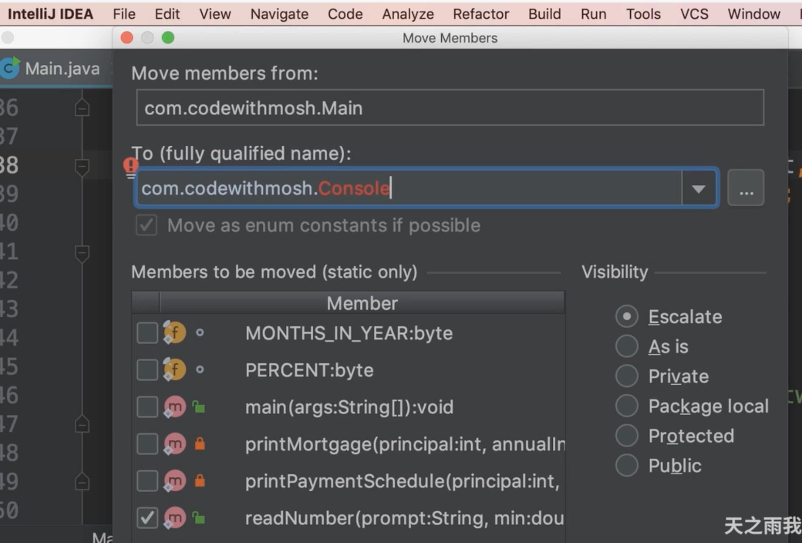
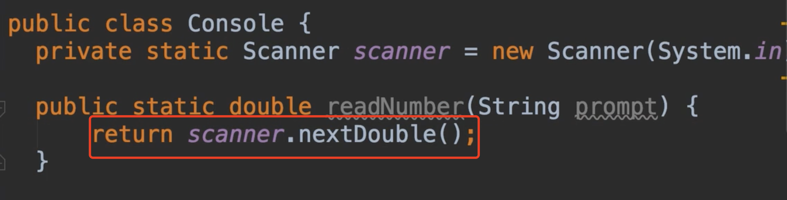

# 15.重构问题处理


​		我们要做的第一件事情就是提取readNumber方法并将其放入在名为console的类中，这是我们读取数字的方法，我们通过剪切的方式去处理代码其实是错误的，会造成编译报错的问题，我们应该通过idea的refactor菜单来处理


​	我们将光标停留在需要重构的方法上，然后选择菜单Refactor--》Refactor this

​		快捷键是control + t


 	intellij提出了一些重构技术


这里我们想把这个方法移动到另外一个类，所以我们选择Move，在顶部我们可以看到，我们正在把这个方法从这个Main下移动到我们输入的Console类中

​	Console我们还没有创建，别担心，idea会自动为我们创建




​	在右侧我们看到各种访问修饰符，我们想确保这个方法是公开的，我们可以勾选public，所以他可以从这个类之外调用，然后我们点击Refactor


提醒是否需要新建Console这个类，我们选择Yes


移动过来之后，


之前调用此方法的也会发生自动修改为移动后的类


这就是我们所说的安全重构，所以我们尽量不要去手动的移动代码，使用我们的Intellij工具，速度更快，产生的错误更少。


#### OverLoading Methods 重构方法

​	目前我们的Console类只有一个readNumber方法，使用了3个参数，分别是提示，最大值和最小值，现在我们想一下，如果不想强制执行这个有效范围该如何去做？

​	我们可以使用重载的方法，我们创建一个参数 提示字符promot的readNumber方法


由于我们需要一直使用Scanner类，我们可以把他设置为静态变量





Console类

```java
package com.company.problemmosh;


import java.util.Scanner;

public class Console {
    private static Scanner scanner = new Scanner(System.in);

    public static double readNumber(String prompt){
        return scanner.nextDouble();
    }


    public static double readNumber(String prompt, double min, double max){
        double value;
        while(true){
            System.out.println(prompt);
            value = scanner.nextFloat();

            //判断年利率是否在范围
            if (value > min && value <= max)
                break;
            System.out.println("请输入 "+ min +" - "+ max +"之间的值");

        }

        return value;

    }
}

```


#### 现在我们处理一下打印时间表

​	我们考虑一下把打印时间表移动到哪里？


​	我们移动到MortgageReport 抵押贷款报告类中，并且将打印时间表也勾选上


移动后-	我们看一下这个Solution.calculateMortgage 这个方法，从技术上讲，这个方法不应该存在，他应该是属于抵押贷款的另一部分 


 #### 我们现在将计算的方法移动出来

​	将计算的2个方法移动到我们 抵押计算器 类中MortgageCalculator


​	移动好了计算的方法


​	现在我们回到主类中看一下，看看我们减少了多少代码


​	现在还没有结束，我们看一下抵押贷款计算 类

​	我们将这些传入的参数进行封装处理


 那么我们现在需要 添加一个构造函数来处理初始化


​	现在我们command + t ，这次我们要改变此方法的签名


然后我们选择我们不想要的并删除，delete


​	然后选择Refactor 会提示我们一个警告，因为我们在方法中使用了这些值

​		因为现在我们这些值存储在这个类中，所以继续构建把


重构完--我们看到一些报错信息


​	因为每位的calculateBanlace方法是static静态的，静态方法只能看到静态的变量，所以现在我们需要将这个方法转换为一个实例方法，我们再次使用重构按钮command + t

​	转换为实例方法


​	不幸的是idea在这种情况下无法为我们做到这点，这时我们必须手动调节修改代码


​	我们去掉静态修饰符 static，我们可以看到错误会立即消失，因为我们可以在本类中访问这些私有字段


​	然后我们重复操作一下，把calculateMortgage方法的参数也处理一下


​	我们在类上右键--然后Find Usages 查看哪里使用是否受到影响


可以看到这个类在抵押报告类中使用了2次


然后我们看一下有报错-因为之前是静态的方法可以类之间调用，现在改为不是静态的了所以报错


​	

​	所以我们需要在这里创建一个抵押贷款计算 对象实例


​	我们看到下面还有一个报错，我们重复声明一下就可以处理，但我不想重复这个，所以我们将其声明为字段在这个类中

​	我们继续使用Refactor菜单处理


​	但这个字段是用这个方法初始化的，这不好，因为我们必须是先调用打印抵押的方法，这样该字段，正确的方式是我们使用构造函数来初始化实例，但是这个计算对象已经声明，而且内部还有2个静态的方法，所以我们想移动一下这些静态的

​	这些静态的值应该有一个适当的对象，他有一些状态以及一些行为，你不应该经常使用静态字段和静态数值，他们很麻烦，例如我们想要在不同的窗口输入不同的内容，使用不同的对象来计算，所以我们不想在内存中使用单个实例的对象，static是会成为单例的


我们现在去掉static 声明的实例变量--然后报错了，因为是静态方法


然后我们将此方法改为实例方法


然后选择为public的


另一个方法也是同样的操作

最后一步是：初始化我们点击灯泡 或者alt + enter


修改完成的MortgageReport这个类

```java
package com.company.problemmosh;

import com.company.Solution;

import java.text.NumberFormat;

public class MortgageReport {

    private MortgageCalculator calculator;

    public MortgageReport(MortgageCalculator calculator) {
        this.calculator = calculator;
    }

    public void printPaymentSchdedule() {
        //打印付款计划
        System.out.println();
        System.out.println("PAYMENT SCHEDULE");
        System.out.println("----------------");

        //现在我们需要for循环，迭代所有的支付
        for (short month = 1; month <= calculator.getYears() * Solution.MONTH_IN_YEAR; month++){
            double banlace = calculator.calculateBanlace(month);

            System.out.println(NumberFormat.getCurrencyInstance().format(banlace));
        }
    }

    public void printMortgage() {
        double mortgage = calculator.calculateMortgage();
        //格式化金额
        String mortgageFormatted = NumberFormat.getCurrencyInstance().format(mortgage);
        System.out.println();
        System.out.println("MORTGAGE");
        System.out.println("--------");
        System.out.println("Monthly Payments" + mortgageFormatted);
    }
}

```

 

现在我们需要确保使用这个类的是否受到影响


我们看到这个main方法使用了2次


最后我们修改一下


```java
package com.company;

import com.company.problemmosh.Console;
import com.company.problemmosh.MortgageCalculator;
import com.company.problemmosh.MortgageReport;

public class Solution {
    //一年12月
    public final static byte MONTH_IN_YEAR = 12;
    //百分比
    public final static byte PERCENT = 100;


    public static void main(String[] args) {

        int principal = (int) Console.readNumber("输入贷款金额Principal :", 1000, 1_000_000);

        float annualInterest = (float) Console.readNumber("请输入年利率 Annual Interest Rate :", 1, 30);

        byte years = (byte) Console.readNumber("请输入贷款年限Years :", 1, 30);

        MortgageCalculator calculator = new MortgageCalculator(principal,annualInterest,years);

        MortgageReport report = new MortgageReport(calculator);
        report.printMortgage();
        report.printPaymentSchdedule();

    }


}

```


#### 移动静态字段 moving static fields

​	通过我们迄今为止所做的重构，我们改进了应用程序的设计，明显的我们还没有完成，看看静态变量在Main主类中声明，这些字段不应该属于这里


​	你觉得我们应该把这些移动到哪里呢？我们先看一下都有谁在使用他

​	邮件 find usages 


我们看到有5处在使用他


​	因为这些字段是用于计算的，所以我们应该将这些静态的移动到MortgageCaluculator这个类中

​	我们contorol + t 


#### 提取重复的逻辑Extracting Duplicate Logic

​	在我们的计算类中有重复使用的代码


​	为了消除重复，我们有俩个选择，一个是提升局部变量作为类中的私有变量，在构造函数中初始化他们，然而我们如果以后要改变利率的时候，我们必须重新计算月利率，目前我们没有getter，如果我们在之后这样做，我们不得不再次替换这个逻辑，我们必须计算每月的利率，所以这不是一个好的选择

​		更好的方法是设置此表达式在此类中作为私有的方法，

我们框选重复的代码，然后重构method方法


​	提示我们--检测到某处重复了这个表达式，问我们是否替换其他的，我们选择All就是全部替换


​		好了，如果以后更改年利率，这个方法依然有效，但如果使用静态变量就不可变了

​	现在我们重复同样的步骤，将付款总月数也重构一下：


​	好的，现在我们回顾一下整体的代码：

​	我们看到计算月利率的方法就像一个getter，我们应该将所有的getter和setter迁移到类的底部为约定，这样的约定有助于更容易阅读和理解代码


​	所以我们移动一下代码片段--移动到底部 shift + alt + down


​	 在这个设计中，我们将所有展示问题都转移到了MortgageReport类中了，我们将计算的全部交给计算的类来处理，将展示全部交给展示的类处理


#### 将计算与展示逻辑分离Separating Calculation from Presentation Logic

​	我们移动这个计算每次剩余余额的逻辑，到计算类中--标注错误，按绿色为准


​	现在我们必须手动执行此操作，我们不能使用idea，因为他是一种特殊的重构，我们复制这俩行代码--到我们的抵押计算类中

​	我们希望返回的是一个double的数组，起名为获取剩余余额--然后调整代码


​	现在我们使用内联的inline命令来重构一下


提示内联全部--并删除该变量进行重构


​	对比刚刚的代码，就是减少了一行代码，将balance变量删除了


​	我们回到展示类中，调用这个方法，然后使用for each 比之前简单多了


​		我们现在有了这个新的实现，所以我们不需要从外部获取到getYear了，我们删除掉这个getter方法，或者私有化，我们在删除前记得看一下find usages看看有没有使用


​	我们发现 MONTHS-IN-YEAR也可以私有化了，百分比也可以私有化了


​	我们隐藏了这些实现，如果将来我们改变这个实现，依赖于抵押贷款的类，计算的类是不需要调整的，随着每次重构，我们的代码越来越好。


​	


​	


​	


​	


