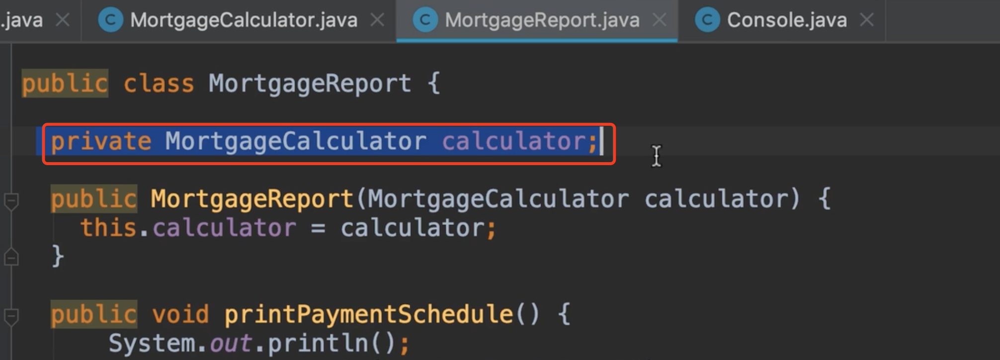
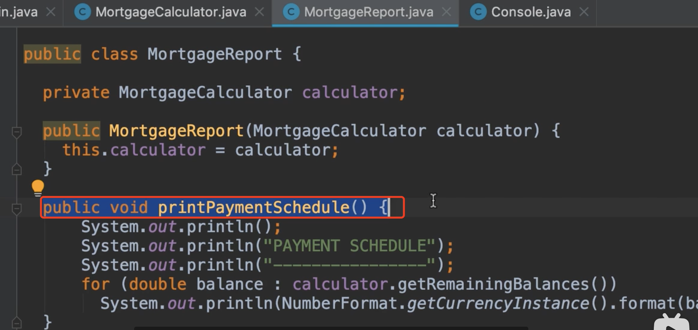
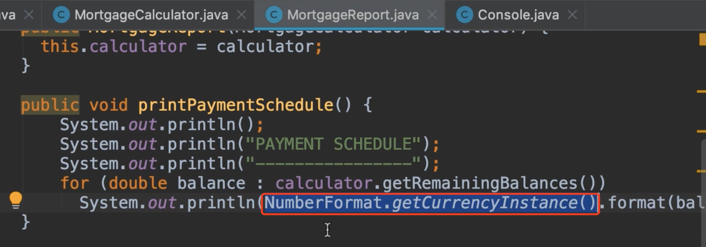
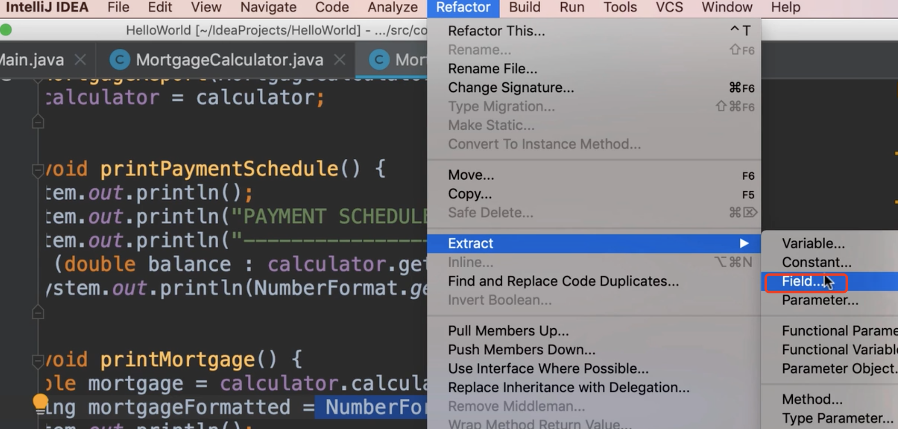
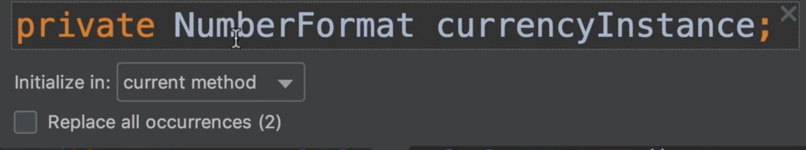
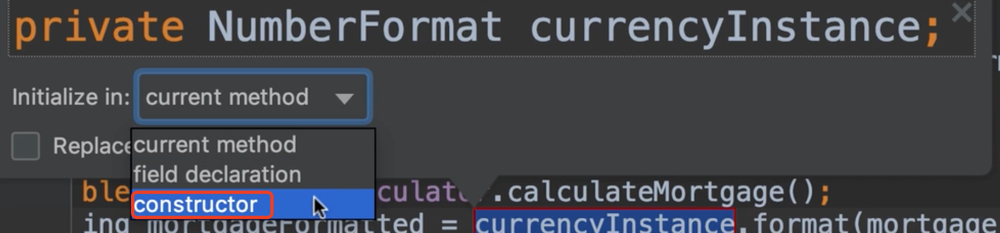
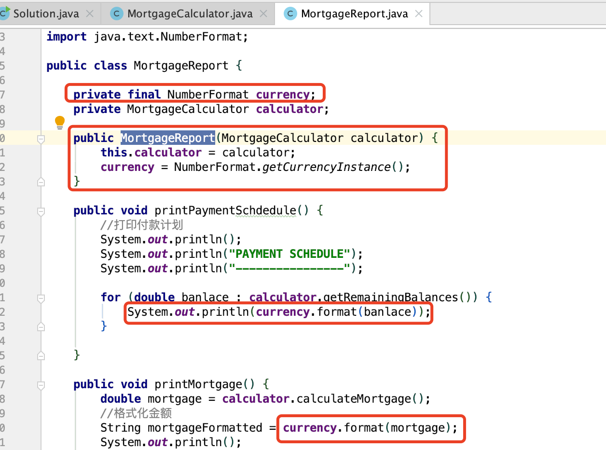

# 16.重构问题处理-总结

​		现在我们复习一下 抵押贷款的代码，我们可以看到封装原理的作用，已经封装了一些数据或状态




​	以及在单个单元中围绕数据进行的操作，因此你的计算对象在这里calculator，围绕计算器对象，这里使用了计算器对象获取一些数据，并在控制台打印。




​	所以我们已经正确的分离了各种关注点，MortgageReport是完全负责展示没有任何的计算了，然而我仍然看到了一次重构的机会，看看这个表达式数字格式




​	我们需要将这个货币对象存储在这个类的一个字段中，这样我们就可以重用他，我们现在重构一下这个--**提取字段**




​	我们这里看到一个领域的预览，他将是私有的NumberFormat，称为货币实例

​	

​	我们可以在当前方法初始化它，这不是一个好主意，我们应该初始化它在声明字段或在构造器初始化，为了保持一致性，我将在构造函数中初始化它，然后勾选Replace all，然后回车




我们可以看到 是final修饰的，作为final修饰一旦构造函数构建了他，他就不能被改变了，这是完美的发现，我们不需要重新创建货币对象了，这样我们的代码更清晰，可读性更强



​	

### 下面我们放一下修改好的类

```java
package com.company.problemmosh;

public class MortgageCalculator {

    //一年12月
    private final static byte MONTH_IN_YEAR = 12;
    //百分比
    private final static byte PERCENT = 100;


    private int principal;

    private  float annualInterest;

    private  byte years;


    public MortgageCalculator(int principal, float annualInterest, byte years) {
        this.principal = principal;
        this.annualInterest = annualInterest;
        this.years = years;
    }

    // 1.这里我们需要什么参数呢 L=贷款金额 ，n贷款期限 ，c月利率，p支付期数
    //这里我们想要的是付款金额
    public double calculateBanlace(short numberOfPaymentsMade){
        short numberOfPayments = getNumberOfPayments();

        //计算得出月利率
        float monthlyInterset = getMonthlyInterset();

        double blance = principal
                * (Math.pow(1 + monthlyInterset, numberOfPayments) - Math.pow(1 + monthlyInterset, numberOfPaymentsMade))
                / (Math.pow(1 + monthlyInterset, numberOfPayments) - 1);

        return blance;

    }

    //1.最先抽取的计算月供的方法
    public double calculateMortgage(){

        short numberOfPayments = getNumberOfPayments();

        //计算得出月利率
        float monthlyInterset = getMonthlyInterset();

        //计算月供
        double mortgage = principal * (monthlyInterset * (Math.pow(1 + monthlyInterset, numberOfPayments)))
                / (Math.pow(1 + monthlyInterset, numberOfPayments) - 1);

        return mortgage;
    }

    public double[] getRemainingBalances(){
        double[] balances = new double[getNumberOfPayments()];
        for (short month = 1; month <= balances.length; month++) {
            balances[month - 1] = calculateBanlace(month);
        }
        return balances;
    }


    private short getNumberOfPayments() {
        return (short) (years * MONTH_IN_YEAR);
    }

    private float getMonthlyInterset() {
        return annualInterest / PERCENT / MONTH_IN_YEAR;
    }
}

```


  展示类

```java
package com.company.problemmosh;

import java.text.NumberFormat;

public class MortgageReport {

    private final NumberFormat currency;
    private MortgageCalculator calculator;

    public MortgageReport(MortgageCalculator calculator) {
        this.calculator = calculator;
        currency = NumberFormat.getCurrencyInstance();
    }

    public void printPaymentSchdedule() {
        //打印付款计划
        System.out.println();
        System.out.println("PAYMENT SCHEDULE");
        System.out.println("----------------");

        for (double banlace : calculator.getRemainingBalances()) {
            System.out.println(currency.format(banlace));
        }

    }

    public void printMortgage() {
        double mortgage = calculator.calculateMortgage();
        //格式化金额
        String mortgageFormatted = currency.format(mortgage);
        System.out.println();
        System.out.println("MORTGAGE");
        System.out.println("--------");
        System.out.println("Monthly Payments" + mortgageFormatted);
    }
}

```


​	运行主类

```java
package com.company;

import com.company.problemmosh.Console;
import com.company.problemmosh.MortgageCalculator;
import com.company.problemmosh.MortgageReport;

public class Solution {


    public static void main(String[] args) {

        int principal = (int) Console.readNumber("输入贷款金额Principal :", 1000, 1_000_000);

        float annualInterest = (float) Console.readNumber("请输入年利率 Annual Interest Rate :", 1, 30);

        byte years = (byte) Console.readNumber("请输入贷款年限Years :", 1, 30);

        MortgageCalculator calculator = new MortgageCalculator(principal,annualInterest,years);

        MortgageReport report = new MortgageReport(calculator);
        report.printMortgage();
        report.printPaymentSchdedule();

    }


}

```


​	


​	


