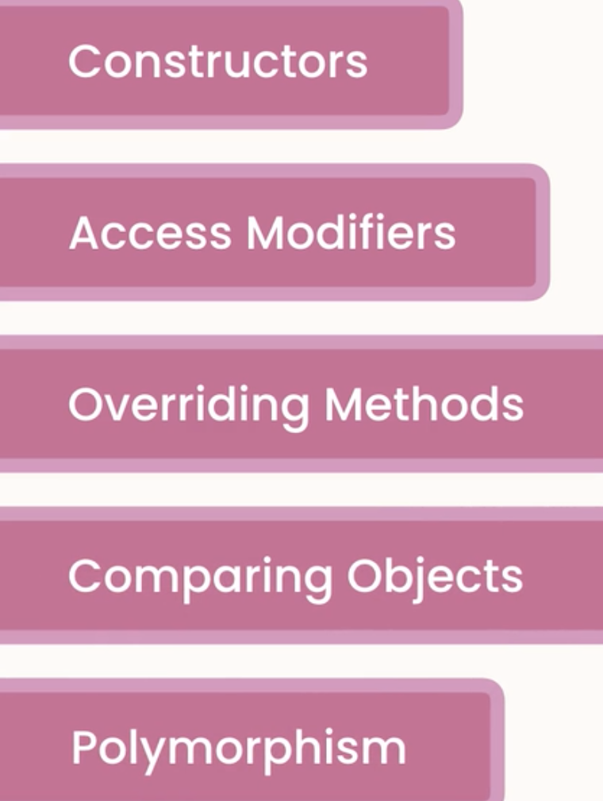

# 17.下节介绍

https://www.bilibili.com/video/BV1Su411X7Bb?p=32&spm_id_from=pageDriver

​	本节中，我们将讨论第三个原则，关于面向对象编程，我们将学到什么？

​	什么是继承，他是如何工作的？什么时候使用他？我们会讨论一下 

​	一些非常重要的概念，如构造函数，access Modifiers访问修改函数，Override Methods重写方法，Comparing Object 比较对象和 Polymorphism多态性

