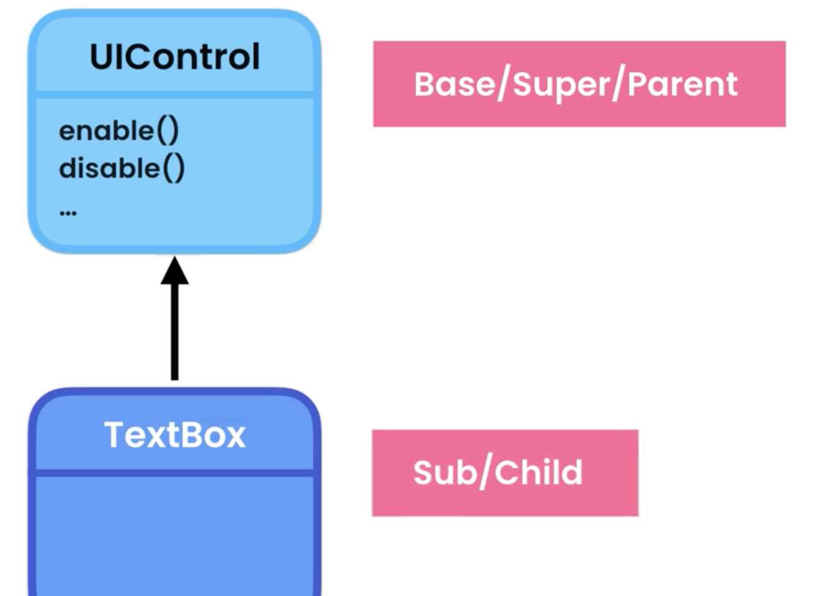
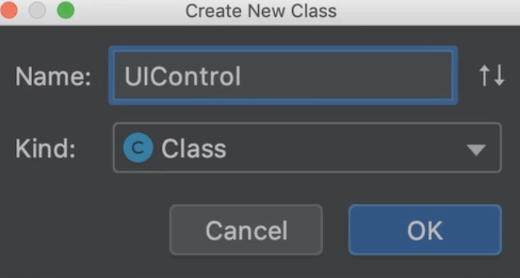
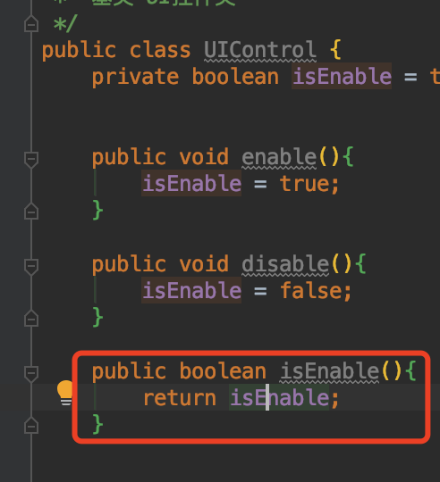
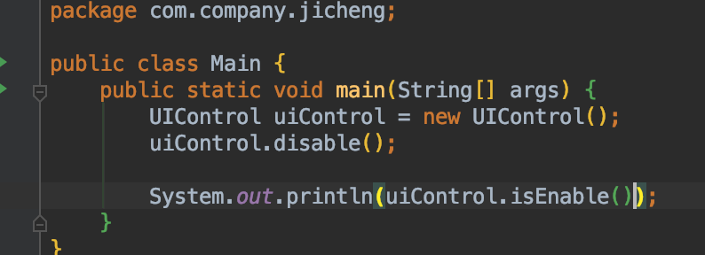
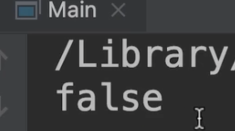
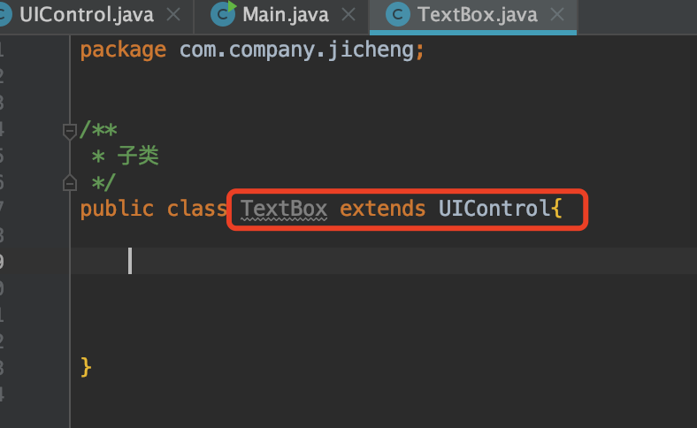
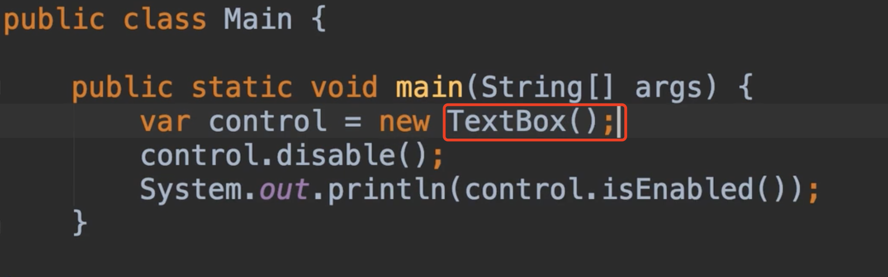
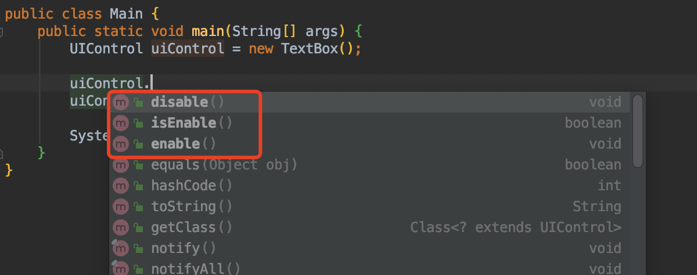

# 18. Inheritance继承

​	2-4-2内容：

我们想象一下，我们想要构建一个用于构建图形用户界面的框架，所有其他人可以使用这个框架来构建具有图形用户界面的应用程序，我们可以用各种类型的输入字段，如文本框，复选框，下拉列表等等。

​	现在所有对象都有一个共同的行为，例如我们可以启用或者是禁用他们，还可以根据屏幕的宽度高度设置他们的大小，编写这些类的时候，我们不想在每个类中实现所有这些特性，这就是我们使用继承来重用代码的地方


​		所以我们定义单个类的所有常用行为，我们称为ui控件，然后让其他类从这个类继承这些行为，在本例中，我们将ui控件称为基类或父类---文本框作为子类




​	现在我们创建一下UIControl 基类，并在其中定义所有的常见行为




​	我们想一下这个定义些什么行为？我们先添加启用或者是禁用每个ui控件的功能

​	默认情况下所有控件都是启用的

```java
public class UIControl {
    private boolean isEnable = true;


    public void enable(){
        isEnable = true;
    }

    public void disable(){
        isEnable = false;
    }


}
```


​	我们现在还需要一个getter 来读取此字段的值




​	现在我们到Main主类中，使用我们的UI控件对象，我们需要先创建一个UI控件对象,然后我们关闭控件，获取一些enable看看能看到什么



​	我们看到false是因为，我们禁用了这个控制对象




​	所以我们在ui控件类中实现了这个特性


现在我们创建一个文本框类，我们不想重复所有的特性，我们想重用他，这就是我们使用继承的原因




我们将Main中的实例化修改为TextBox，看看我们得到了什么？




他也拥有这些方法：这些都是从我们的父类继承过来的方法




