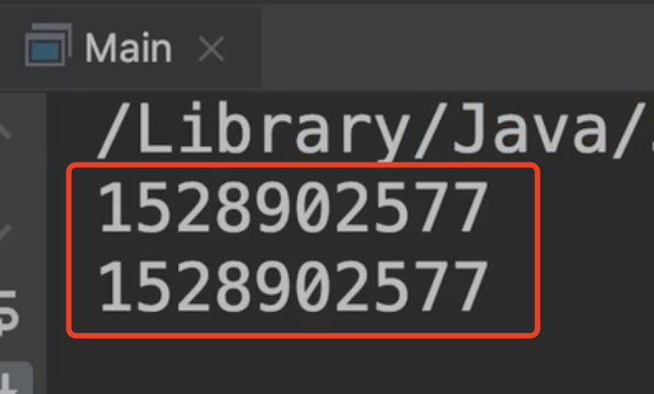
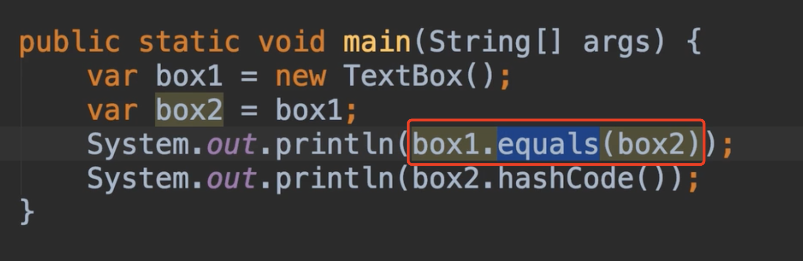

# 19.The Object Class

​		现在我们讨论一下Object 类，我们直接或者间接地声明从Object类继承。

​		我们之前声明了这个文本框类，这个类是扩展类，从UI控件类继承

​	而UI控件类又继承了Object类，现在我们没有显式的输入extends Object，Java编译器会自动为我们进行继承Object类，这就是我们每个类都会有一些附加的方法的原因。

​	继承的Object类是什么？我们来看一下

​	我们来到main方法中，声明一个变量，创建一个Object类的实例，可以看到这个类是Java语言声明的

​	我们看看他的成员obj点，我们有getClass方法，它返回类对象，通过它我们可以读取对象的元数据

​	例如：我们可以定义该对象中组合的所有字段和方法

​	接下来，我们有一个用于比较对象的等式**equals**方法，

​	我们有**hashCode**方法，他返回一个基于内存中此对象的地址

​	toString方法：返回对象的字符串形式的字符串

​	以及在并发中使用的一些方法，如notify，notify all和wait等等，这个我们后续再关注

我们创建一个新的TextBox对象，我们称为box1

​	我们打印一下他的hashCode值

​	我们得到这个整数，它是根据这个对象在内存中的地址，很多人认为这就是这个对象在内存中的地址，但这是不正确的，这个对象地址通过 函数称为 hash function 哈希函数来获取一个值，并将其映射到一个我们称为hash，这就是这个对象的hashCode。

​		为什么这很重要？这种hashCode很多情况下都会使用到，其中之一就是比较对象

​	我们可以测试一下，声明一个box2 = box1，现在我们知道这俩个变量都是引用内存中的同一个对象，所以他们应该拥有相同的hashCode

​		结果和我们预想的一样，确实是一致的hashCode

​	

​	之前我们提到了equals方法，我们可以检查对象是否相等，现在如果我们使用box1.equals(box2)这个方法将返回true，因为这俩个变量在同一个对象中引用，并且他们具有相同的hashCode值

​    但是如果我们创建一个新的box，现在这个equals方法将返回FALSE，因为这俩个对象在内存中的不同位置，他们有不同的hashCode值

​	有些情况下，我们不希望通过所需的hashCode值来比较对象，而是根据内容进行比较，例如：A类有坐标 x和y 现在如果我们有2个A类点对象，这俩个点对象都有完全相同的坐标，技术上是相等的，对吗？所以在这种情况下，我们不想基于hashCode比较俩个对象

​	我们想根据内容进行比较，我们可以改变equals方法的实现，这样就不用比较对象的hashCode值了，我们可以使用存储在其字段中的值来比较他们（我们将在本节稍后的部分中讨论这点）

​	现在我们来看一下这俩个方面：字符串方法toString

​	此方法将返回对象的字符串表示形式，他有2个部分，类的完全路径名称，然后一个@符号后面是hashCode值（以16进制的hashCode）这里的值是hashCode用hexodecimal表示

​	现在又出现了以下情况：字符串方法是不可取的，但我们总是可以更改他，例如：我们有一个坐标类x,y点属性，那么我们修改2个字符串方法，对于返回的字符串，他可以返回x和y坐标。

​		其实就相当于我们重写toString方法，将内部的字段get后拼接然后以字符串的形式返回，而不是返回之前的包路径+类名称+hashCode值

​	

​		

