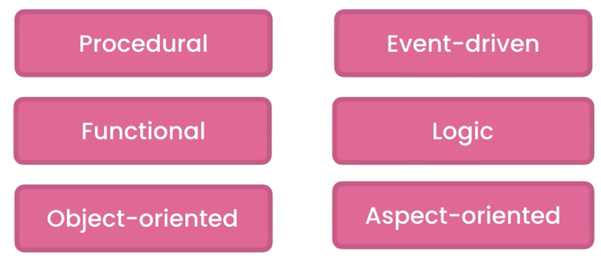
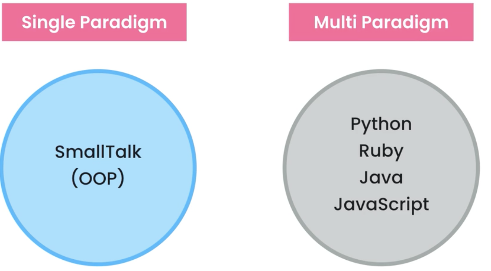
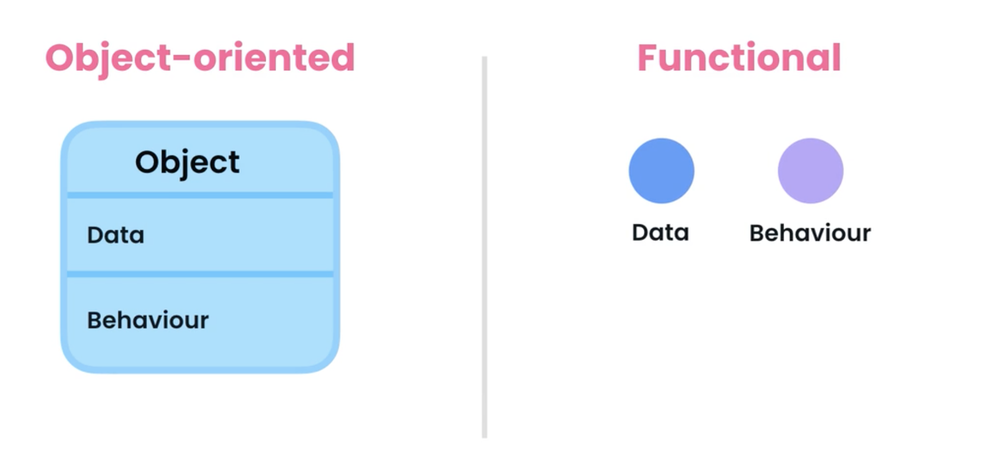

# 2.程序设计范式

​	programming paradigms: 程序设计范式

​		计算机科学我们有各种各样的编程模式或者是风格的程序设计，比如程序性的，功能性的，面向对象的，事件驱动，逻辑，面向方面等等

​	所有这些里面面向对象和函数式编程是最流行的方式，他们不是编程语言，而是根据支持的范例对编程语言进行分类，一些像SmallTalk这样的语言只支持一种模式

​	比如Python，ruby，java，js支持多种范例-在面向对象编程中，一切都是基于关于物体的概念，这些对象包含一些数据，也称为状态，以及对这些数据的操作--也称为行为

 所以在面向对象中，你把操作单个对象的数据和方法。

在函数式编程，我们采取相反的方法，我们先假设数据和行为，并不在一起，这是一个完全不同的过程，不同的编程风格，但可以使用这俩种模式解决相同的问题，最后代码看起来不一样，现在那种模式更好呢？

​		嗯，这个取决于问谁？

​	面向对象编程非常复杂，大多数书籍和课程都有些解释不当。

​	那么上面样的范例是最好的？答案是，这取决于你遇到的问题

想要解决，当今软件行业的一个主要问题是，开发人员对语言，工具，和框架更感兴趣，而不是解决问题，很多开发人员甚至那些多年开发经验的，都不清楚所谓的解决问题是什么意思，他们认为有解决方案，实际上并没有。

​		解决问题是一个过程，定义问题、识别和比较不同解决方案，并根据上下文和约束选择最能解决问题的解决方案的过程。关于上下文和约束，很多开发者都对这个问题不屑一顾。

​		上下文和约束，他们认为不是黑的就是白的，他们有自己的观点，他们最喜欢用语言和工具，用他们解决每一个问题。

回到我们的问题：一些人声称面向对象编程通常是创建用户图形界面和游戏的更好选择，另一方面，函数式编程-对于需要高水平的可靠性，或涉及消息的问题被传来传去，一路被改造，但这只是基本准则，不要把他作为硬性的规定。

​		一个应用程序中，你可以使用不同的范例，您可以使用事件驱动的范例在某些最有意义和功能的部分，其他部分采用面向对象或者函数式，这完全取决于我们试图解决的问题。

​		没有那种模式在所有情况下都能发挥最佳效果。在软件工程中不存在一刀切的情况

每个问题都是不同的，所以不存在一种语言这样的东西，或者最好的范例，最好的框架，好不好这取决于需要解决什么问题。

​	更重要的是，在环境和预算方面，所以不要爱上一个解决方案，把他应用到每个需要解决的问题上。

