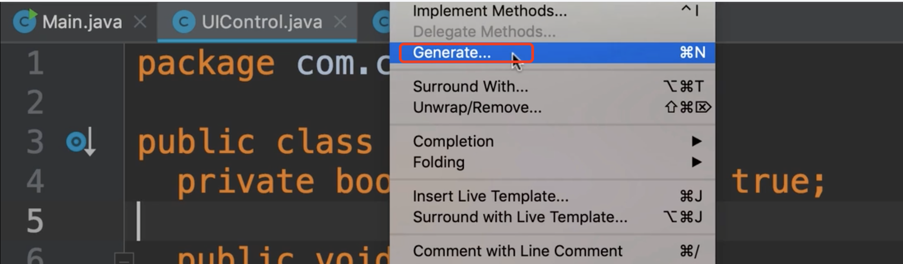
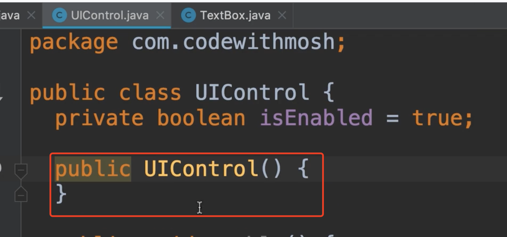
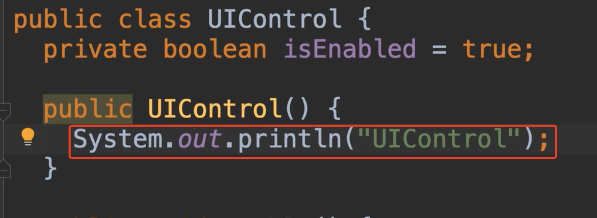
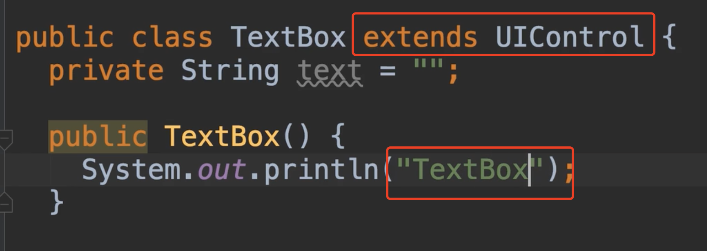
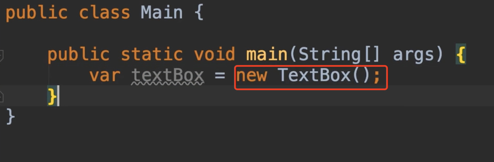
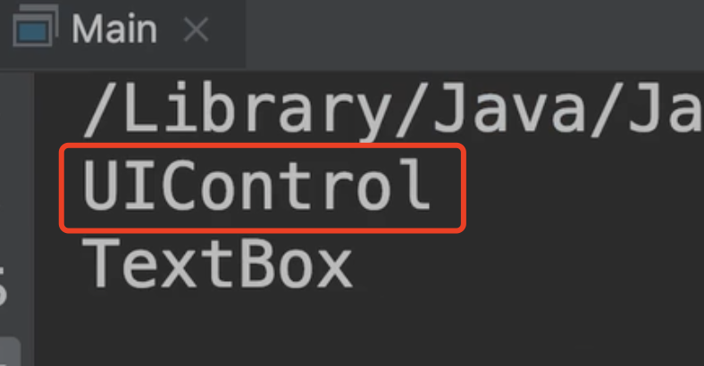
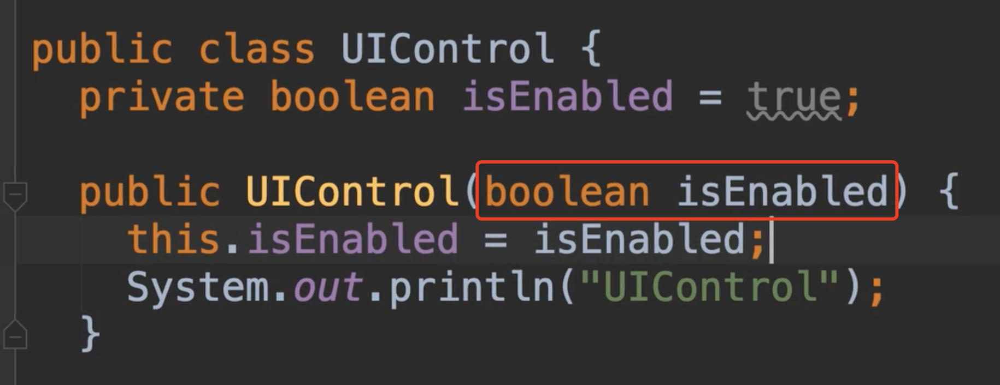
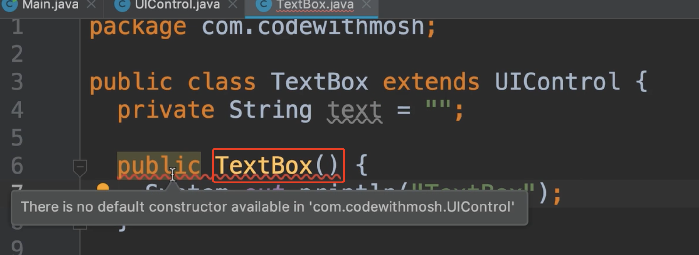
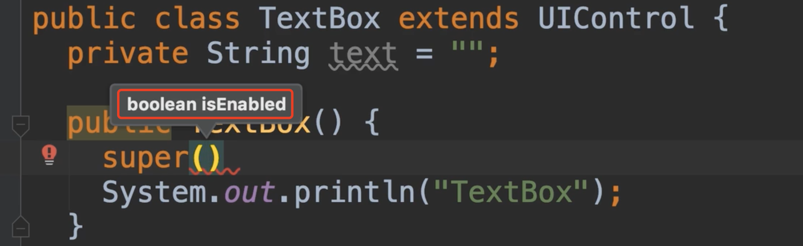
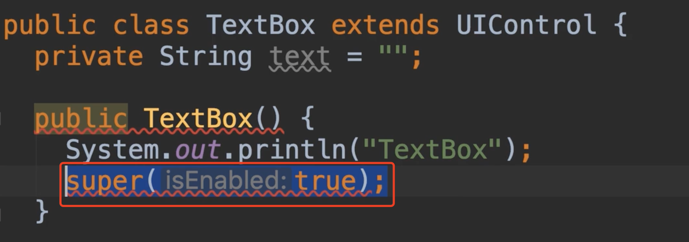

# 20.构造函数和继承

​	Constructors and inheritance:构造函数和继承

​	我们已经了解了构造函数，我们明白当我们创建类的实例，

我们可以使用Intellij的快速创建构造函数 Generate

我们选择一个无惨构造

现在在这个构造函数中，我们想打印一条信息，如下：

然后我们想对Text类做同样的事情

现在我们新建实例，我们看一下发生了什么

​	我们发现 父类的构造函数被调用了，然后是子类的构造函数

那么现在如果父类的构造函数是一个有参数的构造函数呢？

我们回到TextBox类中，发现有一个编译错误，没有可用的默认构造函数，因为我们Text类中没有父类中的参数，所以文本框类的构造函数，不知道要给此构造函数传递什么值

​	所以这里我们需要显式的调用这个构造函数，我们回到TextBox类中

​		使用supper()关键字调用父类的构造函数，可以看到我们需要传递一个布尔值true或者false，这并不重要，重要的是，这份声明应该是这个构造函数中的第一条语句。

​	如果我们不是在第一条语句使用显式的父类构造器调用的话，我们会再次看到一个编译错误

​	

