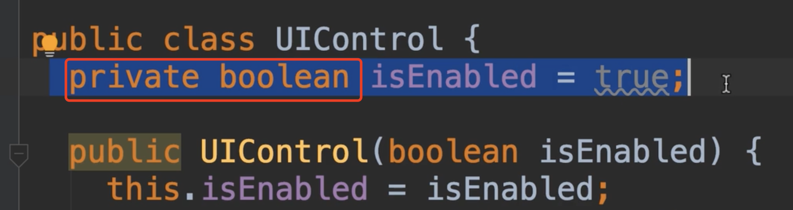
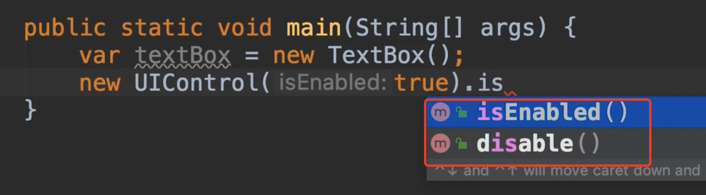
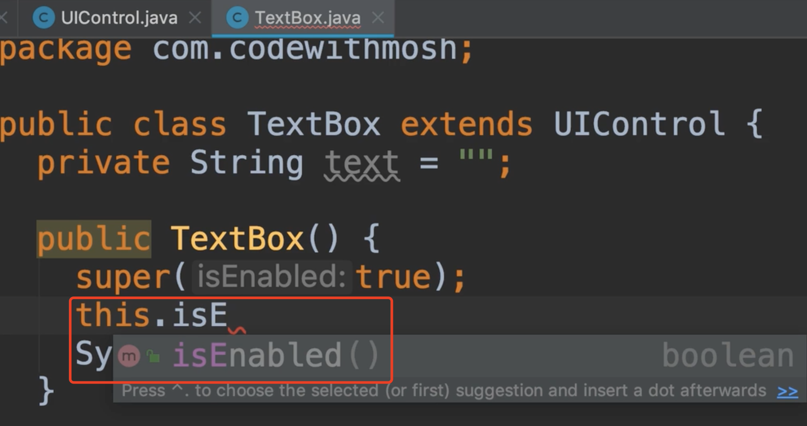
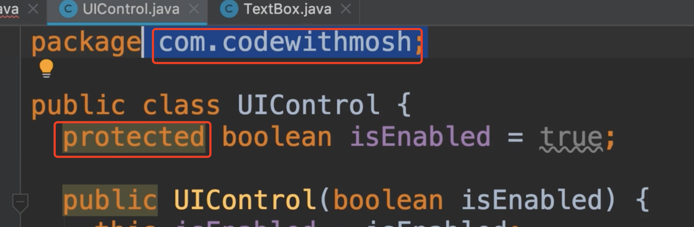
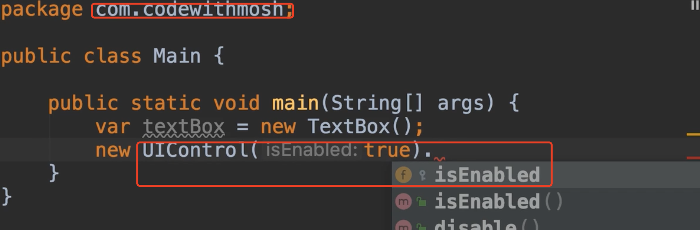
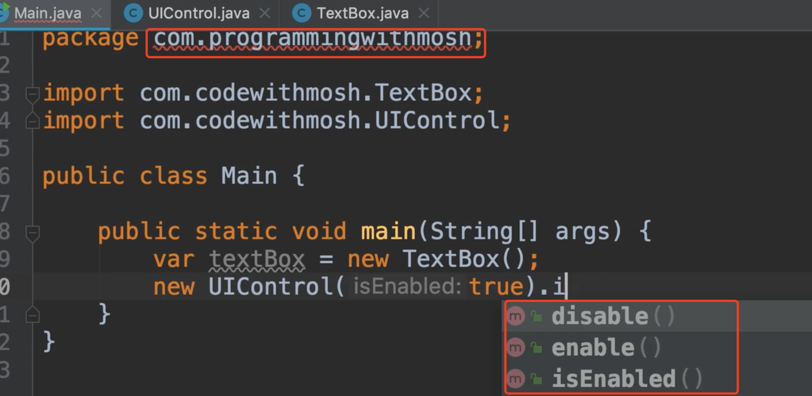
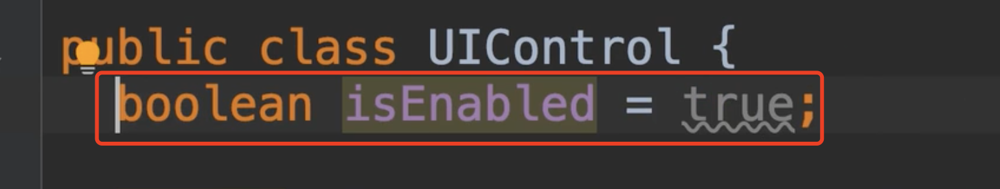

# 21.访问修饰符

​	访问修饰符：Access Modifiers

​		本节，我们将更详细的了解java中的访问修饰符，所以我们看到public，private，我们知道public成员是可以在本类之外访问的，private则不行，只能本类中使用。

​	例如：我们的UI控件类中，我们将字段声明为private，所以我们不能在这个类之外访问他

如果我们到main方法中访问一下，发现只能访问到方法，并不能访问到field

​	还有一点需要我们了解，就是私有成员不是由子类继承的，如我们到子类TextBox中，我们在构造函数中尝试调用一下父类的字段，发现是不能够获取的。

​	所以私有成员是子类不会继承私有字段和私有方法的，而且其他类是不能访问的，所以使用他们来隐藏类的实现细节，这样在不影响其他类的情况下，我们就可以进行更改。

​	protected: 现在我们有java中的另外一个修饰符，他被认为是糟糕的,使用他就是受保护的访问，他在包内就像是public一样

​	我们可以看到包内是可以访问到的

 如果我们在其他的包中，被这个protected 修饰的就访问不到了，例如我们切换个包地址来访问，发现访问不到了没有field字段

​	这有点让人困惑，还有点复杂，这是他被认为是一种不好的做法原因之一，我们应该避免使用他，因为这样很难维护我们的程序，所以无论是公共的还是私有的，任何应该暴露在外面的东西都使用public，私有的就用private是用于隐藏实现细节

   如果我们不使用修饰符呢？其实就是默认的修饰符叫package，这意味着这个字段在这个包的任何地方都是公共的，但在这个包之外就是私有的，甚至其他包中的类将无法继承此字段，他在内部是私有的

​	注意：我们要避免使用默认的，因为这样会很混乱，我们只使用public或者是private

​	

