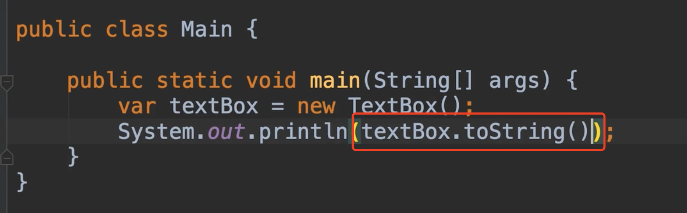
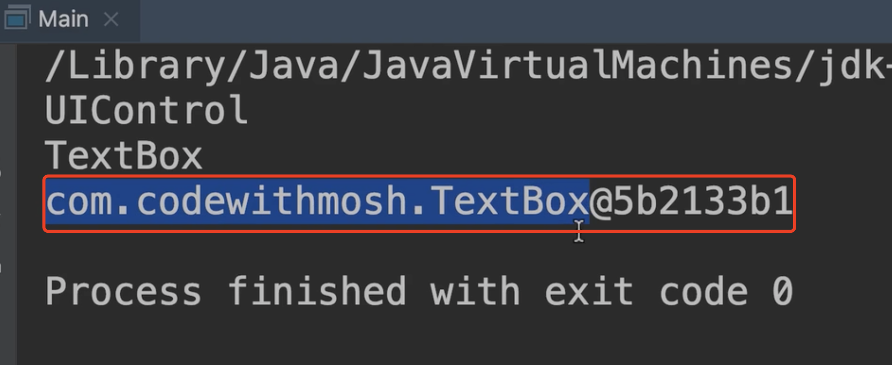
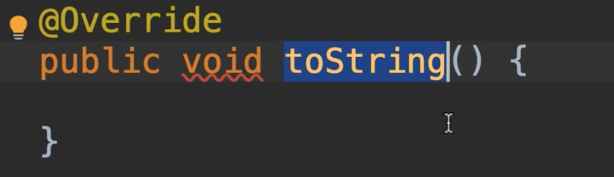
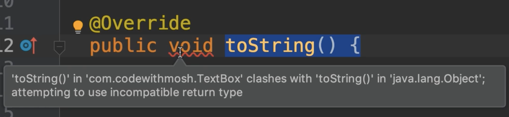
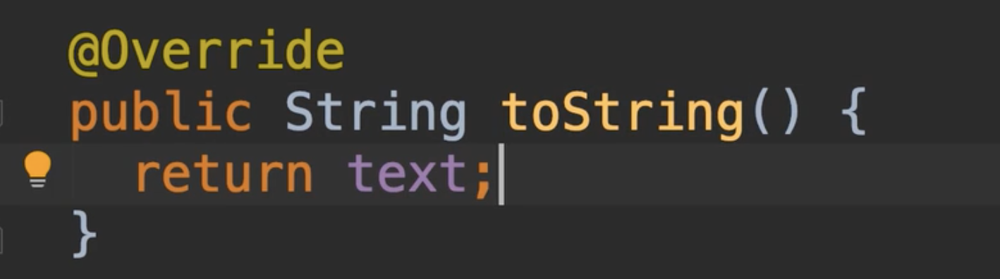
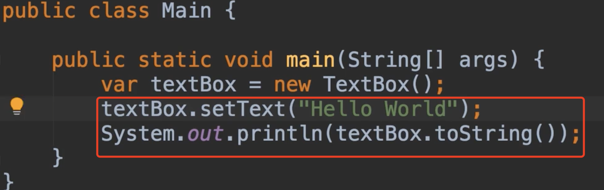
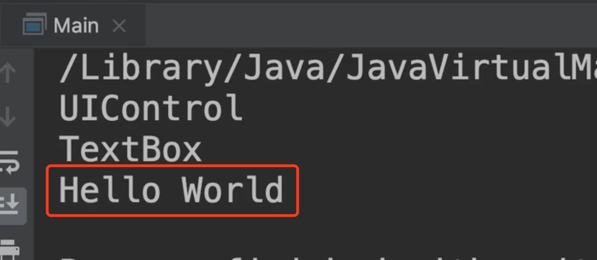
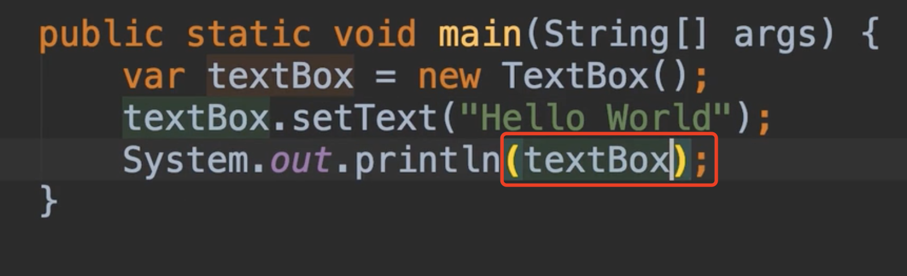

# 22.方法重写

​	Override Method ：方法重写

​	有些情况下，我们从父类继承了一个方法，但我们并不满意他的实现，我们想要改变他，这就是我们所说的方法重写，我们重写的是父类中声明的方法

​	现在不要把方法重写和方法重载混淆了，方法重载是多次声明同一方法名称但参数不同。

​	我们知道每个对象都有继承父类Object的toString方法，现在我们打印

​	打印的值是 包+类名称+16进制的hashCode值

​		我们对这样的输出不太满意，我们希望的是打印TextBox中的文本内容，所以我们需要重写这个方法，我们可以覆盖我们继承的任何方法

​	重写方法需要在方法名称上加@Override，这就是我们所说的annotation注释，注释是一个基本调用，我们附加到类或者是成员上的标签，通过这个我们可以得到额外的信息到编译器，因此我们告诉java编译器我们正在重写Object类中的toString方法

​	有了这个Java编译器将检查签名，对于该方法，他将确保该方法具有相同的精确签名也就是方法名称，现在我们有一个编译错误，因为在Object类中声明返回的是一个String，而我们现在是void，这就是使用这个注释的好处，它帮助java编译器的正确性，所以让我们改变这个返回值类型

​	重写好了，现在我们回到main方法中，我们调用一下toString方法

​	我们发现输出的内容是我们想要的内容

​		这里我们没有显式的调用toString方法，如果是直接放入对象的话，因为println方法会调用自动调用任何对象上的toString方法

​	

​	以上就是方法重写的全部内容。

