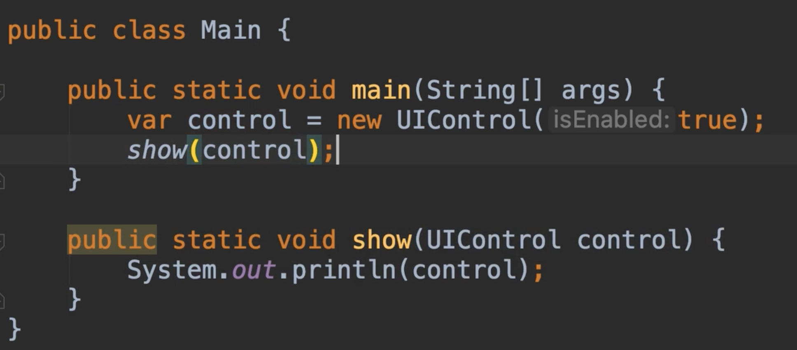

# 23.上行和下行

​	Upcasting and Downcasting :向上转型和向下转型

​		向上转型，表示将对象强制转换为超类型或父类型之一

​		向下转型，是将对象强制转换为子类型之一。

​	让我们实际操作演示一下：

​		我们在main方法中声明一个UI控件类 属于父类

​		然后写一个show方法，并指定参数为UI控件类，然后我们将这个对象打印到控制台

我们可以看到控制台返回的内容

现在如果相反我们将他的子类TextBox对象传递给show方法可以吗？我们发现也是可以传入的代码完全有效，因为这个文本框对象继承了UI控件对象的所有成员，所以文本框对象也是一个控件对象，这就是为什么我们说继承代表且是一种关系。

​		这个对象会被自动转换，对于ui控件对象，这就是我们说的向上转型

​	将对象转换为其父对象，我们也可以将参数类型设置为Object对象，再次向上转换，因为每个TextBox也是一个Object对象

​	我们切换回父类对象为参数，我们测试打印一下内容

我们看到没有任何输出内容，为什么？

​	因为我们之前在TextBox中重写的toString方法，所以我们改变这个方法的默认实现

​	那么其实当执行第12行的时候，实际上执行的是TextBox的toString方法，而不是UIControl的toString方法，因为我们传入的是TextBox

​	有趣的是，在运行的时候这里传递的是TextBox对象，在编译的时候，对这个方法进行编码，我们无法访问到TextBox中的任何方法，例如我们输入control点内容，你只看到UIControl对象中的内容，现在如果想使用TextBox中的其中一个方法呢？

​	如果想使用TextBox中的方法就需要显式强制转换为子类TextBox

​	现在我们运行一下程序，看一下结果

输出的结果是 我们设置的text字段的值，因为我们之前重写的toString方法，所以显式Hello World

​	因为show方法需要接收一个UIControl对象，在编译的时候，我们可以给出一个实例，对UIControl对象或者是派生的子类，但是我们只能在UIControl的成员中工作，在此基础上我们可以显式的将此UIControl对象强制转换为不同的类型，这就是我们所说的向下转型

​	现在有一个这个实现中的问题，如果我们传入的是UIControl对象实例，和参数一种没问题，然后强制转换后，设置字段值，然后打印这样的逻辑，然而当我们运行程序的时候，我们的程序将毫无例外的崩溃

​	提示类型转换异常了--其实我们想把UIControl转换为TextBox这对Java来说毫无意义，原因如下，当然每个文本对象都是控件对象，但不是每个控件对象都是文本对象，这就是为什么这里会有一个异常

UIControl不能强制转换TextBox

​	那么，我们如何防止这种错误的发生呢？如果要强制向下转换类型，我们需要确保运行时传递到这里的对象，如上面的例子，我们得确保他传入过来的是TextBox对象实例，我们才可以转换为TextBox实例，这样的话我们就安全了

​	这里我们可以加一个判断一下，如果传递过来的control是 instanceof TextBox对象的话，我们再执行强制转换

​	

