# 25.多态性

​			Polymorphism:多态性

​	我们已经了解了面向对象的三个原则，封装，抽象，继承

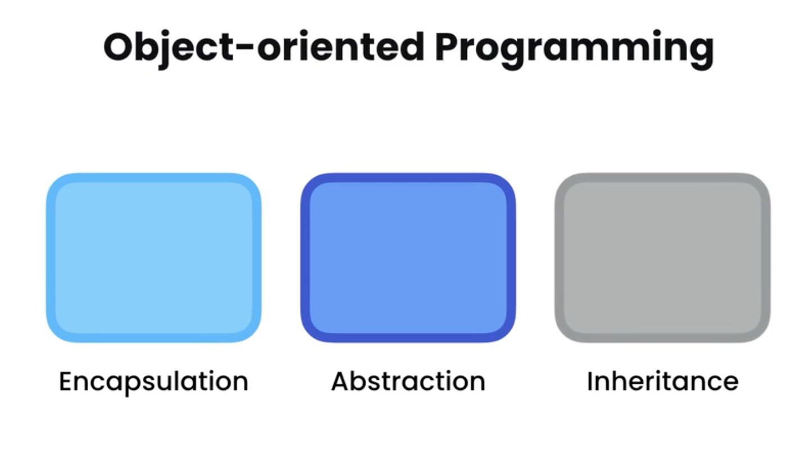

​	下面我们讨论一下第四个原则，多态性，poly - morph -ism 很多时候morph意思是形式，多态性，意味着多种形式，这是面向对象编程语言的特点之一，这使得一个对象可以有不同的形式，这是非常强大的

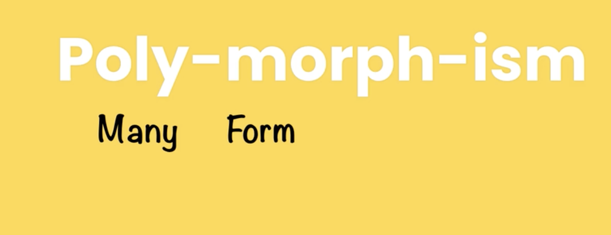

我们新建一个复选框的类checkbox

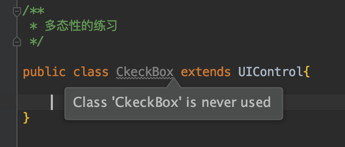

我们在main方法中，声明一个UIControl的数组，里面放文本对象，再放一个复选框对象

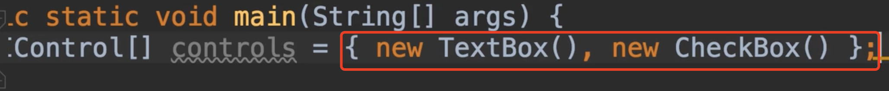

因此，假设现在想要呈现一个具有多个控制对象的窗体，你可以有几个文本框，复选框，单选按钮等等，现在如果要以程序方式渲染不同的控制对象，我们最终会编写这样的代码，我们迭代这个数组，然后内部判断如果这个控件是文本框，那么就渲染文本框内容，然后如果是复选框就渲染复选框的内容等等。

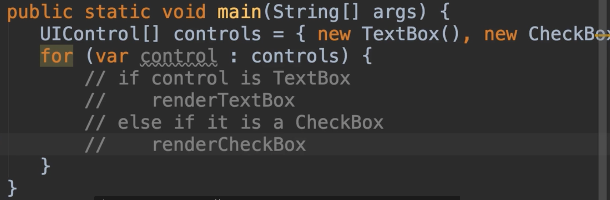

​	所以这是程序性的解决问题，问题是我们最终会有一个大的问题，就是每次我们声明一个扩展的新类的时候，对于UI控件，我们必须回到这里并修改这个if语句，这就是我们应用面向对象的多态性原理的地方

​	现在我们进入我们的UIControl类中，我们编写一个渲染方法render()，在这个方法中，我们不会有任何实现，因为我们不知道如何呈现控件，这取决于他是什么控件，因为对于不同的控件就有不同的计算方法，所以我们把这个默认实现留空

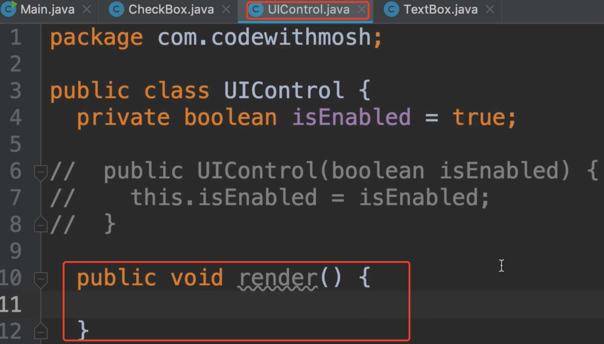

​	但是现在我们可以转到我们的每个子类并重写这个方法，那么我们转到文本框对象中，我们覆盖一下父类的render渲染方法

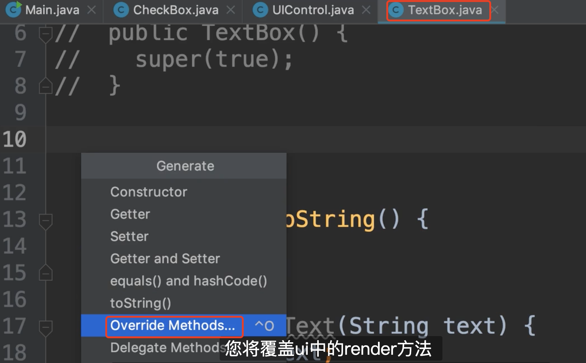

​	让我们渲染一下，比如输出一段内容

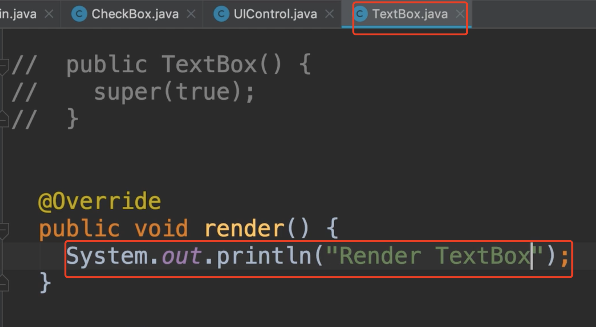

同样我们也操作一下CheckBox

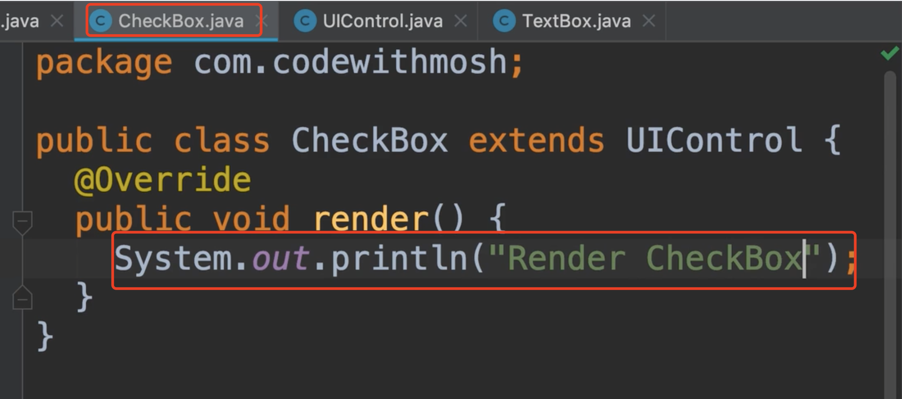

​	每个控件现在都有自己的渲染方法，这也是封装原则在起作用，所以我们将数据和所有操作捆绑在一起，围绕单个单元中的数据，而不是十种渲染方法，每次进行判断后进行分支处理然后渲染等等

​	现在我们回到main方法中，然后我们遍历ui控件，然后control点render方法，这就是多态性的作用

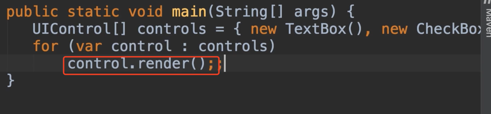

​	UI控件是一个数组，在运行的时候，我们需要插入不同的对象，目前第一个元素是文本框，第二个元素是复选框对象，显然当我们遍历这个数组时，有一个复选框，处理不同的类型对象，每个对象都有自己的渲染方法，这就是我们现在的UI控件对象有许多不同的形式工作方式，这就是多态性。

​	我们运行一下程序看一下，正如我们所看到的每个控件对象都在控制台渲染了自己

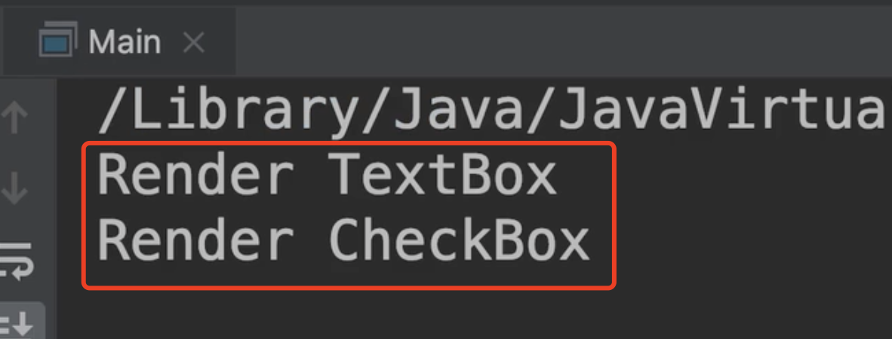

