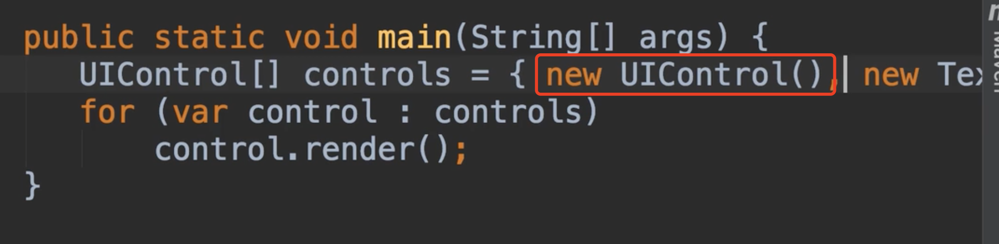
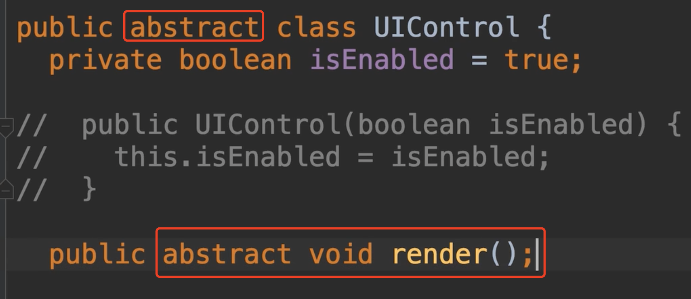
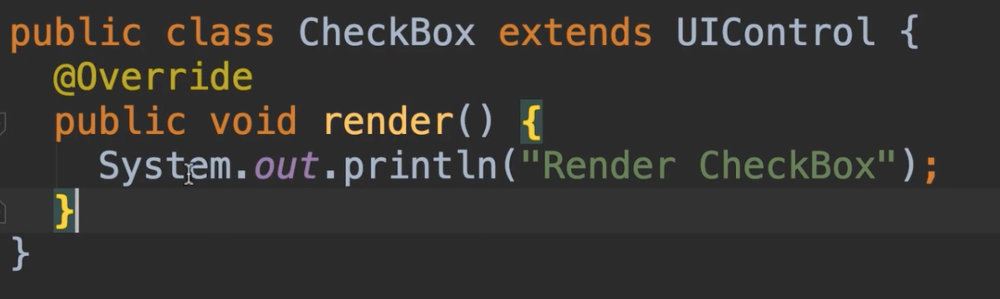
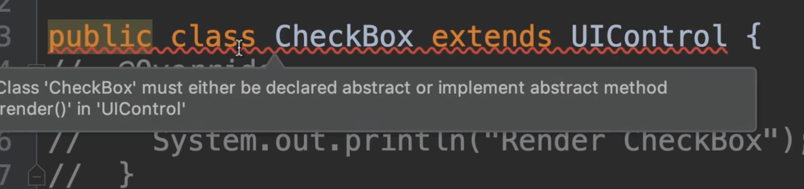
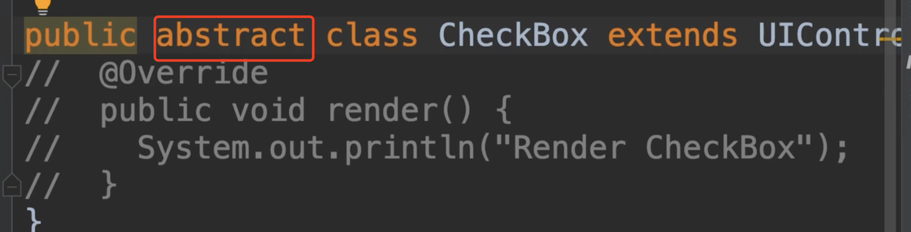

# 26.抽象类和抽象方法

​	Absteact Classes and Methods: 我们讨论一下抽象类和抽象方法，我们使用抽象语言，在我们声明了一个类但我们不想实例化他，我们不希望能够创建该类的新实例。

​	下面我们使用一个例子：在我们上一个例子中我们使用了UIControl数组，然后数组内可以存放很多控件实例，包括UIControl自身，那么UIControl究竟是个什么东西？我们不知道，这是一个抽象的概念

​	我们要呈现这个控件吗？我们不知道，这就是为什么将这个render的方法留空，所以这个类的目的是为他的子类提供一些公共的代码，比如文本框，复选框，我们知道文本框是什么，复选框是什么，我们不知道UIControl是否需要渲染，但是UIControl我们不清楚，这是一个抽象的概念

​	所以在这样的情况下，我们可以将这个类声明为抽象类，并且我们不能实例化这个类，我们只能扩展和创建新的派生类（子类）

​	作为抽象的方法，这将强制的从UIControl派生的任何类，来实现这个方法。使用关键字 abstract，然后该方法去掉主体大括号，用分号结束它。

​	所以我们这里只有方法声明，而没有实现

​	现在我们到复选框CheckBox类中，这里我们有render方法的实现，我们看看如果注释掉这个方法会发生什么？

我们看到会编译错误--必须要实现这个抽象方法，因为我们是UIControl的扩展类

​	我们应该实现这个render方法，或者也可以将这个CheckBox类声明为抽象类，然后是将责任扩展到复选框类实现渲染方法，这就是抽象类和抽象方法

​		

