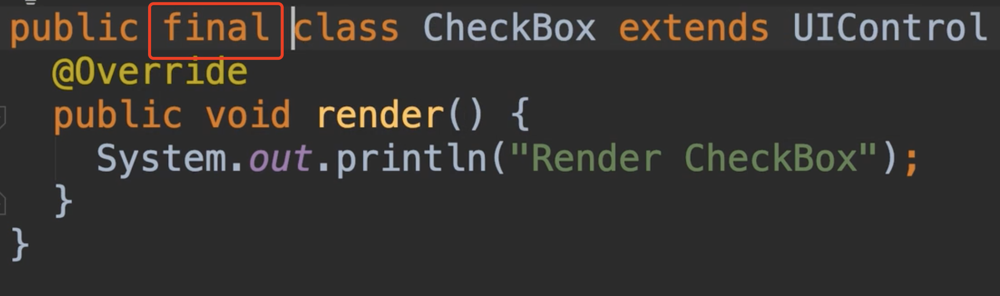
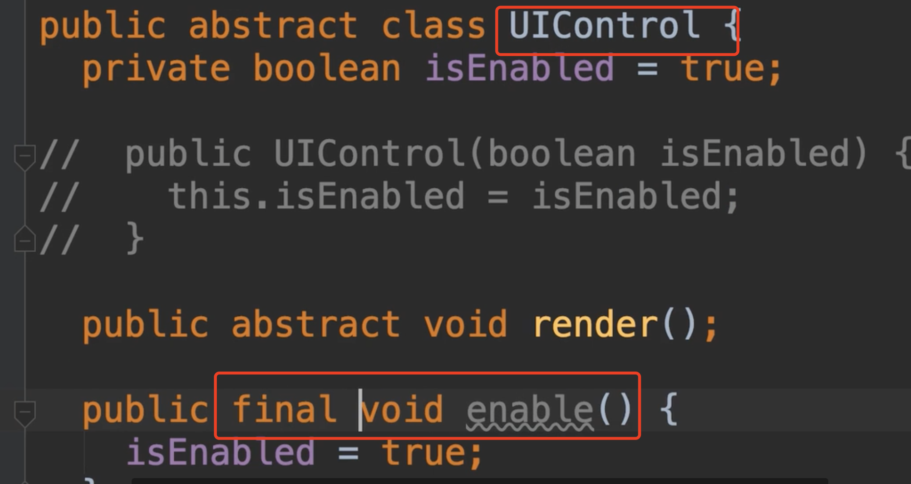
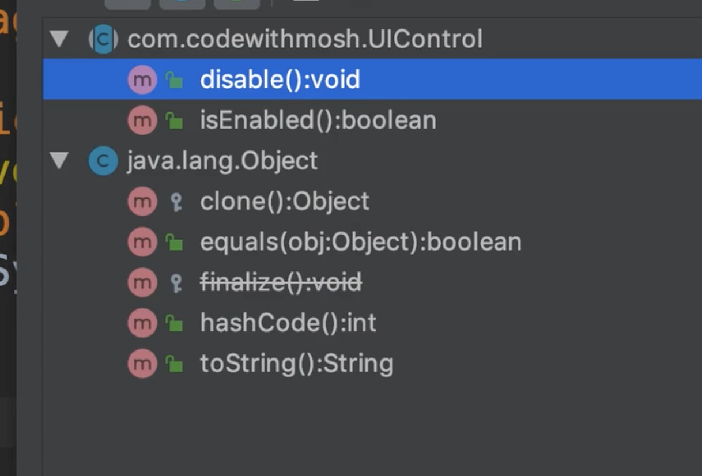

# 27.FInal-Classes-and-Methods

​		我们了解到，当一个类声明为抽象时，我们无法实例化他们，我们只能继承扩展他们，相比而言 我们有Final 类，当我们将一个类声明为Final的时候，我们就不能再扩展他了，也就是说不能继承。

​	我们看一个例子：

我们继承一下CheckBox，发现是无法继承的

​	因此，我们在遇到必须是由本类100%实现的时候才使用final，我们防止继承该类的其他类去实现，这是不常使用的，我们一般不应该使用final修饰的类，因为他通常会阻止我们使用继承和多态及许多其他强大的面向对象功能，但在某些情况下，这个类的实现非常具体，我们已经做了很多现实中的假设，尤其是关于更改状态这种情况下，都没有问题的话，我们可以将我们的类声明为final，这将防止其他类对该类进行继承。

​	我们有个例子：如String类 我们不能继承String类，因为他被声明为final

​	你可能想为什么？因为java中的字符串是不可变的，所以一旦我们创建初始化一个字符串，我们不能改变他的上下文，如果我们调用任何对于他的方法，比如大小写转换toUpcase等等我们将得到一个新的字符串

​	实现String类的人已经确保每个修改字符串的方法都将返回一个新的实例，这就是他们宣布这一点的原因，使用final修饰类，所以我们不会意外的继承扩展这个类和打破这个假设，这就是final class

在Java中，我们也有final方法，当我们将一个方法声明为final的时候，我们不能重写他，这样是为了防止一些方法被重写所以才使用final

​	我们声明一个final的方法

我们在子类中发现并不能重写该方法

​	我们不希望子类意外的改变这种行为或者是破坏我们的方法，这就是关于final的方法。

​	

​	

