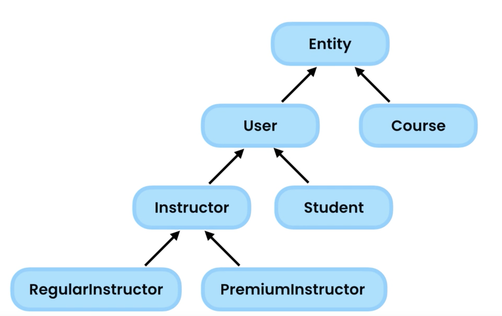

# 28.深度继承

​	

​	我们知道了继承的好处，通过继承，我们可以重用代码并实现多态的行为，但是正如我们常说的太多的好事是坏事

​	所以不要创建深层次的继承结构，这是其中之一，这是很多刚接触继承容易犯的错误

​	我们假设正在构建一个web应用程序，学生可以注册为学生或老师，业余开发人员可能会提出继承层次结构，例如我们有个定期和高级讲师的课程，这俩类都有一些共同的属性和行为，所以我们可以将公共代码抽取到基类中，如讲师Instructor

​	现在我们也有学生，但学生和老师都有几个共同点，例如他们都有用户名称和密码，因此我们可以将公共代码提取到user这样的基类中

​	另外我们有课程类Course，这些课程有几个特点，如id，name等等我们在user类中也有相同的属性，所以我们可以提取一个基类比如entity，并将这些属性放在这里

​	有什么问题呢？继承层次结构彼此紧密耦合，所以在这里user和course都与entity耦合了，如果对entity修改，则必须修改user，还有course，如果我们添加或者修改参数，可能很多地方都需要改动

​	所以在继承层级方面最多一俩个层级，不要超过三个层级

​	

