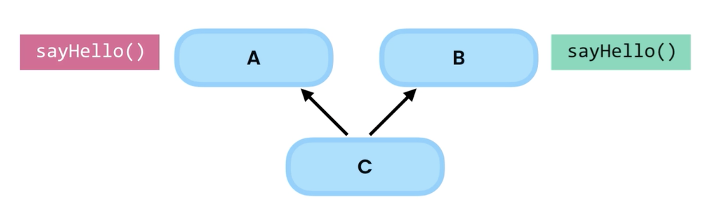
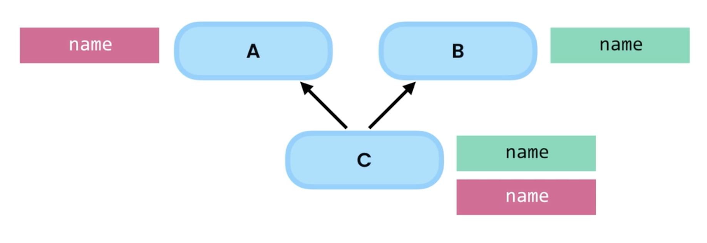
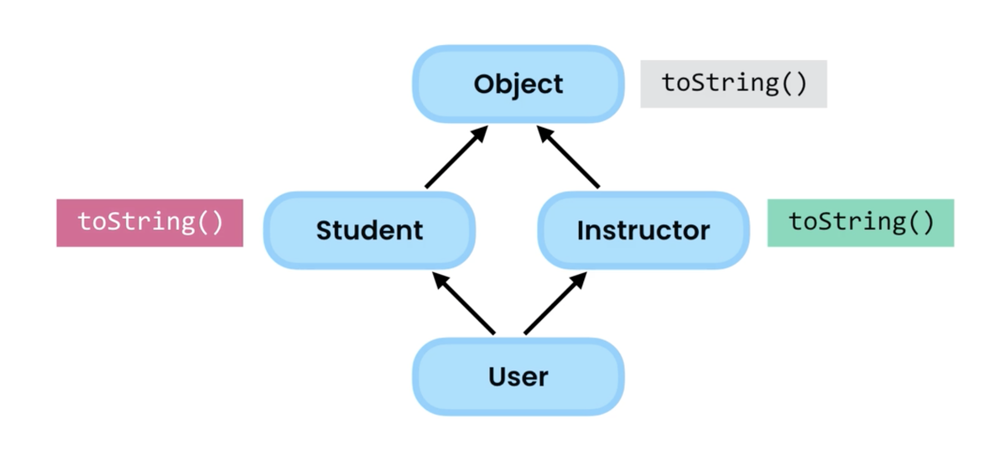

# 29.多重继承

​	在一些编程语言中，如C++，Python一个类可以有多个父类，这就是我们所说的多重继承，Java的设计者决定不这么做，因为实现此功能会因为它带来许多复杂性。

​	例如：c继承a，b但a和b有不同的实现，那么c应该继承那个？这个很模糊，我们不知道

​	如果a和b都声明一个name字段，c应该继承一个或者2个相同的副本字段吗？这是另一个模棱俩可的问题

还有就是砖石继承，更复杂

​	如果Java支持多重继承，就需要面对砖石问题，这就是为什么Java创建者决定不支持这个特性，由于它会带来很多的复杂性，创建者希望Java简单而健壮

​	老实说，这个功能也不是我们经常需要的，它很少被使用，个人从来没有接的需要多重继承。所以请注意它，它带来的问题及java不支持。

​	

​	

