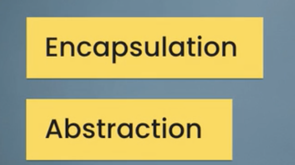

# 3.面向对象编程

​		面向对象编程是关于对象的，这些对象相互交流可以执行各种任务，例如，一辆汽车，有上百成千的零件构成协作的对象，几乎所有这些对象都是可以重用可以替换的。

​		因此，如果其中任何一个出现故障，技术人员可以将其排除，并用另一个对象替换他，这与使用面向对象编程技术完全相同。

​		我们可以通过分解大量数据来降低复杂性，将复杂的应用程序转换为更小，更容易管理和维护的应用程序。如果一个对象不能正常的工作了，我们只需要关注该对象的代码，而不是整个应用程序，我们可以修复这个对象，也可以插入另一个对象作为替换。

​	另一个好处是，我们将另外的机会重用代码

​	一旦我们构建并测试了一个对象，我们就可以在其他应用程序中使用他。

例如：我们正在构建一个图像编辑的应用，在这个应用程序中，我们将为用户提供各种过滤器，用在他们的照片上，一旦我们构建过了这些过滤器，我们就可以在其他应用程序中重用他们。这意味着我们将花费更少的时间构建应用程序，这就是事情变得有趣的地方，面向对象编程真正的好处。

​	但是外面这些人声称这些面向对象好处的人都是理论上的，在现实世界中没有应用，因为他们永远不会重用他们的对象或用其他对象替换他们，但在我看来他们是不知道如何正确的进行面向对象编程。所以只是因为你不知道如何使用一个工具，并不意味着这个工具是无效的。

 我们的目标是：要学好 面向对象编程 和 函数式编程 俩种范式，然后明智的选择他们。

#### 课程结构

​	第一部分：了解类--他们是面向对象的构建块，我们将了解什么是类，为什么我们需要他们，以及如何使用他们，我们可以创造他们。

​	在本节中，我们讨论俩个原则，面向对象编程、封装很抽象

​	这俩个原则经常被误解，所以我们要把他们变成超级简单，后续我们会在代码中使用一些比喻和示例

​	下一节中，我们之前第一部分的贷款计算器项目，我们会学习怎么把一些写的不好的代码重构成干净的以及可维护的，可重用和面向对象的代码，这是一个不可思议的过程。

​	每个Java开发人员都必须具备的技能，但很多人即使那些多年经验的人也缺乏这种技能。

​	接下来我们讨论面向对象编程的另外俩个原则，遗传和多态性

​	最后我们会谈谈接口，最强大，但最难理解

​		面向对象编程的特点，在接口这节我们将学习耦合与依赖性，我们将研究代码，然后展示解决这些问题的接口

​	第二部分的java学习，会给你一个坚实的基础，面向对象编程概念和技术的基础，这会帮助我们更好的理解Java开发工具包中的类，与应用程序中可能使用任何其他框架一样。

​	

​	

​	

