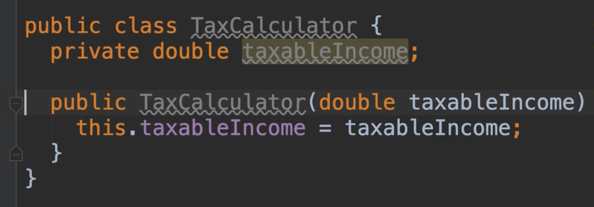

# 31.紧密耦合的代码

​	我们添加一个新类--税务计算器

​		设置应纳税额字段--然后我们想在构造函数中初始化它

然后有一个计算税额的方法： 应纳税额 * 0.3 = 纳税额  30%的税

我们再创建一个税务计算的税务报告类

​		首先我们需要一个税务计算器--然后我们有一个获取纳税额的方法，然后还需要一个显示纳税报告的方法

​	这就是一个紧密耦合的例子，我们税务报告类正在使用税务计算器类，所以我们是依赖税务计算器类的，如果计算器发生变化，那么我们的Report类可能会也要改变

​	比如构造器，现在是一个参数值，比如我们的计算类现在需要使用2个参数构造器，那么我们的Report报告类就报错了，我们需要再次传入一个参数值

​	这没有什么大不了的，因为这是一个很小的改变，但是如果我们有几十个上百个这样的类依赖于计算器类呢，那就比较麻烦了，我们就必须修改所有这些类的构造所需参数

还有就是如果我们不改变这个参数，而是改变了计算的逻辑，那么所有依赖于计算器的类都需要重新编译并重新部署，这就是紧耦合的问题

