# 32.创建一个接口

​	

​	创建一个接口，我们使用ide发现没有创建接口的菜单，我们选择new class然后再选择Interface

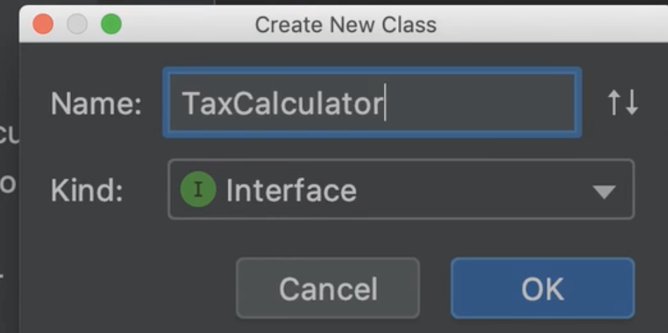

我们最好是在名称前面加一个I表示这是一个接口，这种约定在C语言比较流行，在Java中不怎么流行java一般使用Can的前缀或者able等等都可以没有限制

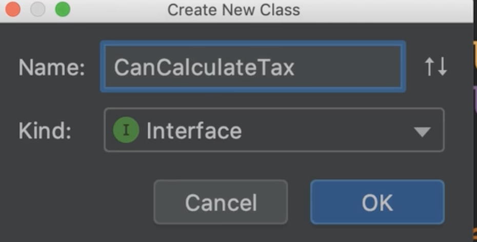

我们现在先把类名称重构一下，因为这个计算税额的类是计算2018年的，我们改为2018

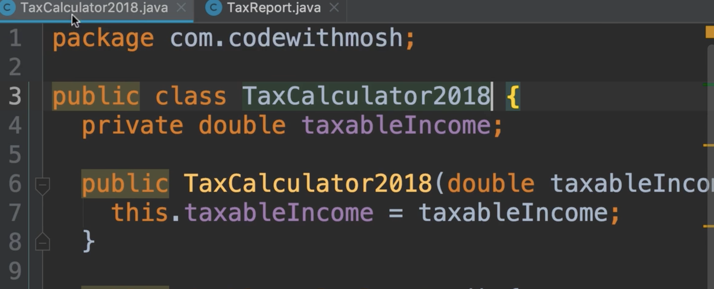

我们创建计算器接口

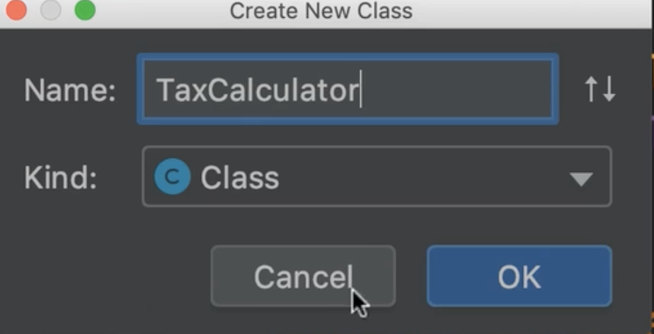

在这个接口我们没有状态和数据，所以我们没有任何字段，我们只有确定需要做什么？

​		我们需要能够计算纳税额的方法，返回为double类型的结果

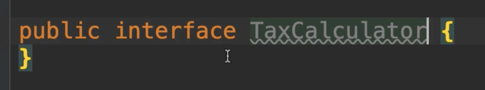

​	我们创建计算纳税额的一个抽象的方法，因为我们没有花括号，我们只有方法声明。

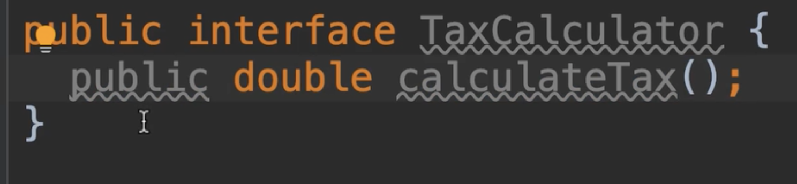

​	现在我们看到public变灰色了，这意味着这里不需要他了，这是多余的，因为我们在这里声明的每个方法都是需要由类实现的，这些方法都是public公开的，所以我们删除这个public

现在我们来到main方法中，我们试试看接口能不能被实例化，显然不能的，因为他没有任何实现代码，那么我们将如何使用他呢？

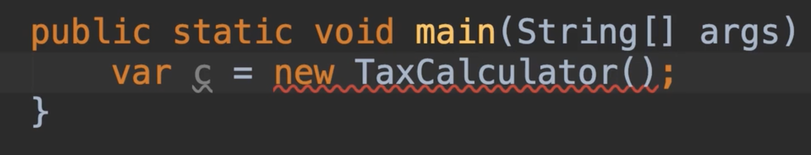

​	我们需要实现的类来 实现implement 这个接口

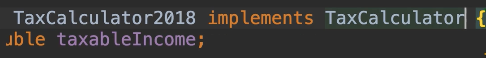

​	作为最佳实践，我们应该将覆盖注释应用于接口方法，所以我们之前了解的注释是我们附加到方法或者是类上的标签，并以此会得到Java编译器的提醒，你可能会问，这样做的好处是什么？这里java编译器会告诉我们这个方法中的实现情况在我们的接口中，如果将来我们决定从我们的接口注释掉这个方法的话，他会提醒我们

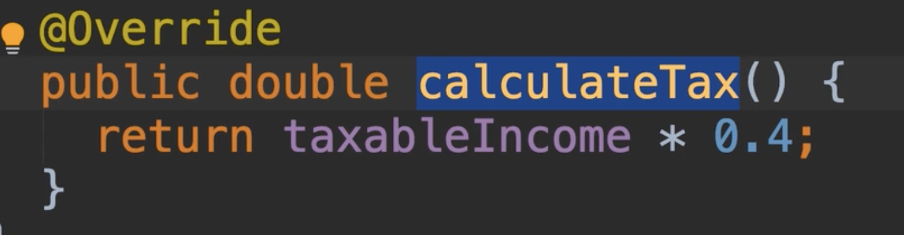

如：注释掉接口方法

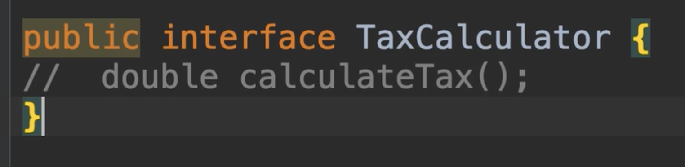

​	我们的实现会得到一个编译错误，因为我们告诉java编译器这个方法正在重写或实现接口的方法，但此方法不存在我们的接口中，这就是使用这个注释的好处

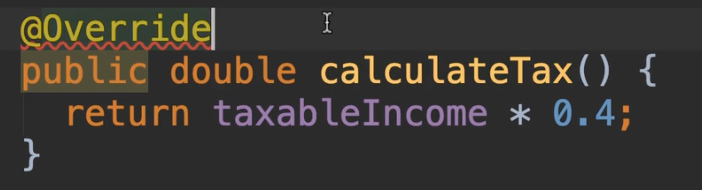

现在这个报告类仍然与这个计算类紧密耦合，我们需要替换为我们的接口

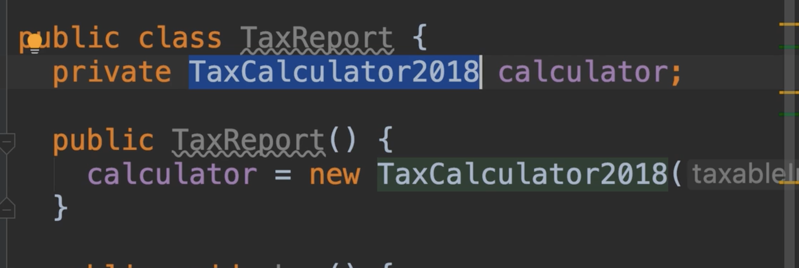

