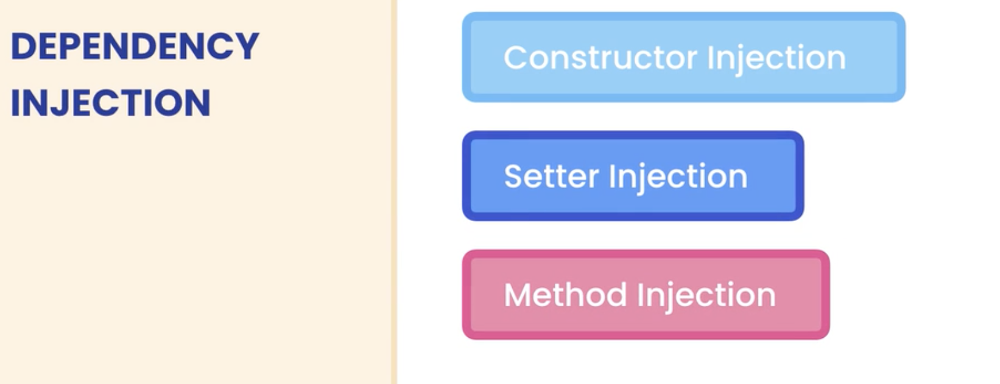

# 33.依赖注入

​	这节我们将讨论面向对象编程一个重要的概念称为依赖注入。

​	根据这个概念，我们的类不应该实例化或更新他们的依赖项，在我们的Report类上正在实例化这个计算器类，这是我们需要改变的，因为依赖注入原则说，我们不应该去创建计算器对象，而只是使用他，创建计算器对象和使用它是俩种不同的方法

​	我们需要将他们的关注点分开，这就是我们所说的关注点的分离。

​	关注点的分离：再次打个比方，例如一家餐馆，餐厅的每个人都有单独的一排（分工明确每排的都不一样），我们不需要厨师来接收命令，我们希望将这些关系分开，我想重新关注他们的责任并解决

​	因此，我们想从这个报表类中创建这个依赖项，把他交给另一个我们需要那个类，如果我们的报告类是计算器对象，这就是我们所说的依赖注入，让其他类通过注入依赖项。现在我们有很多种注入方式，这些依赖项，可以使用构造函数注入，可以通过Setter或常规方法

