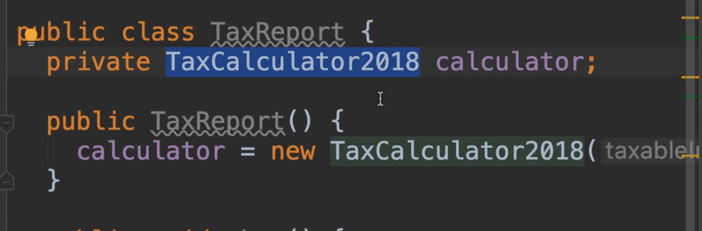
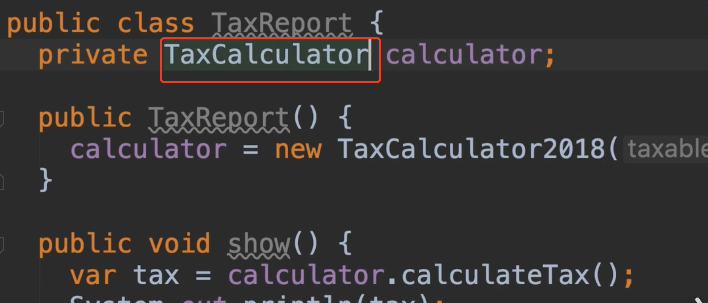
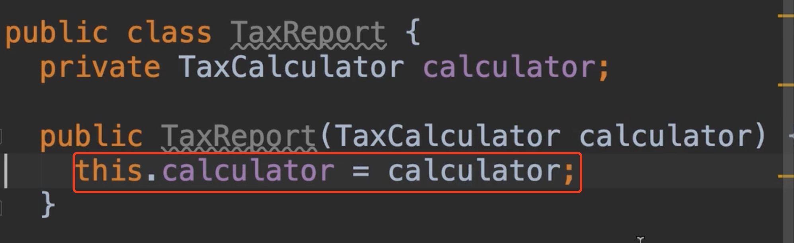
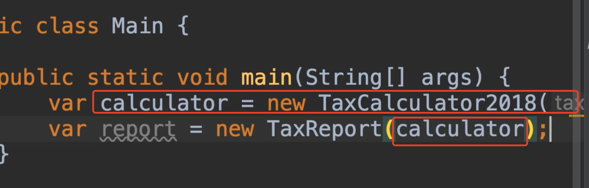
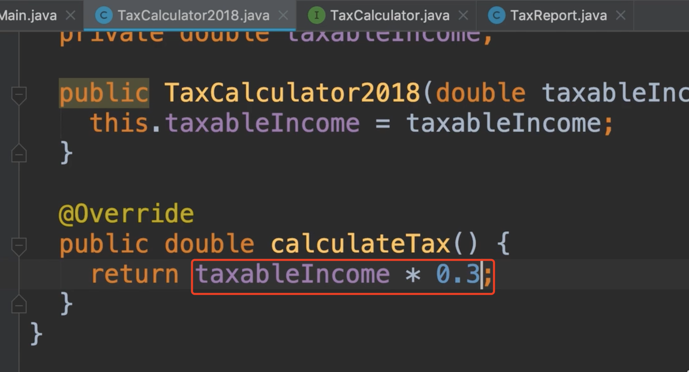
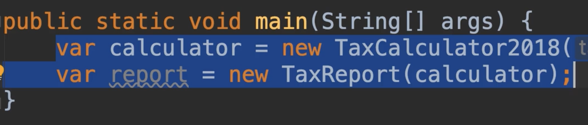

# 34.构造器注入

​	我们不希望我们的报告类是依赖在实现上的，我们希望他依赖一个接口

​	

​	所以我要用新的税务计算器 我们使用接口

​	我们也应该去掉下面的创建实例声明，我们不想让Report类知道关于这个具体是谁实现的，假如他不需要存在，所以我们需要添加一个参数，类型为税务计算器接口，这就是我们所说的构造函数注入

​	我们注入了一个依赖，使用构造函数的税务计算器接口，现在谁来注入这个呢？

​	我们回到main方法，具体实施让我们通过我们的接口实现进行注入

​	我们的税务报告类对是由那个实现注入的一无所知，作为一个具体的实现，它只使用一个接口，这就是我们所说的针对接口编程，具体的注入实现是其他类的责任，比如我们的main类注入这些具体的实现，现在我们使用的是2018的税收计算器，明天我们可以创建另外一个类，比如2019的税收计算器，把这个传给我们的税务报告类也不受影响

​	另外，如果我们回到这个具体的实现，例如我们改变了计算规则等等，我们的Report报告类是不受影响的，修改的类需要重新编译，但报告类不需要重新编译了，也不需要任何修改

​	这就是松耦合

​	在这里我们注入的这种依赖，这就是我们所说的穷人的依赖注入

在这个程序中我们只有2个类，所以我们可以手动轻松创建和注入这些依赖项，在更大的应用程序中，我们可能有几百个类，这些类可能有几个依赖项，你不想在主方法中创建数百个对象并将他们传递给类的构造函数，这就是我们使用后期会使用依赖注入框架，因此有些框架可以实现这一点，很容易将这些依赖项传递给我们的类，Spring就是一个比较受欢迎的框架

​	现在看看这些框架是如何工作的，以及我们如何使用他们，这超出了本课程的范围，我们未来研究这点

